# Binary outcomes: a disconnected smoking-cessation network

``` r

library(cpaic)
library(ggplot2)
set.seed(2026)
```

This vignette is a complete worked example for a **binary** endpoint in
the situation cpaic exists for: a treatment network that is
**disconnected** *and* whose trials enrolled **different populations**.
We reconnect it through shared treatment components and adjust it for
effect-modifier imbalance at the same time, along two routes: the
frequentist two-stage route
([`cstc()`](https://choxos.github.io/cpaic/reference/cstc.md) /
[`cmaic()`](https://choxos.github.io/cpaic/reference/cmaic.md) feeding
[`cnma_bridge()`](https://choxos.github.io/cpaic/reference/cnma_bridge.md))
and the one-stage Bayesian route
([`cmlnmr()`](https://choxos.github.io/cpaic/reference/cmlnmr.md)).

For the general framework see
[`vignette("cpaic-methods")`](https://choxos.github.io/cpaic/articles/cpaic-methods.md);
for the population-specific *hierarchies* that follow from it see
[`vignette("cpaic-disconnected-myeloma")`](https://choxos.github.io/cpaic/articles/cpaic-disconnected-myeloma.md);
for a count endpoint with an exposure offset see
[`vignette("count-outcomes")`](https://choxos.github.io/cpaic/articles/count-outcomes.md).

> **The data here are entirely simulated.** The clinical setting
> (smoking cessation) supplies only the vocabulary, because cessation
> packages are genuinely multi-component: behavioral support and
> pharmacotherapy are combined. No number below is taken from any trial
> or publication. We set the true parameter values ourselves, which is
> exactly what lets us check whether each method recovers them.

## The clinical question

Write `UC` for usual care (brief advice; the inactive comparator) and
use four active components:

- `NRT`: nicotine replacement therapy,
- `CBT`: intensive behavioral counseling,
- `VAR`: varenicline,
- `BUP`: bupropion.

The outcome is **sustained abstinence at six months** (a binary
success), so a log odds ratio above zero favors the active arm.

The trials split into two groups that share **no treatment**:

- **Sub-network 1**, older trials against usual care: `UC` vs `NRT`
  (once), and `UC` vs `CBT` (three times).
- **Sub-network 2**, newer trials that give everyone counseling and
  randomize the drug on top: `CBT+NRT` vs `CBT+VAR` (twice), and
  `CBT+NRT` vs `CBT+BUP` (once).

No trial links the two groups. A guideline panel nevertheless has to
ask: **how does counseling plus varenicline (`CBT+VAR`) compare with
nicotine replacement alone (`NRT`)?** That contrast crosses the gap, and
no randomized comparison of any kind speaks to it.

The two groups also enrolled different smokers. The newer combination
trials recruited **heavier** smokers. We use baseline cigarettes per day
as the effect modifier, coded `cpd = (cigarettes per day - 15) / 10`, so
`cpd = 0` is a 15-a-day smoker and `cpd = 1` is a 25-a-day smoker.
Heavier smokers are harder to treat (a prognostic effect) *and* respond
differently to the components (an effect-modifying one).

## The model

[`cmlnmr()`](https://choxos.github.io/cpaic/reference/cmlnmr.md) fits an
individual-level logistic regression to every patient, whether that
patient’s data arrive as IPD or are integrated out of an aggregate arm:
``` math
\operatorname{logit}\Pr(y_{ijk} = 1 \mid x_i)
  \;=\; \mu_j + x_i^\top b \;+\; C_k^\top(\beta + \Gamma x_i),
```
where $`j`$ indexes the study, $`k`$ the treatment, $`\mu_j`$ is a study
intercept, $`b`$ collects the prognostic effects, and $`C_k`$ is the row
of the treatment-by-component matrix $`C`$ that says which components
treatment $`k`$ contains. The component main effects are $`\beta`$ and
the component by effect-modifier interactions are $`\Gamma`$.

Two consequences follow immediately, and they organize the whole
vignette.

**1. The relative effect is population-specific.** The log odds ratio of
treatment $`t`$ against treatment $`u`$ in a population with
effect-modifier value $`x`$ is
``` math
\theta_t(x) - \theta_u(x) \;=\; (C_t - C_u)^\top (\beta + \Gamma x).
```
There is **no population-free relative effect** once $`\Gamma \neq 0`$.
Asking for one is asking a question that has no answer, so
[`relative_effects()`](https://choxos.github.io/cpaic/reference/relative_effects.md)
requires a `newdata` argument naming the target population. Note also
that $`\beta`$ on its own is the effect at the covariate *origin*: here,
at a smoker who smokes 15 a day. It is not a population-adjusted
quantity and should not be reported as one.

**2. Sub-networks that share components share parameters.** `CBT+VAR`
and `NRT` have no trial between them, but `CBT+VAR` contains `CBT`,
which the old trials measured, and the newer trials measure `VAR`
against `NRT` on a common counseling backbone. The additive structure
turns those shared components into shared parameters, which reconnects
the network by construction, while the aggregate arms are fitted by
integrating the individual model over each study’s own covariate
distribution ([Phillippo et al. 2020](#ref-phillippo2020mlnmr)).

### Non-collapsibility, and why it matters here

The odds ratio is **non-collapsible** ([Greenland et al.
1999](#ref-greenland1999)). The population-average (marginal) log odds
ratio is not the average of the individual (conditional) log odds
ratios: it is pulled toward the null whenever a prognostic covariate is
left out of the model, *even when there is no effect modification at
all*. That is a property of the logit link, not a bias.

So “the log odds ratio in population $`P`$” is ambiguous until you say
whether you mean the conditional or the marginal one, and the methods
answer differently ([Remiro-Azócar et al. 2022](#ref-remiro2022)):

| method | estimand |
|----|----|
| [`cstc()`](https://choxos.github.io/cpaic/reference/cstc.md) | **conditional** log OR at the target’s covariate values |
| [`cmaic()`](https://choxos.github.io/cpaic/reference/cmaic.md) | **marginal** log OR in the target population |
| [`cmlnmr()`](https://choxos.github.io/cpaic/reference/cmlnmr.md), i.e. $`(C_t - C_u)^\top(\beta + \Gamma x)`$ | **conditional** log OR at $`x`$ |

All three can be simultaneously correct and still disagree. We will see
them disagree, and we will measure the disagreement against the truth we
planted.

## Setting up the data

We set the truth ourselves. `beta_true` are the component log odds
ratios at `cpd = 0` and `gamma_true` are their interactions with `cpd`:
varenicline holds up in heavy smokers, whereas nicotine replacement and
counseling lose ground.

``` r

treatments <- c("UC", "NRT", "CBT", "CBT+NRT", "CBT+VAR", "CBT+BUP")
Cmat <- build_C_matrix(treatments, inactive = "UC")
Cmat
#>         BUP CBT NRT VAR
#> UC        0   0   0   0
#> NRT       0   0   1   0
#> CBT       0   1   0   0
#> CBT+NRT   0   1   1   0
#> CBT+VAR   0   1   0   1
#> CBT+BUP   1   1   0   0

beta_true  <- c(BUP = 0.45, CBT =  0.55, NRT =  0.50, VAR = 0.95)  # at cpd = 0
gamma_true <- c(BUP = 0.05, CBT = -0.20, NRT = -0.40, VAR = 0.35)  # x cpd
b_prog     <- -0.35        # heavier smokers quit less often, whatever the arm

# theta_t(x) = C_t' (beta + Gamma x): the TRUE conditional log-OR vs UC.
theta <- function(trt, x) {
  ct <- Cmat[trt, ]
  comps <- names(ct)
  sum(ct * beta_true[comps]) + sum(ct * gamma_true[comps]) * x
}
```

The headline contrast is therefore, exactly,
``` math
\theta_{\texttt{CBT+VAR}}(x) - \theta_{\texttt{NRT}}(x)
 = \underbrace{(0.55 + 0.95 - 0.50)}_{1.00}
 + \underbrace{(-0.20 + 0.35 + 0.40)}_{0.55}\, x ,
```
which runs from an odds ratio of 2.18 in a 10-a-day population to 4.71
in a 25-a-day one. One number cannot serve both.

Seven trials. Two of them are ours, so we hold IPD; the other five are
published, so we hold only aggregate data. The IPD trials enrolled a
real spread of smokers, because a component by effect-modifier
interaction is identified from covariate variation **within** a trial: a
trial in which everybody smokes 20 a day carries no information about
how the effect varies with smoking rate, however many patients it has.

``` r

design <- data.frame(
  study = c("BRIEF-1", "BRIEF-2", "BRIEF-3", "BRIEF-4",
            "COMBO-1", "COMBO-2", "COMBO-3"),
  arm1  = c("UC", "UC", "UC", "UC", "CBT+NRT", "CBT+NRT", "CBT+NRT"),
  arm2  = c("NRT", "CBT", "CBT", "CBT", "CBT+VAR", "CBT+BUP", "CBT+VAR"),
  n     = c(1200, 700, 1200, 1000, 700, 1100, 1200),     # per arm
  mu    = c(-1.9, -1.9, -1.8, -2.0, -1.9, -1.9, -1.8),   # study intercept
  cpd_m = c(-0.7, 0.0, 0.0, 0.2, 0.6, 0.9, 0.5),         # covariate mean
  cpd_s = c(0.55, 0.85, 0.60, 0.60, 0.85, 0.55, 0.60),   # covariate SD
  ipd   = c(FALSE, TRUE, FALSE, FALSE, TRUE, FALSE, FALSE),
  stringsAsFactors = FALSE
)
knitr::kable(design, caption = "Trial design. BRIEF-* are older; COMBO-* newer.")
```

| study   | arm1    | arm2    |    n |   mu | cpd_m | cpd_s | ipd   |
|:--------|:--------|:--------|-----:|-----:|------:|------:|:------|
| BRIEF-1 | UC      | NRT     | 1200 | -1.9 |  -0.7 |  0.55 | FALSE |
| BRIEF-2 | UC      | CBT     |  700 | -1.9 |   0.0 |  0.85 | TRUE  |
| BRIEF-3 | UC      | CBT     | 1200 | -1.8 |   0.0 |  0.60 | FALSE |
| BRIEF-4 | UC      | CBT     | 1000 | -2.0 |   0.2 |  0.60 | FALSE |
| COMBO-1 | CBT+NRT | CBT+VAR |  700 | -1.9 |   0.6 |  0.85 | TRUE  |
| COMBO-2 | CBT+NRT | CBT+BUP | 1100 | -1.9 |   0.9 |  0.55 | FALSE |
| COMBO-3 | CBT+NRT | CBT+VAR | 1200 | -1.8 |   0.5 |  0.60 | FALSE |

Trial design. BRIEF-\* are older; COMBO-\* newer. {.table}

Note which edges are aggregate-only, because it will matter a great deal
later: **`NRT` versus `UC` is measured by exactly one trial (`BRIEF-1`,
aggregate), and bupropion by exactly one (`COMBO-2`, aggregate).**
Counseling and varenicline, by contrast, are each measured by an IPD
trial.

``` r

gen_arm <- function(study, trt, n, mu, m, s) {
  cpd <- rnorm(n, m, s)
  eta <- mu + b_prog * cpd + vapply(cpd, function(x) theta(trt, x), numeric(1))
  data.frame(.study = study, .trt = trt, .y = rbinom(n, 1, plogis(eta)),
             cpd = cpd, stringsAsFactors = FALSE)
}
patients <- do.call(rbind, lapply(seq_len(nrow(design)), function(i) {
  d <- design[i, ]
  rbind(gen_arm(d$study, d$arm1, d$n, d$mu, d$cpd_m, d$cpd_s),
        gen_arm(d$study, d$arm2, d$n, d$mu, d$cpd_m, d$cpd_s))
}))
is_ipd <- patients$.study %in% design$study[design$ipd]
```

The two routes want the data in **different shapes**, and it is worth
being explicit about that.

[`cmlnmr()`](https://choxos.github.io/cpaic/reference/cmlnmr.md) takes
patient rows plus **arm-level** aggregate rows (events `r`, sample size
`n`, and each effect modifier’s `_mean` and `_sd`), because it rebuilds
the aggregate likelihood from the individual model:

``` r

ipd <- patients[is_ipd, ]
agd <- do.call(rbind, lapply(
  split(patients[!is_ipd, ], ~ .study + .trt, drop = TRUE),
  function(d) data.frame(
    .study = d$.study[1], .trt = d$.trt[1],
    r = sum(d$.y), n = nrow(d),
    cpd_mean = mean(d$cpd), cpd_sd = sd(d$cpd), stringsAsFactors = FALSE)))
agd <- agd[order(agd$.study, agd$.trt), ]
rownames(agd) <- NULL
knitr::kable(agd, digits = 3, caption = "Aggregate arms, the shape cmlnmr() wants")
```

| .study  | .trt    |   r |    n | cpd_mean | cpd_sd |
|:--------|:--------|----:|-----:|---------:|-------:|
| BRIEF-1 | NRT     | 355 | 1200 |   -0.724 |  0.535 |
| BRIEF-1 | UC      | 190 | 1200 |   -0.689 |  0.546 |
| BRIEF-3 | CBT     | 283 | 1200 |    0.011 |  0.608 |
| BRIEF-3 | UC      | 171 | 1200 |    0.024 |  0.624 |
| BRIEF-4 | CBT     | 191 | 1000 |    0.192 |  0.602 |
| BRIEF-4 | UC      | 127 | 1000 |    0.219 |  0.586 |
| COMBO-2 | CBT+BUP | 219 | 1100 |    0.931 |  0.559 |
| COMBO-2 | CBT+NRT | 209 | 1100 |    0.897 |  0.570 |
| COMBO-3 | CBT+NRT | 319 | 1200 |    0.515 |  0.596 |
| COMBO-3 | CBT+VAR | 501 | 1200 |    0.495 |  0.586 |

Aggregate arms, the shape cmlnmr() wants {.table}

[`cpaic_network()`](https://choxos.github.io/cpaic/reference/cpaic_network.md)
takes **contrast-level** aggregate data (one row per comparison: `TE`,
`seTE`), the convention of
[`netmeta::discomb()`](https://rdrr.io/pkg/netmeta/man/discomb.html).
Every study appears, including the two IPD ones, whose *unadjusted*
contrasts [`cstc()`](https://choxos.github.io/cpaic/reference/cstc.md)
and [`cmaic()`](https://choxos.github.io/cpaic/reference/cmaic.md) will
overwrite with adjusted ones:

``` r

contrast_of <- function(d, a1, a2) {
  cell <- function(a) { s <- d[d$.trt == a, ]; c(r = sum(s$.y), n = nrow(s)) }
  x2 <- cell(a2); x1 <- cell(a1)
  logodds <- function(v) log(v["r"] / (v["n"] - v["r"]))
  data.frame(
    studlab = d$.study[1], treat1 = a2, treat2 = a1,
    TE   = unname(logodds(x2) - logodds(x1)),
    seTE = unname(sqrt(1 / x2["r"] + 1 / (x2["n"] - x2["r"]) +
                       1 / x1["r"] + 1 / (x1["n"] - x1["r"]))),
    stringsAsFactors = FALSE)
}
agd_contr <- do.call(rbind, lapply(seq_len(nrow(design)), function(i) {
  d <- design[i, ]
  contrast_of(patients[patients$.study == d$study, ], d$arm1, d$arm2)
}))
knitr::kable(agd_contr, digits = 3,
             caption = "Unadjusted contrasts, the shape cpaic_network() wants")
```

| studlab | treat1  | treat2  |    TE |  seTE |
|:--------|:--------|:--------|------:|------:|
| BRIEF-1 | NRT     | UC      | 0.803 | 0.101 |
| BRIEF-2 | CBT     | UC      | 0.424 | 0.142 |
| BRIEF-3 | CBT     | UC      | 0.619 | 0.107 |
| BRIEF-4 | CBT     | UC      | 0.484 | 0.124 |
| COMBO-1 | CBT+VAR | CBT+NRT | 0.699 | 0.119 |
| COMBO-2 | CBT+BUP | CBT+NRT | 0.058 | 0.108 |
| COMBO-3 | CBT+VAR | CBT+NRT | 0.683 | 0.088 |

Unadjusted contrasts, the shape cpaic_network() wants {.table}

The network is disconnected, and
[`cpaic_connectivity()`](https://choxos.github.io/cpaic/reference/cpaic_connectivity.md)
says so, along with the components that could bridge it:

``` r

net <- cpaic_network(agd_contr, ipd = ipd, sm = "OR", family = "binomial",
                     inactive = "UC", ipd_covariates = "cpd")
cpaic_connectivity(net)
#> cpaic connectivity
#>   Connected network: FALSE
#>   Sub-networks:      2
#>     [1] 3 treatments
#>     [2] 3 treatments
#>   Bridging components: CBT, NRT
#>   Component design:  rank(X) = 4 / 4 components -> all component effects identified
#>   Estimable effects: 5 / 5 vs UC
```

[`plot()`](https://rdrr.io/r/graphics/plot.default.html) draws the same
verdict. Each sub-network is laid out on its own circle, so a
disconnected network looks disconnected; edges are colored by whether
the comparison carries any individual patient data, and their width is
the number of studies contributing to it.

``` r

# the panel is widened so that the outer treatment labels are not clipped
plot(net)
```

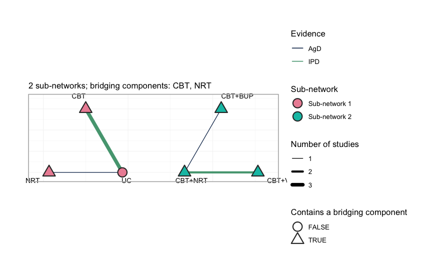

plot of chunk network-plot

Three things to read off it. First, the two groups sit side by side with
**no edge between them**: no comparator, direct or indirect, joins `UC`,
`NRT` and `CBT` to `CBT+NRT`, `CBT+VAR` and `CBT+BUP`. Second, every
treatment except `UC` is drawn as a triangle, meaning it contains one of
the two bridging components, `CBT` or `NRT`; it is through those shared
components, and not through any comparator, that the additive model will
carry information across the gap. Third, only two comparisons are green,
the color reserved for a comparison on which at least one study holds
individual patient data: `UC` versus `CBT`, which three studies inform
but only `BRIEF-2` informs with patient records, and `CBT+NRT` versus
`CBT+VAR`, where `COMBO-1` does the same. **Every adjustment the
frequentist route can perform happens on those two edges.** The
remaining five edges enter the analysis exactly as their publications
reported them.

The component design matrix $`X = BC`$ nevertheless has full column
rank. **Hold that thought.** Full rank means every component effect is
identified *as an aggregate-data component NMA would define it* ([Wigle
et al. 2026](#ref-Wigle2026)). It does not mean every
population-adjusted effect is identified, and the difference turns out
to be the whole story.

## Covariate balance

Population adjustment exists because the trial populations differ. They
do:

``` r

balance <- do.call(rbind, lapply(split(patients, patients$.study), function(d)
  data.frame(Study = d$.study[1],
             Cigarettes_per_day = 15 + 10 * mean(d$cpd),
             cpd_mean = mean(d$cpd), cpd_sd = sd(d$cpd),
             Quit_rate = mean(d$.y))))
knitr::kable(balance, digits = 2, row.names = FALSE,
             caption = "Effect-modifier balance across the five trials")
```

| Study   | Cigarettes_per_day | cpd_mean | cpd_sd | Quit_rate |
|:--------|-------------------:|---------:|-------:|----------:|
| BRIEF-1 |               7.94 |    -0.71 |   0.54 |      0.23 |
| BRIEF-2 |              15.06 |     0.01 |   0.85 |      0.18 |
| BRIEF-3 |              15.17 |     0.02 |   0.62 |      0.19 |
| BRIEF-4 |              17.05 |     0.21 |   0.59 |      0.16 |
| COMBO-1 |              20.92 |     0.59 |   0.85 |      0.30 |
| COMBO-2 |              24.14 |     0.91 |   0.56 |      0.19 |
| COMBO-3 |              20.05 |     0.51 |   0.59 |      0.34 |

Effect-modifier balance across the five trials {.table}

`BRIEF-1` recruited 8-a-day smokers; `COMBO-2` recruited 24-a-day
smokers. A comparison that ignores this is comparing the wrong people.

We must therefore name a **target population**. Take the caseload a
stop-smoking service actually sees: a mean of 18 cigarettes a day,
i.e. `cpd = 0.3`. We will also ask for a lighter-smoking population,
`cpd = -0.4` (11 a day), to show that the answer moves.

``` r

target      <- data.frame(cpd = 0.3)    # 18 cigarettes/day: the decision population
target_light <- data.frame(cpd = -0.4)  # 11 cigarettes/day
```

## Fitting

### Route 1: two stages, frequentist

[`cstc()`](https://choxos.github.io/cpaic/reference/cstc.md) fits, in
each IPD study, an outcome regression with treatment main effects,
prognostic main effects, and treatment-by-effect-modifier interactions,
with the effect modifiers **centered at the target**. The treatment
coefficient is then the anchored, population-adjusted contrast in the
target population.
[`cmaic()`](https://choxos.github.io/cpaic/reference/cmaic.md) instead
reweights each IPD study so its effect-modifier distribution matches the
target ([Signorovitch et al. 2010](#ref-signorovitch2010)) and refits.
Both then hand their adjusted contrasts to
[`cnma_bridge()`](https://choxos.github.io/cpaic/reference/cnma_bridge.md),
which combines everything through the additive component model ([Rücker
et al. 2020](#ref-rucker2020cnma)).

``` r

fit_stc <- cstc(net, target = c(cpd = 0.3), effect_modifiers = "cpd")

fit_maic <- cmaic(net, target = c(cpd = 0.3), target_sd = c(cpd = 0.7),
                  effect_modifiers = "cpd", n_boot = 200, seed = 7)
effective_sample_size(fit_maic)
#>  BRIEF-2  COMBO-1 
#> 1212.364 1208.169
```

Matching costs information. The effective sample sizes above are what is
left of each IPD trial after reweighting; `COMBO-1`, which is furthest
from the target, pays the most. (We pass `target_sd` as well as the mean
so that MAIC matches the target’s *variance* too, not only its center.)

[`forest()`](https://choxos.github.io/cpaic/reference/forest.md)
displays the bridged result. Read it once for the answers and once for
what it does **not** say.

``` r

forest(fit_stc)
```

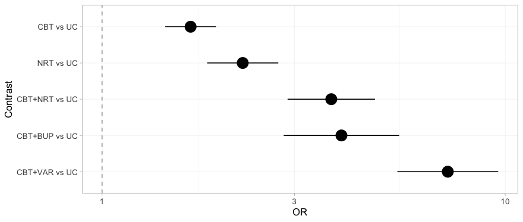

plot of chunk forest-stc

Every contrast against usual care receives a point estimate and an
interval, the three that cross the gap included, and nothing on the plot
distinguishes a contrast the data determine from one they do not. That
is not a defect of
[`forest()`](https://choxos.github.io/cpaic/reference/forest.md); it is
a faithful rendering of what the frequentist bridge believes. The `NRT`
versus `UC` row, which sits comfortably clear of the null, is the one to
remember: we return to it once we have the machinery to see what is
wrong with it.

### Two routes, two estimands

Before reading any numbers, be clear about what each route is
estimating. On a non-collapsible scale this is not a detail:

- [`cstc()`](https://choxos.github.io/cpaic/reference/cstc.md) reports
  the coefficient on treatment in a regression that also contains `cpd`.
  That is a **conditional** log odds ratio, at `cpd = 0.3`.
- [`cmaic()`](https://choxos.github.io/cpaic/reference/cmaic.md) reports
  the coefficient on treatment in a weighted regression with **no
  covariates**, fitted to a sample reweighted to look like the target.
  That is a **marginal** log odds ratio in the target population.
- [`cmlnmr()`](https://choxos.github.io/cpaic/reference/cmlnmr.md)’s
  $`(C_t - C_u)^\top(\beta + \Gamma x)`$ is, like
  [`cstc()`](https://choxos.github.io/cpaic/reference/cstc.md),
  **conditional** at `x`.

These are different numbers, and we can prove it before fitting
anything. The adjusted contrast each method hands to the bridge is
stored on the fitted object, so we can line it up against the truth it
is *supposed* to be estimating. The true conditional effect is
$`(C_t - C_u)^\top(\beta + \Gamma x)`$, in closed form; the true
marginal effect we get by G-computation over the target population.
(Because MAIC’s weights are exponential in `cpd` and `cpd`$`^2`$,
reweighting a normal covariate returns exactly a normal, so the target
really is $`\mathrm{N}(0.3,\,0.7^2)`$ and this Monte Carlo is exact.)

``` r

edge <- function(fitobj, study) {
  a <- fitobj$bridge$network$agd
  a$TE[a$studlab == study]
}
mu_of <- function(s) design$mu[design$study == s]

# the TRUE conditional log-OR: (C_t - C_u)' (beta + Gamma x), in closed form
truth <- function(t1, t2, x) theta(t1, x) - theta(t2, x)

# true MARGINAL log-OR in the target population, by G-computation
mc_marginal <- function(mu, t1, t2, m = 0.3, s = 0.7, M = 2e5) {
  x <- rnorm(M, m, s)
  p <- function(t) mean(plogis(mu + b_prog * x +
                               vapply(x, function(z) theta(t, z), numeric(1))))
  qlogis(p(t1)) - qlogis(p(t2))
}

knitr::kable(data.frame(
  Edge = c("BRIEF-2: CBT vs UC", "COMBO-1: CBT+VAR vs CBT+NRT"),
  true_conditional = c(truth("CBT", "UC", 0.3),
                       truth("CBT+VAR", "CBT+NRT", 0.3)),
  cSTC             = c(edge(fit_stc, "BRIEF-2"), edge(fit_stc, "COMBO-1")),
  true_marginal    = c(mc_marginal(mu_of("BRIEF-2"), "CBT", "UC"),
                       mc_marginal(mu_of("COMBO-1"), "CBT+VAR", "CBT+NRT")),
  cMAIC            = c(edge(fit_maic, "BRIEF-2"), edge(fit_maic, "COMBO-1"))),
  digits = 3, row.names = FALSE,
  caption = "Adjusted log odds ratios each method hands to the bridge, against the estimand it targets")
```

| Edge                        | true_conditional |  cSTC | true_marginal | cMAIC |
|:----------------------------|-----------------:|------:|--------------:|------:|
| BRIEF-2: CBT vs UC          |            0.490 | 0.284 |         0.513 | 0.359 |
| COMBO-1: CBT+VAR vs CBT+NRT |            0.675 | 0.632 |         0.579 | 0.620 |

Adjusted log odds ratios each method hands to the bridge, against the
estimand it targets {.table style="width:100%;"}

Read that table by rows, and note that the *direction* of the estimand
gap is not fixed:

- On `COMBO-1`, where the effect modification is strong, the marginal
  truth sits well below the conditional one (a gap near 0.10 on the log
  scale, about 10% on the odds-ratio scale), and
  [`cmaic()`](https://choxos.github.io/cpaic/reference/cmaic.md) duly
  comes out below
  [`cstc()`](https://choxos.github.io/cpaic/reference/cstc.md).
- On `BRIEF-2` the marginal truth sits slightly *above* the conditional
  one, and
  [`cmaic()`](https://choxos.github.io/cpaic/reference/cmaic.md) duly
  comes out above
  [`cstc()`](https://choxos.github.io/cpaic/reference/cstc.md).

Each method tracks its own estimand, gap direction included. The naive
summary “the marginal effect is attenuated toward the null” is only half
the story: pure non-collapsibility does attenuate, but once a component
is effect-modified, the marginal effect also re-weights the conditional
effects across the covariate distribution, and that can push either way.

The *levels* in the table are noisy: with a binary outcome and 700
patients per arm, an edge carries a standard error around 0.15, and the
`BRIEF-2` estimates both sit about a standard error below their targets.
The ordering is the signal here, not the third decimal place. **The two
methods are estimating different quantities, and both are estimating
them correctly.**

Watch what the bridge then does with that difference, though. Each
adjusted IPD edge is pooled with the *unadjusted aggregate* edges that
sit on the same contrast (`BRIEF-3` and `BRIEF-4` on `CBT`; `COMBO-3` on
`VAR` versus `NRT`), and those aggregate contrasts are identical in both
routes. The estimand difference therefore survives into the bridged
answer only in proportion to how much of the edge’s weight the IPD trial
carries. In a network with plenty of aggregate evidence, the two routes
can come out close together **not because the estimands agree, but
because the adjustment is a minority of the weight.** That is worth
knowing before you conclude from a small STC-MAIC gap that the choice
did not matter.

### Route 2: one stage, Bayesian

[`cmlnmr()`](https://choxos.github.io/cpaic/reference/cmlnmr.md) does
the connecting and the adjusting in a single likelihood. The
individual-level model above is fitted directly to the IPD, and each
aggregate arm’s likelihood is that same model **integrated over that
study’s own covariate distribution** using quasi-Monte-Carlo points.
Nothing is plugged in at a study mean, which matters because the logit
link is nonlinear:
$`\mathbb{E}[\operatorname{logit}^{-1}(\eta)] \neq \operatorname{logit}^{-1}(\mathbb{E}[\eta])`$.

We use `trt_effects = "random"`, which adds a study-arm deviation around
the component-implied effect, so the component model is not forced to
fit every trial exactly.

``` r

fit <- cmlnmr(ipd, agd,
              effect_modifiers = "cpd",
              inactive = "UC", family = "binomial",
              trt_effects = "random",
              chains = 4, iter_warmup = 500, iter_sampling = 500,
              n_int = 64, seed = 1, show_exceptions = FALSE)
fit
#> cpaic: component-additive ML-NMR (Bayesian, binomial)
#>   Treatment effects: random (noncentered)
#>   Effect modifiers: cpd [normal]
#>   Component effects below are at the covariate origin (x = 0).
#>   For a target population use relative_effects(fit, newdata = ...).
#> 
#>  component estimate    se  lower upper
#>        BUP    0.377 0.887 -1.533 1.950
#>        CBT    0.484 0.121  0.213 0.699
#>        NRT    0.553 0.240  0.008 0.954
#>        VAR    0.980 0.304  0.282 1.502
```

Note what the print method insists on: those component effects are at
the covariate **origin**, not in any population you care about.

### Priors

Every prior is recorded on the fitted object, because with a weakly
identified $`\Gamma`$ the interaction prior does real work and you
should be able to see exactly how much:

``` r

knitr::kable(do.call(rbind, lapply(names(fit$priors), function(p) {
  s <- fit$priors[[p]]
  data.frame(parameter = p, distribution = s$distribution,
             location = s$location, scale = s$scale)
})), caption = "The complete prior specification, as passed to Stan")
```

| parameter  | distribution | location | scale |
|:-----------|:-------------|---------:|------:|
| intercept  | normal       |        0 |   2.5 |
| beta       | normal       |        0 |   2.5 |
| regression | normal       |        0 |   1.0 |
| gamma      | normal       |        0 |   1.0 |
| tau        | half-normal  |        0 |   1.0 |

The complete prior specification, as passed to Stan {.table}

The defaults are the Stan prior-choice recommendations: normal(0, 2.5)
on component effects and study intercepts, normal(0, 1) on the component
by effect-modifier interactions, and half-normal(0, 1) on the
heterogeneity standard deviation `tau`. On the log-odds scale a
normal(0, 2.5) is already permissive; a normal(0, 1) on an interaction
says that a one-unit change in `cpd` (10 cigarettes a day) is unlikely
to swing a component’s log odds ratio by more than about two.

Stating a prior is not the same as knowing what it did.
[`plot_prior_posterior()`](https://choxos.github.io/cpaic/reference/plot_prior_posterior.md)
answers that: it draws each posterior as a histogram and its prior as a
line, so a parameter the data informed is one whose histogram has pulled
away from the line beneath it.

``` r

plot_prior_posterior(fit)
```

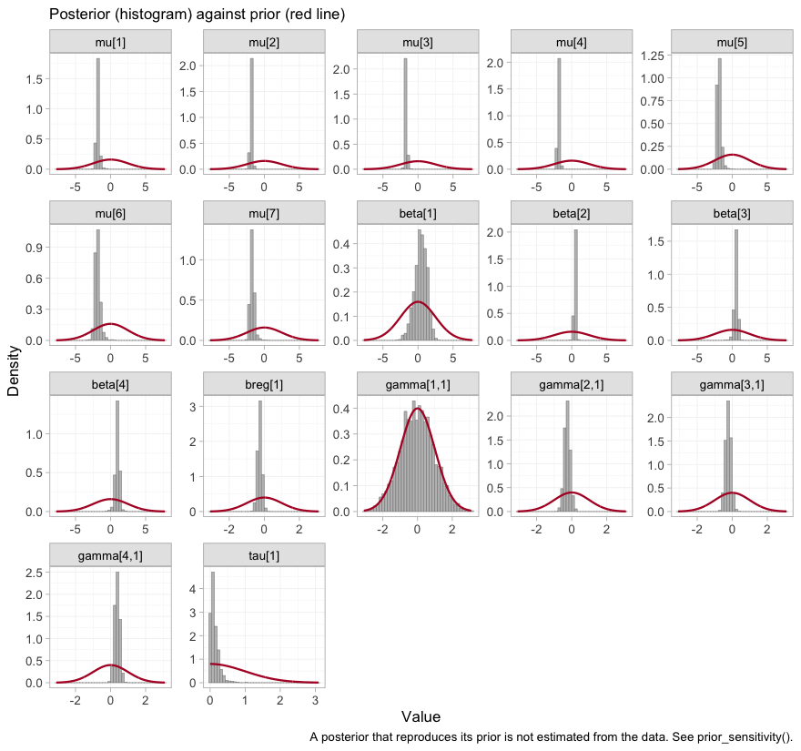

plot of chunk prior-posterior

The study intercepts `mu` and the component effects `beta` are sharp
against broad priors, as they should be with several thousand patients.
The components are indexed alphabetically, so `beta[1]` is bupropion,
and it is conspicuously the widest of the four: bupropion is carried by
a single aggregate trial. The telling panel, though, is `gamma[1,1]`,
the bupropion by `cpd` interaction, whose histogram lies underneath its
prior curve almost exactly. That is the visual signature of a parameter
the likelihood does not constrain at all, and we take it up in earnest
below.

### Convergence

``` r

data.frame(
  divergences   = fit$diagnostics$divergences,
  max_treedepth = fit$diagnostics$max_treedepth,
  max_rhat      = round(fit$diagnostics$max_rhat, 4),
  min_ess_bulk  = round(min(fit$fit$summary(c("beta", "gamma", "mu",
                                              "tau"))$ess_bulk, na.rm = TRUE))
)
#>   divergences max_treedepth max_rhat min_ess_bulk
#> 1           2             0   1.0168          425
```

The trace plot shows the same thing chain by chain.

``` r

plot(fit, type = "trace")
```

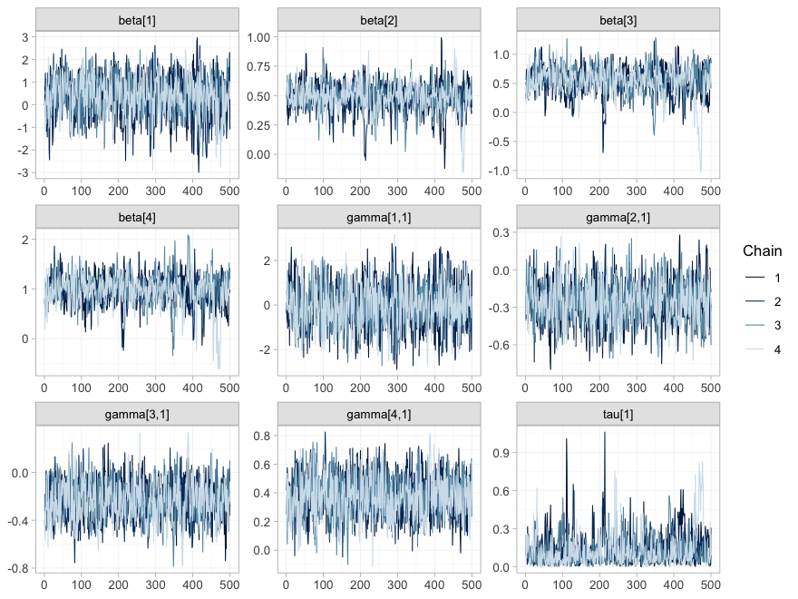

plot of chunk mcmc-trace

``` r

plot(fit, type = "rhat")
```

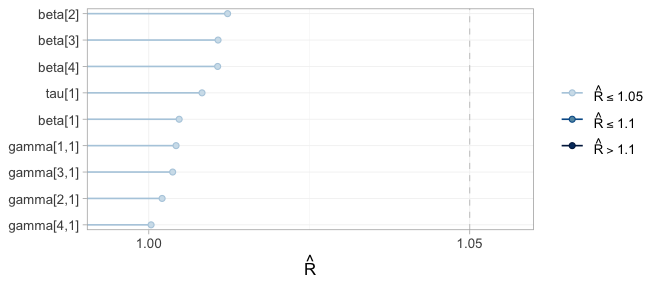

plot of chunk mcmc-rhat

All four chains overlap and are stationary in every panel, and every
$`\hat{R}`$ sits in the lowest band. Note that the *width* of a trace is
not a convergence problem but an information statement: `beta[1]` and
`gamma[1,1]`, bupropion and its interaction, wander over a range several
times wider than the others, because one aggregate two-arm trial is all
the evidence there is about bupropion. This is the distinction that
governs the rest of the vignette: **convergence is a property of the
sampler, not of the evidence.** A parameter the data say nothing about
will converge perfectly well onto its prior.

Sampling is not the only numerical approximation here. Each aggregate
arm’s likelihood is an integral of the individual model over that
study’s covariate distribution, evaluated at `n_int = 64`
quasi-Monte-Carlo points, and
[`plot_integration_error()`](https://choxos.github.io/cpaic/reference/plot_integration_error.md)
traces how far the integral at `N` points sits from the integral at all
64.

``` r

plot_integration_error(fit)
```


plot of chunk integration-error

In every aggregate arm the error is already well inside the dashed `1/N`
envelope by twenty points and keeps shrinking toward sixty-four, so
`n_int = 64` is ample for this model. `COMBO-2`’s bupropion arm is the
noisiest of the ten, which is consistent with it being the arm the model
knows least about. Had any panel still been drifting at the right-hand
edge, the remedy would have been to refit with more integration points,
not to reinterpret the answer.

## Estimability: reconnecting is not identifying

[`cpaic_connectivity()`](https://choxos.github.io/cpaic/reference/cpaic_connectivity.md)
told us the component design has full column rank, so the frequentist
bridge will happily print an estimate for every cell of the league
table. That is exactly the trap.

Population adjustment is **strictly harder** than reconnection, because
the estimand $`(C_t - C_u)^\top(\beta + \Gamma x)`$ needs the
*interactions* $`\Gamma`$ to be identified too, and an aggregate two-arm
trial supplies **one** number per contrast: it pins down
$`m^\top(\beta + \Gamma \bar x_j)`$ at its own covariate mean
$`\bar x_j`$ and cannot separate $`m^\top\beta`$ from $`m^\top\Gamma`$.
[`estimable_effects_at()`](https://choxos.github.io/cpaic/reference/estimable_effects_at.md)
runs that algebra for a named target population.

``` r

estimable_effects_at(fit, newdata = target, reference = "NRT")
#> Estimability of the population-adjusted relative effects
#>   Target population: cpd = 0.3
#>  treatment comparator estimable identified_by          basis
#>        CBT        NRT     FALSE          none not identified
#>    CBT+BUP        NRT     FALSE          none not identified
#>    CBT+NRT        NRT      TRUE           IPD          exact
#>    CBT+VAR        NRT      TRUE           IPD          exact
#>         UC        NRT     FALSE          none not identified
#> 
#>   Rows marked "not identified" carry no first-order information; a number
#>   reported for them would be the prior. relative_effects() returns NA there.
```

Read the `identified_by` column. `CBT+NRT` and `CBT+VAR` are identified
**from IPD**, meaning from covariate variation *within* a trial. The
other three are not identified at all:

- `UC` and `CBT` against `NRT` each need the `NRT` component **on its
  own**, and only `BRIEF-1` measured that, and did so as an aggregate
  contrast, at its own mean of 8 cigarettes a day.
- `CBT+BUP` against `NRT` needs bupropion-minus-nicotine-replacement,
  and only `COMBO-2` measured that, again as an aggregate contrast, at
  its own mean of 24 a day.

Those two quantities are pinned down at *those trials’ covariate means*,
and 18 cigarettes a day is neither of them. An aggregate two-arm trial
gives you one equation; separating a component’s main effect from its
interaction takes two.

That table is one target population.
[`plot_estimability()`](https://choxos.github.io/cpaic/reference/plot_estimability.md)
runs the same algebra across a whole grid of them, which is the only way
to see that estimability is not a fixed property of the network.

``` r

plot_estimability(fit, em = "cpd", values = seq(-1, 1, by = 0.25),
                  reference = "NRT")
```

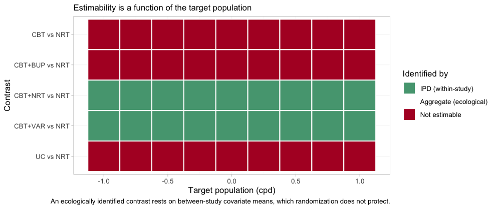

plot of chunk estimability-map

The good news is the two green rows, and they are the rows that matter:
the headline contrast `CBT+VAR` versus `NRT` is identified from
within-trial covariate variation at **every** target population in the
plausible range, from 5-a-day smokers to 25-a-day ones, and so is
`CBT+NRT` versus `NRT`. The population-adjusted comparison across the
gap is available wherever a guideline panel might want to stand. The
three red rows are equally uniform, and equally informative: no choice
of target rescues them.

The dependence on the target is real, not a technicality. `BRIEF-1`
enrolled 8-a-day smokers; ask for **exactly that** population and `NRT`
becomes estimable again. Note “exactly”: the criterion holds at the
trial’s realized covariate mean, so we read that mean off the aggregate
data rather than typing in the nominal `-0.7` we simulated from.

``` r

own <- data.frame(cpd = mean(agd$cpd_mean[agd$.study == "BRIEF-1"]))
own
#>          cpd
#> 1 -0.7061574
estimable_effects_at(fit, newdata = own, reference = "UC")
#> Estimability of the population-adjusted relative effects
#>   Target population: cpd = -0.706
#>  treatment comparator estimable identified_by              basis
#>        CBT         UC      TRUE           IPD              exact
#>    CBT+BUP         UC     FALSE          none     not identified
#>    CBT+NRT         UC      TRUE     aggregate first-order screen
#>    CBT+VAR         UC      TRUE     aggregate first-order screen
#>        NRT         UC      TRUE     aggregate first-order screen
#> 
#>   Rows marked "first-order screen" are estimable by the linear criterion, which
#>   is only a design-based screen for them (aggregate identification, or a
#>   survival baseline) and can be optimistic. Check them with prior_sensitivity().
#> 
#>   Rows marked "not identified" carry no first-order information; a number
#>   reported for them would be the prior. relative_effects() returns NA there.
```

That is the whole of what an aggregate two-arm trial can tell you: its
own contrast, in its own population. Everything else is extrapolation
through $`\Gamma`$, and $`\Gamma`$ has to come from somewhere.

Redraw the map on a grid that passes exactly through `BRIEF-1`’s own
covariate mean, and the point becomes a picture. This time we take the
comparisons against usual care, which is where the aggregate `NRT` edge
does its work.

``` r

plot_estimability(fit, em = "cpd", values = own$cpd + 0.25 * (-1:7))
```


plot of chunk estimability-own-map

One column of the map, and one only, is different: at `BRIEF-1`’s own
population three further contrasts become estimable, and they come up
**yellow**, not green. Yellow is `identified_by = "aggregate"`, which is
to say identified *ecologically*, from between-study differences in
covariate means rather than from randomized within-study variation.
Randomization does not protect an ecological comparison, and
[`estimable_effects_at()`](https://choxos.github.io/cpaic/reference/estimable_effects_at.md)
labels its basis a “first-order screen” precisely to warn that on a
nonlinear link the criterion may be optimistic there. Estimability is
therefore not one property but two: whether a contrast can be identified
at all, and on what kind of evidence. One step either side of that
column, every one of those three contrasts is red again.

The same algebra reaches the component effects. In the target
population, only `CBT` is separately identified; even `VAR` is not,
because varenicline was only ever measured *against* nicotine
replacement:

``` r

component_effects(fit, newdata = target)
#>   component estimate        se    lower     upper
#> 1       BUP       NA        NA       NA        NA
#> 2       CBT 0.406458 0.1309455 0.122849 0.6495137
#> 3       NRT       NA        NA       NA        NA
#> 4       VAR       NA        NA       NA        NA
```

[`forest()`](https://choxos.github.io/cpaic/reference/forest.md) renders
the same table, and renders the `NA`s as what they are.

``` r

forest(fit, what = "component", newdata = target)
```

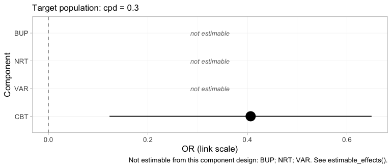

plot of chunk forest-component

Three of the four components are printed as empty rows marked *not
estimable* rather than dropped. Dropping them would leave a plot that
looked complete when it was not, which is the single most consequential
design decision in the package’s plotting surface.

That looks like a defeat and is not. The headline contrast does not need
`VAR` alone: `CBT+VAR` versus `NRT` is `CBT` plus (`VAR` minus `NRT`),
and *both of those pieces come from IPD*. cpaic returns `NA` for what it
cannot identify and a number for what it can, which is the behavior you
want from a tool that will otherwise hand you the prior with a straight
face ([Wigle et al. 2026](#ref-Wigle2026)).

### Which edges actually carry the answer

The frequentist bridge has no `NA`s to return, but the same linear
algebra still governs it, and
[`plot_edge_influence()`](https://choxos.github.io/cpaic/reference/plot_edge_influence.md)
exposes it from the other side. A bridged contrast is a weighted
combination of the observed edges, with weights chosen by the component
design rather than by any path through the network. Those weights are
worth looking at before trusting the contrast.

``` r

plot_edge_influence(fit_stc, treatment = "CBT+VAR")
```

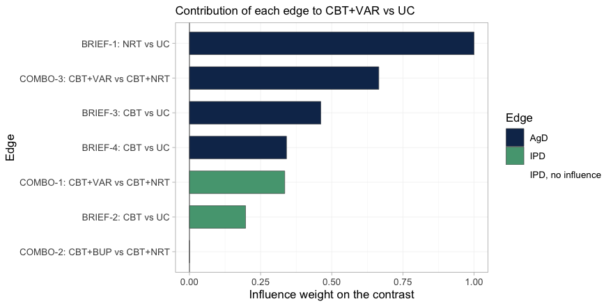

plot of chunk edge-influence

Read the bars from the top. The edge that contributes **most** to
`CBT+VAR` versus `UC` is `BRIEF-1`, the aggregate trial in 8-a-day
smokers; it carries more weight than any other edge in the network. It
reaches this contrast because varenicline was only ever measured
*against* nicotine replacement, so the `NRT` component has to be
supplied from somewhere, and `BRIEF-1` is the only place it exists. Yet
`BRIEF-1` is aggregate, so neither
[`cstc()`](https://choxos.github.io/cpaic/reference/cstc.md) nor
[`cmaic()`](https://choxos.github.io/cpaic/reference/cmaic.md) can touch
it, and it enters the bridge in its own light-smoking population.
Meanwhile the two edges that *were* adjusted, `COMBO-1` and `BRIEF-2`,
are the green ones, and between them they carry a minority of the
weight.

The last bar is instructive in the opposite direction: `COMBO-2`, the
bupropion trial, has an influence of exactly zero. `CBT+VAR` versus `UC`
contains no bupropion, so no amount of evidence about bupropion can move
it. This is the diagnostic that the conventional population-adjustment
checks cannot perform: an effective sample size tells you how much of a
trial survived reweighting, but it cannot tell you that reweighting that
trial was incapable of changing your answer in the first place.

## Results

### Recovered against the truth

[`relative_effects()`](https://choxos.github.io/cpaic/reference/relative_effects.md)
needs `newdata`, because there is no population-free answer. Here is the
target population, against `NRT`:

``` r

relative_effects(fit, reference = "NRT", newdata = target)
#> Relative effects (OR, back-transformed)
#>   Target population: cpd = 0.3
#>  treatment comparator estimate    se lower upper pr_gt0
#>        CBT        NRT       NA    NA    NA    NA     NA
#>    CBT+BUP        NRT       NA    NA    NA    NA     NA
#>    CBT+NRT        NRT    1.514 0.131 1.131 1.915  0.992
#>    CBT+VAR        NRT    2.820 0.193 1.860 3.956  1.000
#>         UC        NRT       NA    NA    NA    NA     NA
#>   NA = not uniquely estimable from this component design (see estimable_effects()).
```

``` r

forest(fit, reference = "NRT", newdata = target)
```

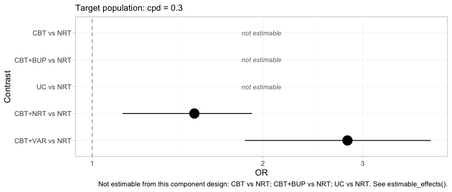

plot of chunk forest-bayes

Two contrasts, an interval each, and three rows that decline to answer.
The headline result is the bottom row: `CBT+VAR` versus `NRT`, a
comparison no trial in this network made and no comparator connects,
estimated in a named population with an interval that reflects how much
the data actually say. Compare this plot with the frequentist forest
above, which had five filled rows and no empty ones. Same network, same
target, same question.

And the same network in a lighter-smoking population:

``` r

relative_effects(fit, reference = "NRT", newdata = target_light)
#> Relative effects (OR, back-transformed)
#>   Target population: cpd = -0.4
#>  treatment comparator estimate    se lower upper pr_gt0
#>        CBT        NRT       NA    NA    NA    NA     NA
#>    CBT+BUP        NRT       NA    NA    NA    NA     NA
#>    CBT+NRT        NRT    1.818 0.137 1.324 2.298  0.997
#>    CBT+VAR        NRT    2.220 0.231 1.359 3.323  0.997
#>         UC        NRT       NA    NA    NA    NA     NA
#>   NA = not uniquely estimable from this component design (see estimable_effects()).
```

Now put every method next to the truth we planted. The truth is the
conditional log odds ratio $`(C_t - C_u)^\top(\beta + \Gamma x)`$, which
is what [`cstc()`](https://choxos.github.io/cpaic/reference/cstc.md) and
[`cmlnmr()`](https://choxos.github.io/cpaic/reference/cmlnmr.md) target;
[`cmaic()`](https://choxos.github.io/cpaic/reference/cmaic.md) targets
the marginal effect, so it is expected to sit closer to the null.

``` r

# pull one cell (as plain numbers) out of a relative_effects() table
grab <- function(tab, t1, ref, what = "estimate") {
  as.numeric(tab[[what]][tab$treatment == t1 & tab$comparator == ref])
}
re_bayes <- relative_effects(fit, reference = "NRT", newdata = target)
re_stc   <- relative_effects(fit_stc,  reference = "NRT")
re_maic  <- relative_effects(fit_maic, reference = "NRT")

recovery <- do.call(rbind, lapply(c("CBT+NRT", "CBT+VAR"), function(t1) {
  data.frame(
    Contrast       = paste(t1, "vs NRT"),
    True_OR        = exp(truth(t1, "NRT", 0.3)),
    cSTC           = grab(re_stc,   t1, "NRT"),
    cMAIC          = grab(re_maic,  t1, "NRT"),
    `cML-NMR`      = grab(re_bayes, t1, "NRT"),
    `cML-NMR 95% CrI` = sprintf("(%.2f, %.2f)",
                                grab(re_bayes, t1, "NRT", "lower"),
                                grab(re_bayes, t1, "NRT", "upper")),
    check.names = FALSE)
}))
knitr::kable(recovery, digits = 2, row.names = FALSE,
  caption = "Odds ratios in the target population (cpd = 0.3), against the truth")
```

| Contrast       | True_OR | cSTC | cMAIC | cML-NMR | cML-NMR 95% CrI |
|:---------------|--------:|-----:|------:|--------:|:----------------|
| CBT+NRT vs NRT |    1.63 | 1.66 |  1.68 |    1.51 | (1.13, 1.91)    |
| CBT+VAR vs NRT |    3.21 | 3.23 |  3.25 |    2.82 | (1.86, 3.96)    |

Odds ratios in the target population (cpd = 0.3), against the truth
{.table}

Both estimable contrasts are recovered: the point estimates sit near the
planted truth and the credible intervals cover it. The `CBT+VAR` row is
the one to dwell on, because *no trial in the network measured it*.

The bridged `cSTC` and `cMAIC` answers come out close together, for the
reason set out above: the estimand gap lives on the two IPD edges, and
the bridge dilutes it with unadjusted aggregate evidence on the same
contrasts. The place to look for the difference is the edge table, not
the league table.

[`league_table()`](https://choxos.github.io/cpaic/reference/league_table.md)
lays out every pairwise comparison at the target population. It is worth
printing in full, because what it leaves out is as informative as what
it contains.

``` r

lg <- league_table(fit, newdata = target)
knitr::kable(lg, caption = paste("League table at cpd = 0.3 (row versus column).",
                                 "Empty cells are not estimable."))
```

|  | CBT | CBT+BUP | CBT+NRT | CBT+VAR | NRT | UC |
|:---|:---|:---|:---|:---|:---|:---|
| CBT | CBT |  |  |  |  | 1.51 (1.13, 1.91) |
| CBT+BUP |  | CBT+BUP |  |  |  |  |
| CBT+NRT |  |  | CBT+NRT | 0.55 (0.41, 0.73) | 1.51 (1.13, 1.91) |  |
| CBT+VAR |  |  | 1.86 (1.37, 2.43) | CBT+VAR | 2.82 (1.86, 3.96) |  |
| NRT |  |  | 0.67 (0.52, 0.88) | 0.37 (0.25, 0.54) | NRT |  |
| UC | 0.67 (0.52, 0.88) |  |  |  |  | UC |

League table at cpd = 0.3 (row versus column). Empty cells are not
estimable. {.table style="width:100%;"}

Most of it is empty: of the 30 off-diagonal cells, 8 carry a number. A
conventional league table built from this network would have been full,
and every cell in it would have looked equally authoritative. Note also
that the `CBT` versus `UC` cell and the `CBT+NRT` versus `NRT` cell
agree to the last digit. That is not a coincidence: under an additive
model both contrasts *are* the counseling component, reached by two
different routes.

The population dependence is recovered too:

``` r

grid <- seq(-0.8, 1.2, by = 0.1)
curve <- do.call(rbind, lapply(grid, function(x) {
  re <- relative_effects(fit, reference = "NRT", newdata = data.frame(cpd = x))
  r <- re[re$treatment == "CBT+VAR", ]
  data.frame(cpd = x, est = r$estimate, lo = r$lower, hi = r$upper,
             truth = exp(truth("CBT+VAR", "NRT", x)))
}))
ggplot(curve, aes(15 + 10 * cpd)) +
  geom_ribbon(aes(ymin = lo, ymax = hi), alpha = 0.15) +
  geom_line(aes(y = est, color = "cML-NMR posterior mean"), linewidth = 1) +
  geom_line(aes(y = truth, color = "Truth"), linetype = "dashed",
            linewidth = 1) +
  geom_hline(yintercept = 1, color = "grey50") +
  scale_y_log10() +
  scale_color_manual(values = c("cML-NMR posterior mean" = "#2c7fb8",
                                 "Truth" = "#d95f0e")) +
  labs(x = "Cigarettes per day in the target population",
       y = "Odds ratio, CBT+VAR vs NRT (log scale)", color = NULL,
       title = "There is no population-free relative effect",
       subtitle = "The contrast no trial measured, recovered across a gap no comparator spans") +
  theme_minimal() + theme(legend.position = "top")
```


plot of chunk pop-curve

### The hierarchy, and the refusal to build one

A guideline panel will ask for a ranking. Wigle et al.
([2026](#ref-Wigle2026)) set out the workflow that answers it
responsibly: state the set to be ranked, **determine which of the
required relative effects are estimable**, refine the set to the
estimable ones or decline to rank, and only then compute the metrics.
[`cpaic_ranks()`](https://choxos.github.io/cpaic/reference/cpaic_ranks.md)
performs those steps and reports what it had to discard.

``` r

rk <- cpaic_ranks(fit, newdata = target)
rk
#> Population-adjusted treatment hierarchy
#>   Target population: cpd = 0.3
#>  element estimate p_best median_rank mean_rank sucra
#>      CBT    0.406  0.992           1     1.008 0.992
#>       UC    0.000  0.008           2     1.992 0.008
#>   Not estimable in this population, so not ranked: CBT+BUP, CBT+NRT, CBT+VAR, NRT
#>   Ranking metrics depend on the set ranked; report them with the effects, not instead.
plot(rk)
```

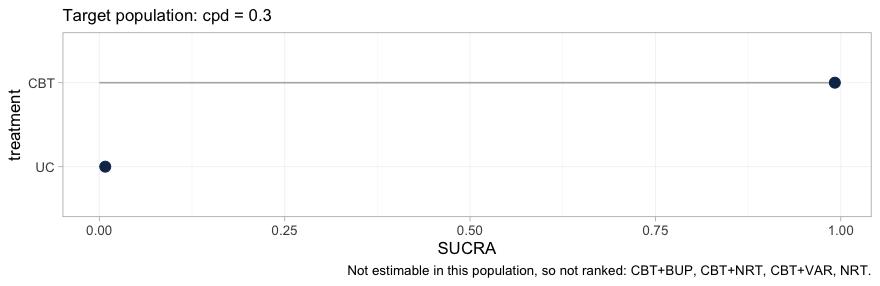

plot of chunk hierarchy

Four of the six treatments are gone. What remains is a two-element
hierarchy, `CBT` above `UC`, and the caption names the four that were
dropped. This is not a failure of the ranking code; it is the
estimability result of the previous section reaching the quantity a
guideline panel is most likely to quote. A SUCRA is computed from a
treatment’s relative effect, so a treatment whose relative effect is not
identified can only be ranked by ranking the prior, and no ranking
metric would carry any trace of the substitution.

The rankogram makes the point more sharply still, because it declines
outright.
[`rank_probs()`](https://choxos.github.io/cpaic/reference/rank_probs.md)
ranks the non-reference treatments, and once the four non-estimable ones
are dropped a single treatment is left, from which no hierarchy can be
formed:

``` r

tryCatch(rank_probs(fit, newdata = target),
         error = function(e) cat("rank_probs() declined:\n ", conditionMessage(e)))
#> rank_probs() declined:
#>   Fewer than two elements are estimable in this target population, so no hierarchy can be formed. See estimable_effects_at().
```

**An error is the correct output here.** A rankogram of this network at
this target population would have been a picture of the prior, drawn
with the same confident bars as a picture of the data, and no diagnostic
downstream of it would have revealed the difference. Refusing is the
whole point of Step 3.

Within the set that *can* be ranked, the hierarchy is still
population-specific, and
[`plot_rank_curve()`](https://choxos.github.io/cpaic/reference/plot_rank_curve.md)
traces it across target populations.

``` r

rc <- rank_curve(fit, em = "cpd", values = seq(-1, 1, by = 0.25))
plot_rank_curve(fit, em = "cpd", values = seq(-1, 1, by = 0.25))
```

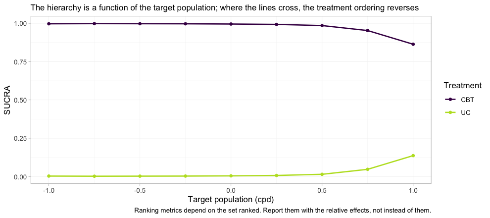

plot of chunk rank-curve

Two cautions in one figure. First, the curves do not cross here, so
counseling beats usual care in every target population; but the margin
erodes steadily, and `CBT`’s SUCRA falls from 0.997 in the
lightest-smoking population to 0.863 in the heaviest, which is what a
component whose interaction with `cpd` is negative should do. In a
network with more estimable contrasts the curves generally *do* cross,
and a hierarchy quoted without a population is then not merely imprecise
but wrong. Second, and more important: the plot shows two treatments
because two is all that could be ranked. It gives no indication that
four others exist. Read a rank curve only after
[`estimable_effects_at()`](https://choxos.github.io/cpaic/reference/estimable_effects_at.md),
never instead of it.

### The contrasts the frequentist bridge gets quietly wrong

Now the uncomfortable part, and the reason the estimability check is not
optional. [`cstc()`](https://choxos.github.io/cpaic/reference/cstc.md)
and [`cmaic()`](https://choxos.github.io/cpaic/reference/cmaic.md)
adjust the **IPD** edges to the target. They cannot adjust the aggregate
edges, because there is no IPD for those trials; the aggregate contrasts
enter
[`cnma_bridge()`](https://choxos.github.io/cpaic/reference/cnma_bridge.md)
**in their own populations**. Nothing warns you. Compare against `UC`,
where the `NRT` edge (`BRIEF-1`, 8-a-day smokers) is doing the work:

``` r

re_stc_uc  <- relative_effects(fit_stc,  reference = "UC")
re_maic_uc <- relative_effects(fit_maic, reference = "UC")
re_bay_uc  <- relative_effects(fit, reference = "UC", newdata = target)

cmp <- do.call(rbind, lapply(setdiff(treatments, "UC"), function(t1) {
  data.frame(
    Contrast    = paste(t1, "vs UC"),
    True_OR     = exp(truth(t1, "UC", 0.3)),
    cSTC        = grab(re_stc_uc,  t1, "UC"),
    `cSTC 95% CI` = sprintf("(%.2f, %.2f)",
                            grab(re_stc_uc, t1, "UC", "lower"),
                            grab(re_stc_uc, t1, "UC", "upper")),
    covers      = ifelse(exp(truth(t1, "UC", 0.3)) >= grab(re_stc_uc, t1, "UC", "lower") &
                         exp(truth(t1, "UC", 0.3)) <= grab(re_stc_uc, t1, "UC", "upper"),
                         "yes", "NO"),
    cMAIC       = grab(re_maic_uc, t1, "UC"),
    `cML-NMR`   = grab(re_bay_uc,  t1, "UC"),
    check.names = FALSE)
}))
knitr::kable(cmp, digits = 2, row.names = FALSE,
  caption = "Odds ratios vs usual care in the target population (cpd = 0.3)")
```

| Contrast      | True_OR | cSTC | cSTC 95% CI  | covers | cMAIC | cML-NMR |
|:--------------|--------:|-----:|:-------------|:-------|------:|--------:|
| NRT vs UC     |    1.46 | 2.23 | (1.82, 2.74) | NO     |  2.23 |      NA |
| CBT vs UC     |    1.63 | 1.66 | (1.43, 1.92) | yes    |  1.68 |    1.51 |
| CBT+NRT vs UC |    2.39 | 3.70 | (2.89, 4.75) | NO     |  3.75 |      NA |
| CBT+VAR vs UC |    4.69 | 7.20 | (5.40, 9.61) | NO     |  7.26 |      NA |
| CBT+BUP vs UC |    2.60 | 3.92 | (2.82, 5.46) | NO     |  3.98 |      NA |

Odds ratios vs usual care in the target population (cpd = 0.3) {.table}

The frequentist bridge prints a confident number for every row. For
`NRT` versus `UC` it prints roughly the odds ratio that held in
`BRIEF-1`’s light-smoking population, because that is the only `NRT`
evidence there is and it entered the bridge unadjusted. But nicotine
replacement loses ground in heavy smokers
($`\Gamma_{\texttt{NRT}} = -0.40`$), so the truth in the *target*
population is materially smaller. Every row that inherits that edge
inherits the error, and the `covers` column shows what that costs: the
95% confidence interval misses the truth.

Now read the last column.
**[`cmlnmr()`](https://choxos.github.io/cpaic/reference/cmlnmr.md)
returns `NA` for exactly the rows the two-stage route is getting wrong,
and a number for exactly the row it is getting right.** That
correspondence is not a coincidence: it is the same piece of linear
algebra, read once as a warning and once as a silent assumption.

Put the two forests side by side and the contrast is the argument of
this vignette in one image. The frequentist bridge, plotted earlier in
this section’s own comparator, filled all five rows. Here is
[`cmlnmr()`](https://choxos.github.io/cpaic/reference/cmlnmr.md) asked
the identical question, against the identical comparator, in the
identical target population:

``` r

forest(fit, newdata = target)
```

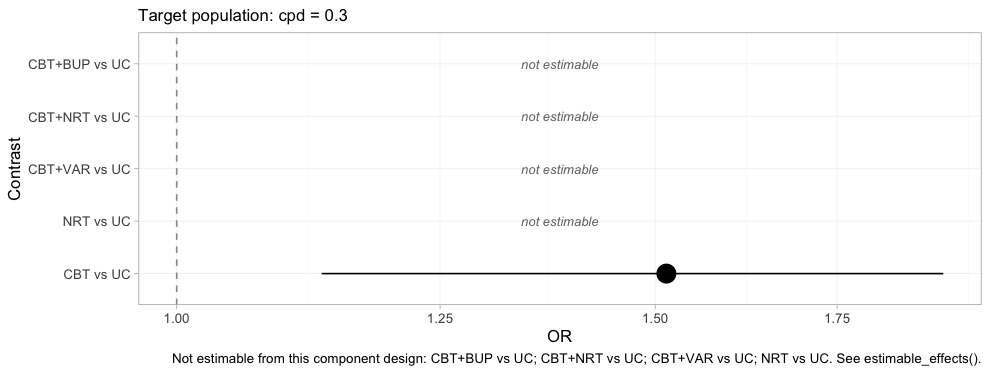

plot of chunk forest-bayes-uc

One row survives, and it is the row the frequentist bridge also got
right. The four blank rows are the four the `covers` column just
convicted. A plot that refuses to draw four fifths of itself is an
uncomfortable deliverable, and it is the correct one: the alternative is
the plot above it, which is complete, confident, and wrong about `NRT`
versus `UC` by a margin its confidence interval does not admit.

### Random effects and model comparison

The random-effects model lets each study-arm deviate from the
component-implied effect; `tau` measures how much. With five contrasts
and four components there is very little information about `tau`, so its
posterior leans on the half-normal(0, 1) prior. Say so, rather than
reporting it as a finding.

``` r

knitr::kable(fit$fit$summary("tau")[, c("variable", "mean", "sd", "q5", "q95",
                                        "rhat", "ess_bulk")], digits = 3)
```

| variable |  mean |    sd |    q5 |   q95 |  rhat | ess_bulk |
|:---------|------:|------:|------:|------:|------:|---------:|
| tau\[1\] | 0.126 | 0.121 | 0.009 | 0.352 | 1.008 |  442.099 |

Compare the random-effects fit against a fixed-effect one by
leave-one-out cross-validation ([Vehtari et al. 2017](#ref-vehtari2017))
and DIC ([Spiegelhalter et al. 2002](#ref-spiegelhalter2002dic)):

``` r

fit_fixed <- cmlnmr(ipd, agd, effect_modifiers = "cpd", inactive = "UC",
                    family = "binomial", trt_effects = "fixed",
                    chains = 4, iter_warmup = 500, iter_sampling = 500,
                    n_int = 64, seed = 1, show_exceptions = FALSE)

loo::loo_compare(list(random = loo::loo(fit), fixed = loo::loo(fit_fixed)))
#>   model elpd_diff se_diff p_worse       diag_diff      diag_elpd
#>   fixed       0.0     0.0      NA                 6 k_psis > 0.7
#>  random      -1.7     0.7    0.99 |elpd_diff| < 4 8 k_psis > 0.7

knitr::kable(data.frame(
  model = c("random", "fixed"),
  DIC   = c(dic(fit)$dic, dic(fit_fixed)$dic),
  p_eff = c(dic(fit)$p_eff, dic(fit_fixed)$p_eff)),
  digits = 1, caption = "Deviance information criterion")
```

| model  |    DIC | p_eff |
|:-------|-------:|------:|
| random | 3019.4 |  16.3 |
| fixed  | 3017.1 |  14.7 |

Deviance information criterion {.table}

The two models sit essentially on top of each other, which is what
should happen: the data really were generated by an additive component
model with no extra study-arm noise, so the random-effects model is
paying for flexibility it does not need. It remains the safer default,
because in a real network you do not get to know that.

A single DIC difference reduces the whole data set to one number. The
dev-dev plot restores the detail: each point is one data point’s
contribution to the posterior mean deviance under each of the two
models.

``` r

plot(dic(fit_fixed), dic(fit), labels = c("fixed", "random"))
```

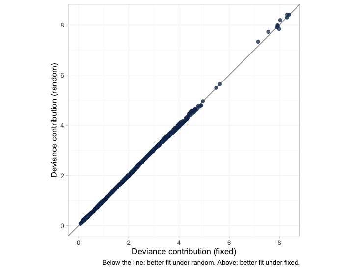

plot of chunk devdev

The points lie along the line of equality with almost no scatter, so the
two models are not merely tied on average; they fit essentially every
arm and every patient the same way. A DIC tie that came instead from one
model fitting some points much better and others much worse would look
nothing like this, and would mean something quite different.

The leverage plot asks the complementary question: is any single data
point distorting the fit?

``` r

plot_leverage(fit)
```

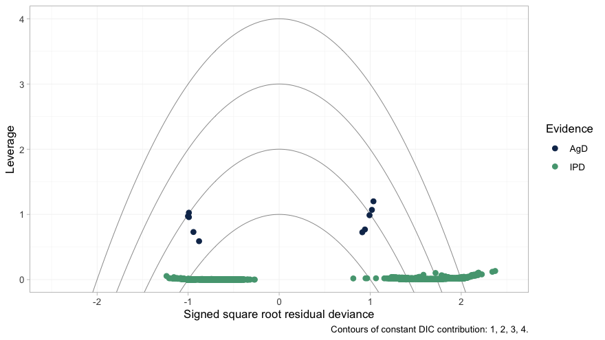

plot of chunk leverage

No point lies outside the `DIC = 3` contour, so nothing is spoiling the
fit. The structure worth noticing is the separation between the two
colors. The individual patients (green) sit along leverage zero, each
contributing almost nothing on its own; the aggregate arms (navy) sit an
order of magnitude higher. That is exactly as it should be, and it is
the same fact that the next paragraph reaches from the other direction.

Two cautions on reading these numbers. First, LOO’s Pareto-$`k`$
diagnostic flags several observations. It is right to: **each aggregate
arm is a single “observation” that carries an entire trial’s worth of
information**, so leaving it out is a large perturbation and the
importance-sampling approximation strains. Treat the LOO comparison of
an IPD-plus-aggregate model as indicative, and read it alongside DIC.
Second, neither criterion can test the assumption that actually bridges
the gap; nor can the Cochran $`Q`$ of the frequentist bridge, which is
why
[`additivity_test()`](https://choxos.github.io/cpaic/reference/additivity_test.md)
says so out loud:

``` r

additivity_test(fit_stc)
#> Additive component model: fit statistics
#>   Total lack of fit (Q.additive): Q = 3.101, df = 3, p = 0.376
#>   Additivity restrictions (Q.diff): not available; no standard NMA
#>     is estimable on a disconnected network.
#>   Note: neither statistic tests whether component effects are constant
#>   ACROSS sub-networks, which is the assumption that bridges the gap.
#>   That assumption is untestable from the data and must be justified
#>   clinically.
```

The additive model fits the observed contrasts comfortably here. Do not
read that as reassurance about the bridge: a `Q` this size is consistent
with an additive model *and* with the population mismatch we are about
to expose, and it says nothing whatever about whether the component
effects are the same on both sides of the gap. (In
[`vignette("count-outcomes")`](https://choxos.github.io/cpaic/articles/count-outcomes.md)
the same statistic comes out large, for a reason that has nothing to do
with additivity.)

### Prior sensitivity

The interactions $`\Gamma`$ are where the identification problem lives,
so look at them alone before perturbing anything.

``` r

plot_prior_posterior(fit, prior = "gamma")
```


plot of chunk prior-posterior-gamma

Three of the four posteriors have collapsed to a narrow spike well
inside the `normal(0, 1)` prior: those are the interactions for `CBT`,
`NRT` and `VAR`, the three components that the two IPD trials touch, and
they are estimated from within-trial covariate variation. The fourth,
`gamma[1,1]`, is bupropion, and its histogram traces the prior curve.
**The prior is not a formality for that parameter; it is the entire
posterior.** Whatever `prior_gamma_scale` we had chosen, the data would
have returned it unchanged, and any contrast that leans on it inherits
that property while continuing to look like an estimate.

Prior movement is the empirical definition of identification: a contrast
that moves when you change a prior it should not depend on was never
data-driven.
[`prior_sensitivity()`](https://choxos.github.io/cpaic/reference/prior_sensitivity.md)
refits under a tighter and a looser interaction prior and reports how
far each contrast travels. **It deliberately reports movement for
non-estimable contrasts too**, bypassing the `NA` mask, so you can see
the mechanism rather than take it on trust.

``` r

ps <- prior_sensitivity(fit, newdata = target, reference = "NRT",
                        prior = "gamma", tighter = 0.5, looser = 2,
                        chains = 2, iter_warmup = 250, iter_sampling = 250)
ps
#> cML-NMR prior sensitivity: gamma prior
#>  treatment comparator estimate tighter looser move_tighter move_looser max_movement estimable
#>        CBT        NRT   -0.076  -0.087 -0.066        0.012       0.010        0.012     FALSE
#>    CBT+BUP        NRT    0.294   0.366  0.158        0.073       0.135        0.135     FALSE
#>    CBT+NRT        NRT    0.406   0.405  0.416        0.001       0.009        0.009      TRUE
#>    CBT+VAR        NRT    1.018   1.022  1.026        0.004       0.008        0.008      TRUE
#>         UC        NRT   -0.482  -0.493 -0.482        0.010       0.001        0.010     FALSE
```

Read the `max_movement` column against `estimable`. Every contrast the
criterion calls estimable is prior-insensitive; every contrast it
rejects moves with the prior. That is what “not identified” *means*:
there is no likelihood ridge holding the posterior in place, so the
prior fills the vacuum, and the posterior looks perfectly healthy while
doing it. The criterion and the sampler agree, which is the check the
package’s own validation script performs.

## What to take away

|  | Adjusts the population | Bridges the gap | Reports non-identified effects |
|----|----|----|----|
| Standard NMA | no | no | not at all; they lie outside the model |
| ML-NMR | yes | no | yes, as prior-driven numbers |
| [`cstc()`](https://choxos.github.io/cpaic/reference/cstc.md) / [`cmaic()`](https://choxos.github.io/cpaic/reference/cmaic.md) + [`cnma_bridge()`](https://choxos.github.io/cpaic/reference/cnma_bridge.md) | IPD edges only | yes | **yes, silently** |
| [`cmlnmr()`](https://choxos.github.io/cpaic/reference/cmlnmr.md) | yes, all edges | yes | no: returns `NA` |

- **Name the population.** With effect modifiers there is no
  population-free relative effect.
  [`relative_effects()`](https://choxos.github.io/cpaic/reference/relative_effects.md)
  will not let you pretend otherwise, and the odds ratio for `CBT+VAR`
  versus `NRT` genuinely runs from about 2 to about 5 across plausible
  target populations.
- **Reconnecting is not identifying.** The component design here has
  full column rank, so an aggregate-data component NMA identifies every
  component effect; the *population-adjusted* effects are still not all
  identified, because the interactions are not. Run
  [`estimable_effects_at()`](https://choxos.github.io/cpaic/reference/estimable_effects_at.md)
  and believe it.
- **Pick your estimand deliberately.**
  [`cstc()`](https://choxos.github.io/cpaic/reference/cstc.md) and
  [`cmlnmr()`](https://choxos.github.io/cpaic/reference/cmlnmr.md) give
  a conditional odds ratio;
  [`cmaic()`](https://choxos.github.io/cpaic/reference/cmaic.md) gives a
  marginal one. On a non-collapsible scale they differ even when all
  three are right.

Three honest limitations.

1.  **The bridging assumption is untestable.** Reconnecting through
    shared components requires component effects *and their interactions
    with the effect modifiers* to be the same in both sub-networks.
    There is, by construction, no cross-gap evidence with which to test
    that.
    [`additivity_test()`](https://choxos.github.io/cpaic/reference/additivity_test.md)
    tests additivity *within* what the data can see and cannot touch
    this; the assumption must be defended clinically ([Veroniki et al.
    2026](#ref-Veroniki2026)).
2.  **The two-stage route leaves the aggregate edges unadjusted.**
    [`cstc()`](https://choxos.github.io/cpaic/reference/cstc.md) and
    [`cmaic()`](https://choxos.github.io/cpaic/reference/cmaic.md)
    adjust only the edges where you hold IPD. Every aggregate edge
    enters the bridge in its own trial’s population, and the additive
    model then propagates that mismatch into any contrast that leans on
    it, with no warning, and, as the `covers` column showed, with an
    interval that can exclude the truth. Use the two-stage route when
    the aggregate edges sit close to the target or their components are
    not effect-modified; otherwise prefer
    [`cmlnmr()`](https://choxos.github.io/cpaic/reference/cmlnmr.md),
    which integrates each aggregate study over its own covariate
    distribution and tells you when it cannot answer.
3.  **The bridge mixes estimands, and dilutes the adjustment.** Two
    related problems, both visible above. First, the additive component
    model is a model for *conditional*, link-scale effects; marginal log
    odds ratios do not add across components, so feeding
    [`cmaic()`](https://choxos.github.io/cpaic/reference/cmaic.md)
    contrasts into
    [`cnma_bridge()`](https://choxos.github.io/cpaic/reference/cnma_bridge.md)
    mixes currencies on a non-collapsible scale. (The published
    aggregate contrasts are marginal too, so even the
    [`cstc()`](https://choxos.github.io/cpaic/reference/cstc.md) route
    pools conditional IPD edges with marginal aggregate ones.) Second,
    the adjusted IPD edge is only ever a *share* of the weight on its
    contrast, so the population adjustment is diluted by however much
    unadjusted aggregate evidence sits alongside it. Both problems are
    milder on a collapsible measure; see
    [`vignette("count-outcomes")`](https://choxos.github.io/cpaic/articles/count-outcomes.md),
    where the rate ratio is collapsible and the conditional and marginal
    estimands very nearly coincide.

## References

Greenland, Sander, James M. Robins, and Judea Pearl. 1999. “Confounding
and Collapsibility in Causal Inference.” *Statistical Science* 14 (1):
29–46. <https://doi.org/10.1214/ss/1009211805>.

Phillippo, David M., Sofia Dias, A. E. Ades, et al. 2020. “Multilevel
Network Meta-Regression for Population-Adjusted Treatment Comparisons.”
*Journal of the Royal Statistical Society: Series A* 183 (3): 1189–210.
<https://doi.org/10.1111/rssa.12579>.

Remiro-Azócar, Antonio, Anna Heath, and Gianluca Baio. 2022. “Conflating
Marginal and Conditional Treatment Effects: Comments on ‘Assessing the
Performance of Population Adjustment Methods for Anchored Indirect
Comparisons: A Simulation Study’.” *Statistics in Medicine* 41 (9):
1541–53. <https://doi.org/10.1002/sim.9286>.

Rücker, Gerta, Maria Petropoulou, and Guido Schwarzer. 2020. “Network
Meta-Analysis of Multicomponent Interventions.” *Biometrical Journal* 62
(3): 808–21. <https://doi.org/10.1002/bimj.201800167>.

Signorovitch, James E., Eric Q. Wu, Andrew P. Yu, et al. 2010.
“Comparative Effectiveness Without Head-to-Head Trials: A Method for
Matching-Adjusted Indirect Comparisons Applied to Psoriasis Treatment
with Adalimumab or Etanercept.” *PharmacoEconomics* 28 (10): 935–45.
<https://doi.org/10.2165/11538370-000000000-00000>.

Spiegelhalter, David J., Nicola G. Best, Bradley P. Carlin, and Angelika
van der Linde. 2002. “Bayesian Measures of Model Complexity and Fit.”
*Journal of the Royal Statistical Society: Series B* 64 (4): 583–639.
<https://doi.org/10.1111/1467-9868.00353>.

Vehtari, Aki, Andrew Gelman, and Jonah Gabry. 2017. “Practical Bayesian
Model Evaluation Using Leave-One-Out Cross-Validation and WAIC.”
*Statistics and Computing* 27 (5): 1413–32.
<https://doi.org/10.1007/s11222-016-9696-9>.

Veroniki, Areti Angeliki, Georgios Seitidis, Sofia Tsokani, et al. 2026.
“Analysing Component Network Meta-Analysis in Disconnected Networks:
Guidance for Practice.” *BMJ*.

Wigle, Augustine, Audrey Béliveau, Adriani Nikolakopoulou, and Lifeng
Lin. 2026. *Creating Treatment and Component Hierarchies in Component
Network Meta-Analysis*.
