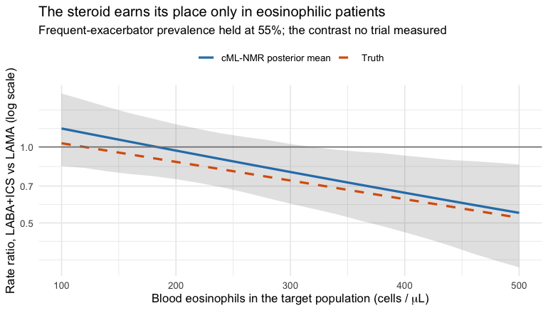

# Count outcomes: a disconnected COPD exacerbation network

``` r

library(cpaic)
library(ggplot2)
set.seed(2027)
```

This vignette is a complete worked example for a **count** endpoint with
an **exposure offset**: exacerbation *rates*, in a treatment network
that is **disconnected** and whose trials enrolled **different
patients**. As in
[`vignette("binary-outcomes")`](https://choxos.github.io/cpaic/articles/binary-outcomes.md)
we run both routes, the frequentist two-stage route
([`cstc()`](https://choxos.github.io/cpaic/reference/cstc.md) /
[`cmaic()`](https://choxos.github.io/cpaic/reference/cmaic.md) into
[`cnma_bridge()`](https://choxos.github.io/cpaic/reference/cnma_bridge.md))
and the one-stage Bayesian route
([`cmlnmr()`](https://choxos.github.io/cpaic/reference/cmlnmr.md)); but
three things are new here and they are the reason to read this one as
well:

- the **log link with an offset**, so the estimand is a **rate ratio**;
- **two** effect modifiers, one continuous and one binary, which turns
  out to make the aggregate-only components *harder*, not easier, to
  identify;
- the rate ratio is **collapsible**, unlike the odds ratio, so
  [`cstc()`](https://choxos.github.io/cpaic/reference/cstc.md) and
  [`cmaic()`](https://choxos.github.io/cpaic/reference/cmaic.md) target
  nearly the same estimand here, where on the odds-ratio scale they do
  not.

> **The data here are entirely simulated.** The clinical setting
> (maintenance inhaler therapy in COPD) supplies only the vocabulary,
> because inhaled regimens are genuinely multi-component:
> bronchodilators and steroids are combined in one device. No number
> below is taken from any trial or publication. We set the true
> parameter values ourselves, which is exactly what lets us check
> whether each method recovers them.

## The clinical question

Write `PBO` for placebo (the inactive comparator) and use four active
components:

- `LABA`: a long-acting beta-agonist,
- `LAMA`: a long-acting muscarinic antagonist,
- `ICS`: an inhaled corticosteroid,
- `ROF`: roflumilast, an oral add-on.

The outcome is the **number of moderate-to-severe exacerbations** a
patient has during follow-up. Follow-up length differs between patients
(people drop out), so the outcome is a count *per person-year*: a rate.
**Lower is better**, so a rate ratio below 1 favors the active arm.

The trials split into two groups that share **no treatment**:

- **Sub-network 1**, older placebo-controlled monotherapy trials: `PBO`
  vs `LABA` (three times), `PBO` vs `LAMA` (once).
- **Sub-network 2**, newer trials on a `LABA` backbone: `LABA+ICS` vs
  `LABA+LAMA` (twice), and `LABA+LAMA` vs `LABA+LAMA+ROF` (once).

No trial links the two groups. A formulary committee nevertheless has to
ask: **how does the ICS-containing dual inhaler (`LABA+ICS`) compare
with `LAMA` monotherapy?** That contrast crosses the gap.

The two groups also enrolled different patients, on two axes that
matter:

- `eos`: the **blood eosinophil count**, coded as
  `(cells per microliter - 200) / 100`, so `eos = 0` is 200 cells and
  `eos = 1.5` is 350 cells. It is continuous, and it modifies the
  steroid effect.
- `freqex`: a **frequent exacerbator** indicator (two or more
  exacerbations in the year before enrolment). It is binary, it is
  strongly *prognostic*, and it modifies the `LAMA` effect.

A binary covariate and a continuous one need different integration
margins, and cpaic picks them automatically: a 0/1 covariate gets a
**Bernoulli** margin, so that integration points land on `{0, 1}` and
not somewhere in between, and anything else gets a **normal** margin.
Integrating a binary covariate as though it were normal would average
the model over patients who cannot exist.

## The model

[`cmlnmr()`](https://choxos.github.io/cpaic/reference/cmlnmr.md) fits an
individual-level Poisson regression with a log link and a **log-exposure
offset** to every patient, whether that patient’s data arrive as IPD or
are integrated out of an aggregate arm:
``` math
\log \mathbb{E}[y_{ijk} \mid x_i]
  \;=\; \log T_i \;+\; \mu_j + x_i^\top b \;+\; C_k^\top(\beta + \Gamma x_i),
```
where $`T_i`$ is patient $`i`$’s person-time, $`j`$ indexes the study,
$`k`$ the treatment, and $`C_k`$ says which components treatment $`k`$
contains. The offset has coefficient fixed at 1, which is what turns a
model for *counts* into a model for *rates*.

The relative effect is again population-specific,
``` math
\theta_t(x) - \theta_u(x) \;=\; (C_t - C_u)^\top(\beta + \Gamma x),
```
now a **log rate ratio** rather than a log odds ratio. There is no
population-free answer, so
[`relative_effects()`](https://choxos.github.io/cpaic/reference/relative_effects.md)
requires `newdata`.

### The log link is nonlinear, so you cannot plug in the mean

An aggregate arm reports a total event count and total person-time, plus
the *mean* of each covariate. It is tempting to evaluate the model at
that mean. It is also wrong. By Jensen’s inequality,
``` math
\mathbb{E}\big[\exp(\eta(x))\big] \;\neq\; \exp\big(\eta(\mathbb{E}[x])\big),
```
and for a convex function the plug-in *understates* the average rate.
The gap is the classic **aggregation bias** of study-level
meta-regression ([Berlin et al. 2002](#ref-berlin2002ecological)).
[`cmlnmr()`](https://choxos.github.io/cpaic/reference/cmlnmr.md)
therefore does not plug in: it evaluates the individual model at
quasi-Monte-Carlo points drawn from each study’s own covariate
distribution (coupled by a Gaussian copula whose correlation is
estimated *within* the IPD studies) and averages the **rate**, on its
natural scale, before comparing it with the observed count ([Phillippo
et al. 2020](#ref-phillippo2020mlnmr)).

### The rate ratio is collapsible, and the odds ratio is not

This is the sharpest contrast with
[`vignette("binary-outcomes")`](https://choxos.github.io/cpaic/articles/binary-outcomes.md).
Under a log link with no treatment-by-covariate interaction, the
population-average (marginal) rate ratio *equals* the individual
(conditional) one:
``` math
\frac{\mathbb{E}_x[\exp(\eta_t(x))]}{\mathbb{E}_x[\exp(\eta_u(x))]}
 \;=\; \exp(\theta_t - \theta_u)
 \qquad\text{when } \Gamma = 0 .
```
The rate ratio is **collapsible**; the odds ratio is not ([Greenland et
al. 1999](#ref-greenland1999)). So the estimand gap between
[`cstc()`](https://choxos.github.io/cpaic/reference/cstc.md)
(conditional) and
[`cmaic()`](https://choxos.github.io/cpaic/reference/cmaic.md)
(marginal) that we saw on the odds-ratio scale largely closes here
([Remiro-Azócar et al. 2022](#ref-remiro2022)). What survives is a
second-order Jensen term whenever $`\Gamma \neq 0`$, because then the
two arms’ rates are averaged over the covariate distribution with
different exponents. The two methods should agree closely, and disagree
a little, and both statements are informative.

## Setting up the data

We set the truth ourselves. The component effects `beta_true` are log
rate ratios at the covariate origin, and `Gamma_true` is a
components-by-modifiers matrix: the steroid works much better in
eosinophilic patients, and `LAMA` works much better in frequent
exacerbators.

``` r

treatments <- c("PBO", "LABA", "LAMA", "LABA+ICS", "LABA+LAMA", "LABA+LAMA+ROF")
Cmat <- build_C_matrix(treatments, inactive = "PBO")
Cmat
#>               ICS LABA LAMA ROF
#> PBO             0    0    0   0
#> LABA            0    1    0   0
#> LAMA            0    0    1   0
#> LABA+ICS        1    1    0   0
#> LABA+LAMA       0    1    1   0
#> LABA+LAMA+ROF   0    1    1   1

beta_true <- c(ICS = -0.25, LABA = -0.15, LAMA = -0.22, ROF = -0.12)
Gamma_true <- rbind(                       # rows: components; columns: modifiers
  ICS  = c(eos = -0.18, freqex = -0.10),   # steroid: much better if eosinophilic
  LABA = c(eos =  0.02, freqex = -0.02),
  LAMA = c(eos =  0.01, freqex = -0.20),   # LAMA: much better if a frequent exacerbator
  ROF  = c(eos =  0.00, freqex = -0.05))
b_prog <- c(eos = 0.05, freqex = 0.55)     # frequent exacerbators exacerbate more, whatever the arm

# theta_t(x) = C_t' (beta + Gamma x): the TRUE conditional log rate ratio vs PBO.
theta <- function(trt, x) {
  ct <- Cmat[trt, ]
  comps <- names(ct)
  sum(ct * beta_true[comps]) + sum(ct * (Gamma_true[comps, , drop = FALSE] %*% x))
}
knitr::kable(Gamma_true, caption = "Gamma: component x effect-modifier interactions (the truth)")
```

|      |   eos | freqex |
|:-----|------:|-------:|
| ICS  | -0.18 |  -0.10 |
| LABA |  0.02 |  -0.02 |
| LAMA |  0.01 |  -0.20 |
| ROF  |  0.00 |  -0.05 |

Gamma: component x effect-modifier interactions (the truth) {.table}

The headline contrast, `LABA+ICS` versus `LAMA`, has component vector
$`C_{\texttt{LABA+ICS}} - C_{\texttt{LAMA}} = e_{\texttt{LABA}} + e_{\texttt{ICS}} - e_{\texttt{LAMA}}`$,
so its true value is exactly
``` math
\theta(x) = -0.18 \;-\; 0.17\,\texttt{eos} \;+\; 0.08\,\texttt{freqex},
```
which is a rate ratio near 1 in a low-eosinophil population and around
0.68 in a high-eosinophil one. One number cannot serve both.

Seven trials. Two are ours (IPD); five are published (aggregate only).

``` r

design <- data.frame(
  study  = c("MONO-1", "MONO-2", "MONO-3", "MONO-4", "ADD-1", "ADD-2", "ADD-3"),
  arm1   = c("PBO", "PBO", "PBO", "PBO",
             "LABA+ICS", "LABA+LAMA", "LABA+ICS"),
  arm2   = c("LABA", "LAMA", "LABA", "LABA",
             "LABA+LAMA", "LABA+LAMA+ROF", "LABA+LAMA"),
  n      = c(600, 600, 400, 350, 600, 550, 450),   # per arm
  mu     = c(0.10, 0.05, 0.15, 0.12, 0.20, 0.25, 0.18),
  eos_m  = c(0.2, -0.3, 0.0, 0.4, 0.8, 1.0, 0.6),  # covariate means
  eos_s  = c(1.0,  0.9, 1.0, 1.0, 1.1, 1.0, 1.0),
  fx_p   = c(0.35, 0.30, 0.40, 0.45, 0.55, 0.65, 0.50),
  ipd    = c(TRUE, FALSE, FALSE, FALSE, TRUE, FALSE, FALSE),
  stringsAsFactors = FALSE
)
knitr::kable(design, caption = "Trial design. MONO-* are older; ADD-* newer.")
```

| study  | arm1      | arm2          |   n |   mu | eos_m | eos_s | fx_p | ipd   |
|:-------|:----------|:--------------|----:|-----:|------:|------:|-----:|:------|
| MONO-1 | PBO       | LABA          | 600 | 0.10 |   0.2 |   1.0 | 0.35 | TRUE  |
| MONO-2 | PBO       | LAMA          | 600 | 0.05 |  -0.3 |   0.9 | 0.30 | FALSE |
| MONO-3 | PBO       | LABA          | 400 | 0.15 |   0.0 |   1.0 | 0.40 | FALSE |
| MONO-4 | PBO       | LABA          | 350 | 0.12 |   0.4 |   1.0 | 0.45 | FALSE |
| ADD-1  | LABA+ICS  | LABA+LAMA     | 600 | 0.20 |   0.8 |   1.1 | 0.55 | TRUE  |
| ADD-2  | LABA+LAMA | LABA+LAMA+ROF | 550 | 0.25 |   1.0 |   1.0 | 0.65 | FALSE |
| ADD-3  | LABA+ICS  | LABA+LAMA     | 450 | 0.18 |   0.6 |   1.0 | 0.50 | FALSE |

Trial design. MONO-\* are older; ADD-\* newer. {.table
style="width:100%;"}

Note which edges are aggregate-only, because it will matter later:
**`LAMA` versus `PBO` is measured by exactly one trial (`MONO-2`,
aggregate), and roflumilast by exactly one (`ADD-2`, aggregate).**

``` r

gen_arm <- function(study, trt, n, mu, em, es, fp) {
  freqex <- rbinom(n, 1, fp)
  # eosinophils and exacerbation history are correlated within a trial
  eos    <- rnorm(n, em + 0.25 * (freqex - fp), es)
  expo   <- pmin(rexp(n, rate = 0.25), 1)     # person-years, censored at 1
  x      <- cbind(eos, freqex)
  lograte <- mu + as.vector(x %*% b_prog) +
    vapply(seq_len(n), function(i) theta(trt, x[i, ]), numeric(1))
  data.frame(.study = study, .trt = trt,
             .y = rpois(n, expo * exp(lograte)), .exposure = expo,
             eos = eos, freqex = freqex, stringsAsFactors = FALSE)
}
patients <- do.call(rbind, lapply(seq_len(nrow(design)), function(i) {
  d <- design[i, ]
  rbind(gen_arm(d$study, d$arm1, d$n, d$mu, d$eos_m, d$eos_s, d$fx_p),
        gen_arm(d$study, d$arm2, d$n, d$mu, d$eos_m, d$eos_s, d$fx_p))
}))
is_ipd <- patients$.study %in% design$study[design$ipd]
```

The two routes want different data shapes.
[`cmlnmr()`](https://choxos.github.io/cpaic/reference/cmlnmr.md) takes
patient rows (with an `.exposure` column) plus **arm-level** aggregate
rows: total events `r`, total person-time `E`, and each modifier’s
summary. The continuous modifier needs a `_mean` and an `_sd`; the
binary one needs only a `_mean`, which *is* its prevalence, because a
Bernoulli’s mean determines its variance.

``` r

ipd <- patients[is_ipd, ]
agd <- do.call(rbind, lapply(
  split(patients[!is_ipd, ], ~ .study + .trt, drop = TRUE),
  function(d) data.frame(
    .study = d$.study[1], .trt = d$.trt[1],
    r = sum(d$.y), E = sum(d$.exposure),
    eos_mean = mean(d$eos), eos_sd = sd(d$eos),
    freqex_mean = mean(d$freqex), stringsAsFactors = FALSE)))
agd <- agd[order(agd$.study, agd$.trt), ]
rownames(agd) <- NULL
knitr::kable(agd, digits = 3, caption = "Aggregate arms: events, person-time, covariate summaries")
```

| .study | .trt          |   r |       E | eos_mean | eos_sd | freqex_mean |
|:-------|:--------------|----:|--------:|---------:|-------:|------------:|
| ADD-2  | LABA+LAMA     | 576 | 495.260 |    1.008 |  0.944 |       0.667 |
| ADD-2  | LABA+LAMA+ROF | 525 | 489.079 |    0.988 |  1.023 |       0.645 |
| ADD-3  | LABA+ICS      | 443 | 402.532 |    0.561 |  0.973 |       0.507 |
| ADD-3  | LABA+LAMA     | 421 | 401.098 |    0.649 |  1.016 |       0.507 |
| MONO-2 | LAMA          | 501 | 524.945 |   -0.260 |  0.886 |       0.288 |
| MONO-2 | PBO           | 640 | 530.543 |   -0.319 |  0.921 |       0.293 |
| MONO-3 | LABA          | 466 | 361.710 |    0.005 |  1.012 |       0.408 |
| MONO-3 | PBO           | 524 | 353.593 |    0.127 |  0.999 |       0.402 |
| MONO-4 | LABA          | 404 | 308.161 |    0.428 |  1.026 |       0.491 |
| MONO-4 | PBO           | 435 | 302.285 |    0.349 |  0.995 |       0.463 |

Aggregate arms: events, person-time, covariate summaries {.table}

[`cpaic_network()`](https://choxos.github.io/cpaic/reference/cpaic_network.md)
takes **contrast-level** aggregate data, one row per comparison, on the
log-rate scale (`sm = "IRR"`). The two IPD studies appear here too, with
their *unadjusted* contrasts, which
[`cstc()`](https://choxos.github.io/cpaic/reference/cstc.md) and
[`cmaic()`](https://choxos.github.io/cpaic/reference/cmaic.md) will
replace:

``` r

contrast_of <- function(d, a1, a2) {
  cell <- function(a) {
    s <- d[d$.trt == a, ]; c(r = sum(s$.y), E = sum(s$.exposure))
  }
  x2 <- cell(a2); x1 <- cell(a1)
  data.frame(
    studlab = d$.study[1], treat1 = a2, treat2 = a1,
    TE   = unname(log(x2["r"] / x2["E"]) - log(x1["r"] / x1["E"])),
    seTE = unname(sqrt(1 / x2["r"] + 1 / x1["r"])),
    stringsAsFactors = FALSE)
}
agd_contr <- do.call(rbind, lapply(seq_len(nrow(design)), function(i) {
  d <- design[i, ]
  contrast_of(patients[patients$.study == d$study, ], d$arm1, d$arm2)
}))
knitr::kable(agd_contr, digits = 3, caption = "Unadjusted log rate ratios")
```

| studlab | treat1        | treat2    |     TE |  seTE |
|:--------|:--------------|:----------|-------:|------:|
| MONO-1  | LABA          | PBO       | -0.179 | 0.054 |
| MONO-2  | LAMA          | PBO       | -0.234 | 0.060 |
| MONO-3  | LABA          | PBO       | -0.140 | 0.064 |
| MONO-4  | LABA          | PBO       | -0.093 | 0.069 |
| ADD-1   | LABA+LAMA     | LABA+ICS  |  0.086 | 0.060 |
| ADD-2   | LABA+LAMA+ROF | LABA+LAMA | -0.080 | 0.060 |
| ADD-3   | LABA+LAMA     | LABA+ICS  | -0.047 | 0.068 |

Unadjusted log rate ratios {.table}

``` r

net <- cpaic_network(agd_contr, ipd = ipd, sm = "IRR", family = "poisson",
                     inactive = "PBO", ipd_covariates = c("eos", "freqex"),
                     ipd_exposure = ".exposure")
cpaic_connectivity(net)
#> cpaic connectivity
#>   Connected network: FALSE
#>   Sub-networks:      2
#>     [1] 3 treatments
#>     [2] 3 treatments
#>   Bridging components: LABA, LAMA
#>   Component design:  rank(X) = 4 / 4 components -> all component effects identified
#>   Estimable effects: 5 / 5 vs PBO
```

Two sub-networks, bridged by `LABA` and `LAMA`, and the component design
matrix $`X = BC`$ has **full column rank**: an aggregate-data component
NMA would identify every component effect and every relative effect
([Rücker et al. 2020](#ref-rucker2020cnma); [Wigle et al.
2026](#ref-Wigle2026)). Hold that thought.

## Covariate balance

``` r

balance <- do.call(rbind, lapply(split(patients, patients$.study), function(d)
  data.frame(Study = d$.study[1],
             Eosinophils = 200 + 100 * mean(d$eos),
             eos_mean = mean(d$eos), eos_sd = sd(d$eos),
             freqex = mean(d$freqex),
             Rate_per_year = sum(d$.y) / sum(d$.exposure))))
knitr::kable(balance, digits = 2, row.names = FALSE,
             caption = "Effect-modifier balance across the seven trials")
```

| Study  | Eosinophils | eos_mean | eos_sd | freqex | Rate_per_year |
|:-------|------------:|---------:|-------:|-------:|--------------:|
| ADD-1  |      280.29 |     0.80 |   1.10 |   0.55 |          1.04 |
| ADD-2  |      299.80 |     1.00 |   0.98 |   0.66 |          1.12 |
| ADD-3  |      260.53 |     0.61 |   0.99 |   0.51 |          1.08 |
| MONO-1 |      220.10 |     0.20 |   1.01 |   0.33 |          1.32 |
| MONO-2 |      171.03 |    -0.29 |   0.90 |   0.29 |          1.08 |
| MONO-3 |      206.57 |     0.07 |   1.01 |   0.41 |          1.38 |
| MONO-4 |      238.85 |     0.39 |   1.01 |   0.48 |          1.37 |

Effect-modifier balance across the seven trials {.table}

The older `MONO-*` trials enrolled patients around 170-240 eosinophils,
of whom roughly a third were frequent exacerbators. The newer `ADD-*`
trials enrolled patients around 260-300 eosinophils, of whom more than
half were. The two sub-networks are not comparing the same people, and
both covariates move together, which is why the integration uses a
copula rather than treating them as independent.

We must name a **target population**. Take the patients a formulary
committee is actually deciding for: an eosinophilic, frequently
exacerbating group (350 cells, 55% frequent exacerbators). We will also
ask for a low-eosinophil, infrequently exacerbating population, where
the answer is quite different.

``` r

target     <- data.frame(eos =  1.5, freqex = 0.55)   # 350 cells, 55% frequent
target_low <- data.frame(eos = -0.5, freqex = 0.20)   # 150 cells, 20% frequent
```

## Fitting

### Route 1: two stages, frequentist

[`cstc()`](https://choxos.github.io/cpaic/reference/cstc.md) regresses
the count on treatment, the covariate main effects, and
treatment-by-modifier interactions, with a `log(exposure)` offset and
the modifiers centered at the target; its treatment coefficient is then
the population-adjusted **conditional** log rate ratio in the target
population.
[`cmaic()`](https://choxos.github.io/cpaic/reference/cmaic.md) reweights
each IPD trial so its modifier distribution matches the target
([Signorovitch et al. 2010](#ref-signorovitch2010)) and refits a
weighted Poisson model with the same offset, giving a **marginal** log
rate ratio. Both hand their adjusted contrasts to
[`cnma_bridge()`](https://choxos.github.io/cpaic/reference/cnma_bridge.md).

``` r

ems <- c("eos", "freqex")

fit_stc <- cstc(net, target = c(eos = 1.5, freqex = 0.55), effect_modifiers = ems)

fit_maic <- cmaic(net, target = c(eos = 1.5, freqex = 0.55),
                  target_sd = c(eos = 1.0),      # only the continuous one needs an SD
                  effect_modifiers = ems, n_boot = 200, seed = 9)
effective_sample_size(fit_maic)
#>   MONO-1    ADD-1 
#> 236.6135 823.9037
```

`target_sd` names only `eos`. A Bernoulli variable’s mean fixes its
variance, so matching `freqex`’s prevalence already matches its second
moment; there is nothing extra to ask for.

Matching costs information, and the effective sample sizes show how
much. `MONO-1` is the trial furthest from the target on both covariates,
and it pays heavily: most of its patients receive very little weight,
because the target population barely resembles them. That number is a
warning, not a diagnostic to be optimized away; a small ESS means the
adjusted contrast rests on a handful of patients ([Phillippo et al.
2018](#ref-phillippo2018)).

### Two routes, two estimands

The two methods target different things, and we can check that directly.
The adjusted contrast each hands to the bridge is stored on the fitted
object, so we can line it up against the estimand it is *supposed* to be
hitting: the true conditional log rate ratio in closed form, and the
true marginal one by G-computation over the target population.

``` r

edge <- function(fitobj, study) {
  a <- fitobj$bridge$network$agd
  a$TE[a$studlab == study]
}
mu_of <- function(s) design$mu[design$study == s]

# true MARGINAL log rate ratio in the target population, by G-computation
mc_marginal <- function(mu, t1, t2, M = 3e5) {
  fx <- rbinom(M, 1, 0.55)
  x  <- cbind(eos = rnorm(M, 1.5, 1.0), freqex = fx)
  rate <- function(t) mean(exp(mu + as.vector(x %*% b_prog) +
    vapply(seq_len(M), function(i) theta(t, x[i, ]), numeric(1))))
  log(rate(t1)) - log(rate(t2))
}

x_tgt <- c(eos = 1.5, freqex = 0.55)
truth <- function(t1, t2, x) theta(t1, x) - theta(t2, x)

knitr::kable(data.frame(
  Edge = c("MONO-1: LABA vs PBO", "ADD-1: LABA+LAMA vs LABA+ICS"),
  true_conditional = c(truth("LABA", "PBO", x_tgt),
                       truth("LABA+LAMA", "LABA+ICS", x_tgt)),
  cSTC             = c(edge(fit_stc, "MONO-1"), edge(fit_stc, "ADD-1")),
  true_marginal    = c(mc_marginal(mu_of("MONO-1"), "LABA", "PBO"),
                       mc_marginal(mu_of("ADD-1"), "LABA+LAMA", "LABA+ICS")),
  cMAIC            = c(edge(fit_maic, "MONO-1"), edge(fit_maic, "ADD-1"))),
  digits = 3, row.names = FALSE,
  caption = "Adjusted log rate ratios handed to the bridge, against the estimand each targets")
```

| Edge                         | true_conditional |   cSTC | true_marginal |  cMAIC |
|:-----------------------------|-----------------:|-------:|--------------:|-------:|
| MONO-1: LABA vs PBO          |           -0.131 | -0.181 |        -0.132 | -0.274 |
| ADD-1: LABA+LAMA vs LABA+ICS |            0.260 |  0.254 |         0.249 |  0.203 |

Adjusted log rate ratios handed to the bridge, against the estimand each
targets {.table}

Compare the `true_conditional` and `true_marginal` columns. **They are
almost the same number**: on the `MONO-1` edge they agree to three
decimal places. That is collapsibility: on the rate-ratio scale,
marginalizing over a covariate does not move the effect, and what little
movement survives is the second-order Jensen term that exists only
because $`\Gamma \neq 0`$. Run the identical comparison on the
odds-ratio scale
([`vignette("binary-outcomes")`](https://choxos.github.io/cpaic/articles/binary-outcomes.md))
and the two truths separate by about 10%. Same two functions, same
network shape, different link: the estimand gap opens or closes
according to the link, and nothing else.

So on a collapsible measure the
[`cstc()`](https://choxos.github.io/cpaic/reference/cstc.md)-versus-[`cmaic()`](https://choxos.github.io/cpaic/reference/cmaic.md)
choice is not a choice of estimand, and you may pick on variance grounds
instead. That is worth doing, and this table shows why:
[`cmaic()`](https://choxos.github.io/cpaic/reference/cmaic.md) is
visibly the noisier of the two on the `MONO-1` edge. Its effective
sample size there collapsed to a few hundred of the 1200 patients,
because `MONO-1` is the trial furthest from the target, and the estimate
pays for it. Regression adjustment uses every patient and is usually the
more efficient. On a *non*-collapsible measure you do not get this
luxury: there the choice is a choice of estimand, and it has to be made
deliberately ([Remiro-Azócar et al. 2022](#ref-remiro2022)).

### Route 2: one stage, Bayesian

``` r

fit <- cmlnmr(ipd, agd,
              effect_modifiers = ems,
              inactive = "PBO", family = "poisson",
              exposure = ".exposure",
              trt_effects = "random",
              chains = 4, iter_warmup = 500, iter_sampling = 500,
              n_int = 64, seed = 3, show_exceptions = FALSE)
fit
#> cpaic: component-additive ML-NMR (Bayesian, poisson)
#>   Treatment effects: random (noncentered)
#>   Effect modifiers: eos [normal], freqex [bernoulli]
#>   Component effects below are at the covariate origin (x = 0).
#>   For a target population use relative_effects(fit, newdata = ...).
#> 
#>  component estimate    se  lower upper
#>        ICS   -0.130 0.184 -0.479 0.234
#>       LABA   -0.134 0.099 -0.327 0.065
#>       LAMA   -0.130 0.136 -0.406 0.157
#>        ROF   -0.320 1.019 -2.785 1.174
```

The `[bernoulli]` and `[normal]` tags in the print output are the
integration margins cpaic chose. It guessed them from the IPD (`freqex`
is 0/1, `eos` is not);
`margins = c(freqex = "bernoulli", eos = "normal")` would set them
explicitly.

### Priors

``` r

knitr::kable(do.call(rbind, lapply(names(fit$priors), function(p) {
  s <- fit$priors[[p]]
  data.frame(parameter = p, distribution = s$distribution,
             location = s$location, scale = s$scale)
})), caption = "The complete prior specification, as passed to Stan")
```

| parameter  | distribution | location | scale |
|:-----------|:-------------|---------:|------:|
| intercept  | normal       |        0 |   2.5 |
| beta       | normal       |        0 |   2.5 |
| regression | normal       |        0 |   1.0 |
| gamma      | normal       |        0 |   1.0 |
| tau        | half-normal  |        0 |   1.0 |

The complete prior specification, as passed to Stan {.table}

The interaction prior, normal(0, 1), deserves a second look on this
scale. Exacerbation log rate ratios are small numbers: the component
main effects here are all between $`-0.25`$ and $`-0.12`$. A
normal(0, 1) prior on an interaction is therefore very permissive
relative to the effects we are estimating, and it does real regularizing
work only where $`\Gamma`$ is weakly identified. That is exactly where
we will need
[`prior_sensitivity()`](https://choxos.github.io/cpaic/reference/prior_sensitivity.md)
below.

### Convergence

``` r

data.frame(
  divergences   = fit$diagnostics$divergences,
  max_treedepth = fit$diagnostics$max_treedepth,
  max_rhat      = round(fit$diagnostics$max_rhat, 4),
  min_ess_bulk  = round(min(fit$fit$summary(c("beta", "gamma", "mu",
                                              "tau"))$ess_bulk, na.rm = TRUE))
)
#>   divergences max_treedepth max_rhat min_ess_bulk
#> 1           0             5    1.014          320
```

No divergences, and $`\hat R`$ and the effective sample sizes are fine.
A handful of iterations saturate the maximum tree depth, which costs
efficiency rather than correctness; it is the signature of the mild
funnel that any random-effects model has when `tau` is only weakly
informed. Raising `max_treedepth` (passed through `...` to `cmdstanr`)
removes it at the cost of runtime.

## Estimability: more effect modifiers, fewer estimable effects

Here is the count-specific twist, and it is not intuitive.

An aggregate two-arm trial contributes **one** number per contrast: it
pins down $`m^\top(\beta + \Gamma \bar x_j)`$ at its own covariate mean
$`\bar x_j`$, and no more. But the population-adjusted estimand
$`m^\top(\beta + \Gamma x)`$ has $`1 + Q`$ unknowns in the direction
$`m`$: one main effect and $`Q`$ interactions. So an aggregate-only
component needs $`1 + Q`$ independent aggregate equations to be
identified at a general target.

With one effect modifier that is two equations. **With two effect
modifiers it is three.** Adding a modifier to the model makes the
*aggregate-only* components strictly harder to identify, even though it
makes the model more nearly correct. An IPD trial escapes this, because
within a trial you can regress on arm and on arm-by-covariate directly,
and so recover all $`1 + Q`$ at once.

``` r

estimable_effects_at(fit, newdata = target, reference = "LAMA")
#>       treatment comparator estimable identified_by
#> 1          LABA       LAMA     FALSE          none
#> 2      LABA+ICS       LAMA      TRUE           IPD
#> 3     LABA+LAMA       LAMA      TRUE           IPD
#> 4 LABA+LAMA+ROF       LAMA     FALSE          none
#> 5           PBO       LAMA     FALSE          none
```

`LABA+ICS` (the headline) and `LABA+LAMA` are identified, from **IPD**.
The other three are not identified at all, because each needs `LAMA` or
`ROF` on its own, and each of those is seen in exactly one aggregate
contrast: one equation, three unknowns.

Estimability depends on the target. `MONO-2` is the aggregate trial that
measured `LAMA`; ask for *its* population and `LAMA` comes back:

``` r

mono2 <- agd[agd$.study == "MONO-2", ]
own   <- data.frame(eos = mean(mono2$eos_mean), freqex = mean(mono2$freqex_mean))
own
#>          eos    freqex
#> 1 -0.2896867 0.2908333
estimable_effects_at(fit, newdata = own, reference = "LAMA")
#>       treatment comparator estimable identified_by
#> 1          LABA       LAMA      TRUE     aggregate
#> 2      LABA+ICS       LAMA      TRUE           IPD
#> 3     LABA+LAMA       LAMA      TRUE           IPD
#> 4 LABA+LAMA+ROF       LAMA     FALSE          none
#> 5           PBO       LAMA      TRUE     aggregate
```

That is the whole of what an aggregate two-arm trial can tell you: its
own contrast, in its own population. Everything else is extrapolation
through $`\Gamma`$, and $`\Gamma`$ has to come from somewhere.

The same algebra reaches the component effects:

``` r

component_effects(fit, newdata = target)
#>   component   estimate       se      lower     upper
#> 1       ICS         NA       NA         NA        NA
#> 2      LABA -0.1410082 0.104184 -0.3490409 0.0619174
#> 3      LAMA         NA       NA         NA        NA
#> 4       ROF         NA       NA         NA        NA
```

`LABA` is identified. `ICS`, `LAMA` and `ROF` individually are not; but
the *combination* the headline needs, `LABA` plus `ICS` minus `LAMA`,
is, because `ADD-1` measured `LAMA` against `ICS` with IPD. cpaic
returns `NA` for what it cannot identify rather than a prior-driven
number, which is the behavior you want from a tool that would otherwise
hand you the prior with a straight face ([Wigle et al.
2026](#ref-Wigle2026)).

## Results

### Recovered against the truth

``` r

relative_effects(fit, reference = "LAMA", newdata = target)
#> Relative effects (IRR, back-transformed)
#>   Target population: eos = 1.5, freqex = 0.55
#>      treatment comparator estimate    se lower upper pr_gt0
#>           LABA       LAMA       NA    NA    NA    NA     NA
#>       LABA+ICS       LAMA    0.723 0.154 0.528 0.968  0.020
#>      LABA+LAMA       LAMA    0.873 0.104 0.705 1.064  0.073
#>  LABA+LAMA+ROF       LAMA       NA    NA    NA    NA     NA
#>            PBO       LAMA       NA    NA    NA    NA     NA
#>   NA = not uniquely estimable from this component design (see estimable_effects()).
```

``` r

relative_effects(fit, reference = "LAMA", newdata = target_low)
#> Relative effects (IRR, back-transformed)
#>   Target population: eos = -0.5, freqex = 0.2
#>      treatment comparator estimate    se lower upper pr_gt0
#>           LABA       LAMA       NA    NA    NA    NA     NA
#>       LABA+ICS       LAMA    1.010 0.159 0.735 1.362  0.494
#>      LABA+LAMA       LAMA    0.881 0.096 0.725 1.069  0.066
#>  LABA+LAMA+ROF       LAMA       NA    NA    NA    NA     NA
#>            PBO       LAMA       NA    NA    NA    NA     NA
#>   NA = not uniquely estimable from this component design (see estimable_effects()).
```

The headline rate ratio moves from roughly 0.7 in the eosinophilic
target to roughly 0.9 in the low-eosinophil one: the steroid earns its
place in one population and barely in the other. Now put every method
beside the planted truth.

``` r

grab <- function(tab, t1, ref, what = "estimate") {
  as.numeric(tab[[what]][tab$treatment == t1 & tab$comparator == ref])
}
re_bayes <- relative_effects(fit, reference = "LAMA", newdata = target)
re_stc   <- relative_effects(fit_stc,  reference = "LAMA")
re_maic  <- relative_effects(fit_maic, reference = "LAMA")

ci <- function(tab, t1) sprintf("(%.2f, %.2f)", grab(tab, t1, "LAMA", "lower"),
                                                grab(tab, t1, "LAMA", "upper"))
covers <- function(tab, t1) {
  tr <- exp(truth(t1, "LAMA", x_tgt))
  ifelse(tr >= grab(tab, t1, "LAMA", "lower") &&
         tr <= grab(tab, t1, "LAMA", "upper"), "yes", "NO")
}
recovery <- do.call(rbind, lapply(c("LABA+ICS", "LABA+LAMA"), function(t1) {
  data.frame(
    Contrast    = paste(t1, "vs LAMA"),
    True_RR     = exp(truth(t1, "LAMA", x_tgt)),
    cSTC        = grab(re_stc,  t1, "LAMA"),
    `cSTC covers` = covers(re_stc, t1),
    cMAIC       = grab(re_maic, t1, "LAMA"),
    `cML-NMR`   = grab(re_bayes, t1, "LAMA"),
    `cML-NMR 95% CrI` = ci(re_bayes, t1),
    `cML-NMR covers`  = covers(re_bayes, t1),
    check.names = FALSE)
}))
knitr::kable(recovery, digits = 3, row.names = FALSE,
  caption = "Rate ratios in the target population, against the truth")
```

| Contrast | True_RR | cSTC | cSTC covers | cMAIC | cML-NMR | cML-NMR 95% CrI | cML-NMR covers |
|:---|---:|---:|:---|---:|---:|:---|:---|
| LABA+ICS vs LAMA | 0.676 | 0.790 | yes | 0.803 | 0.723 | (0.53, 0.97) | yes |
| LABA+LAMA vs LAMA | 0.877 | 0.873 | yes | 0.870 | 0.873 | (0.71, 1.06) | yes |

Rate ratios in the target population, against the truth {.table}

Three things to notice.

First, [`cstc()`](https://choxos.github.io/cpaic/reference/cstc.md) and
[`cmaic()`](https://choxos.github.io/cpaic/reference/cmaic.md) land on
essentially the same number, as the estimand table above predicted they
would: on a collapsible scale the two estimands nearly coincide.

Second,
**[`cmlnmr()`](https://choxos.github.io/cpaic/reference/cmlnmr.md) sits
closer to the truth than either of them on the headline contrast.** That
is not luck. The `ADD-3` trial measured the same comparison as our IPD
trial `ADD-1`, but it is aggregate, so
[`cstc()`](https://choxos.github.io/cpaic/reference/cstc.md) and
[`cmaic()`](https://choxos.github.io/cpaic/reference/cmaic.md) cannot
adjust it: it enters
[`cnma_bridge()`](https://choxos.github.io/cpaic/reference/cnma_bridge.md)
at *its own* eosinophil level (around 260 cells), and `ICS` is strongly
eosinophil-modified, so it drags the pooled estimate toward the weaker
effect that held in its population.
[`cmlnmr()`](https://choxos.github.io/cpaic/reference/cmlnmr.md) has no
such problem, because it integrates every aggregate arm over that arm’s
own covariate distribution inside the likelihood. **The two-stage route
is biased even on contrasts that are formally estimable**, in proportion
to how much unadjusted aggregate evidence sits on the same edge.

Third, the credible interval covers the truth. So, here, does the
confidence interval; but it is aimed slightly off, and in a network with
more aggregate evidence on that edge it would miss.

``` r

grid <- seq(-1, 3, by = 0.2)
curve <- do.call(rbind, lapply(grid, function(e) {
  re <- relative_effects(fit, reference = "LAMA",
                         newdata = data.frame(eos = e, freqex = 0.55))
  r <- re[re$treatment == "LABA+ICS", ]
  data.frame(eos = e, est = r$estimate, lo = r$lower, hi = r$upper,
             truth = exp(truth("LABA+ICS", "LAMA", c(eos = e, freqex = 0.55))))
}))
ggplot(curve, aes(200 + 100 * eos)) +
  geom_ribbon(aes(ymin = lo, ymax = hi), alpha = 0.15) +
  geom_line(aes(y = est, color = "cML-NMR posterior mean"), linewidth = 1) +
  geom_line(aes(y = truth, color = "Truth"), linetype = "dashed",
            linewidth = 1) +
  geom_hline(yintercept = 1, color = "grey50") +
  scale_y_log10() +
  scale_color_manual(values = c("cML-NMR posterior mean" = "#2c7fb8",
                                 "Truth" = "#d95f0e")) +
  labs(x = expression("Blood eosinophils in the target population (cells /" ~ mu * "L)"),
       y = "Rate ratio, LABA+ICS vs LAMA (log scale)", color = NULL,
       title = "The steroid earns its place only in eosinophilic patients",
       subtitle = "Frequent-exacerbator prevalence held at 55%; the contrast no trial measured") +
  theme_minimal() + theme(legend.position = "top")
```



plot of chunk pop-curve

### What the frequentist bridge does with the effects it cannot identify

[`cstc()`](https://choxos.github.io/cpaic/reference/cstc.md) and
[`cmaic()`](https://choxos.github.io/cpaic/reference/cmaic.md) adjust
only the edges where you hold IPD. Every aggregate edge enters
[`cnma_bridge()`](https://choxos.github.io/cpaic/reference/cnma_bridge.md)
**in its own trial’s population**, and the additive model then
propagates that into any contrast that leans on it, with no warning.
Look at the contrasts
[`cmlnmr()`](https://choxos.github.io/cpaic/reference/cmlnmr.md) refused
to report:

``` r

cmp <- do.call(rbind, lapply(c("PBO", "LABA", "LABA+LAMA+ROF"), function(t1) {
  data.frame(
    Contrast  = paste(t1, "vs LAMA"),
    True_RR   = exp(truth(t1, "LAMA", x_tgt)),
    cSTC      = grab(re_stc,   t1, "LAMA"),
    cMAIC     = grab(re_maic,  t1, "LAMA"),
    `cML-NMR` = grab(re_bayes, t1, "LAMA"),
    check.names = FALSE)
}))
knitr::kable(cmp, digits = 3, row.names = FALSE,
  caption = "Rate ratios cML-NMR declines to report, and what the bridge prints anyway")
```

| Contrast              | True_RR |  cSTC | cMAIC | cML-NMR |
|:----------------------|--------:|------:|------:|--------:|
| PBO vs LAMA           |   1.370 | 1.264 | 1.264 |      NA |
| LABA vs LAMA          |   1.202 | 1.103 | 1.099 |      NA |
| LABA+LAMA+ROF vs LAMA |   0.757 | 0.805 | 0.803 |      NA |

Rate ratios cML-NMR declines to report, and what the bridge prints
anyway {.table}

The frequentist bridge prints a confident number for each of these, and
here those numbers are *not far off*. That is worth being honest about,
and it is worth understanding, because it is luck rather than method: in
this network the aggregate-only components happen to be weakly
effect-modified in the directions that matter
(`Gamma_true["LAMA", "eos"] = 0.01`, and roflumilast barely interacts
with anything), so evaluating their contrasts in the wrong population
costs little.

Change `Gamma_true["LAMA", "eos"]` to something substantial and those
cells would be badly wrong, with intervals that exclude the truth; that
is exactly what happens in
[`vignette("binary-outcomes")`](https://choxos.github.io/cpaic/articles/binary-outcomes.md),
where the aggregate-only component *is* strongly effect-modified. **You
cannot know which case you are in without fitting a model that can tell
you.** The `NA` is not the tool being unhelpful; it is the tool
declining to pretend.

### Random effects and model comparison

`tau` is the study-arm heterogeneity around the component-implied
effects. With seven contrasts and four components there are three
degrees of freedom for it, so it is informed, but not richly.

``` r

knitr::kable(fit$fit$summary("tau")[, c("variable", "mean", "sd", "q5", "q95",
                                        "rhat", "ess_bulk")], digits = 3)
```

| variable |  mean |    sd |    q5 |   q95 |  rhat | ess_bulk |
|:---------|------:|------:|------:|------:|------:|---------:|
| tau\[1\] | 0.085 | 0.092 | 0.006 | 0.262 | 1.014 |   320.13 |

Compare against a fixed-effect fit by leave-one-out cross-validation
([Vehtari et al. 2017](#ref-vehtari2017)) and DIC ([Spiegelhalter et al.
2002](#ref-spiegelhalter2002dic)):

``` r

fit_fixed <- cmlnmr(ipd, agd, effect_modifiers = ems, inactive = "PBO",
                    family = "poisson", exposure = ".exposure",
                    trt_effects = "fixed",
                    chains = 4, iter_warmup = 500, iter_sampling = 500,
                    n_int = 64, seed = 3, show_exceptions = FALSE)

loo::loo_compare(list(random = loo::loo(fit), fixed = loo::loo(fit_fixed)))
#>   model elpd_diff se_diff p_worse       diag_diff      diag_elpd
#>   fixed       0.0     0.0      NA                 7 k_psis > 0.7
#>  random      -0.4     0.7    0.74 |elpd_diff| < 4 9 k_psis > 0.7

knitr::kable(data.frame(
  model = c("random", "fixed"),
  DIC   = c(dic(fit)$dic, dic(fit_fixed)$dic),
  p_eff = c(dic(fit)$p_eff, dic(fit_fixed)$p_eff)),
  digits = 1, caption = "Deviance information criterion")
```

| model  |    DIC | p_eff |
|:-------|-------:|------:|
| random | 6244.0 |  20.3 |
| fixed  | 6242.2 |  18.7 |

Deviance information criterion {.table}

Two cautions on the LOO comparison. First, its Pareto-$`k`$ diagnostic
flags several observations, and it is right to: **each aggregate arm is
a single “observation” carrying an entire trial’s worth of
information**, so leaving one out is a large perturbation and the
importance-sampling approximation strains. Read LOO here as indicative,
alongside DIC. Second, neither criterion tests the assumption that
bridges the gap.

The frequentist bridge offers a Cochran $`Q`$. Read `Q.diff`, not `Q`:
only the former tests the additivity restrictions, and on a disconnected
network it does not exist at all, because there is no standard NMA to
nest the additive model inside.

``` r

additivity_test(fit_stc)
#> Additive component model: fit statistics
#>   Total lack of fit (Q.additive): Q = 9.772, df = 3, p = 0.0206
#>   Additivity restrictions (Q.diff): not available -- no standard NMA
#>     is estimable on a disconnected network.
#>   Note: neither statistic tests whether component effects are constant
#>   ACROSS sub-networks, which is the assumption that bridges the gap.
#>   That assumption is untestable from the data and must be justified
#>   clinically.
```

The *total* lack of fit `Q.additive` is nevertheless large here. Because
we planted the truth, we know exactly why, and it is not a failure of
additivity: the additive model is exactly right by construction. It is
that the contrasts being pooled are **not all in the same population**.
The aggregate edges enter at their own covariate means, the adjusted IPD
edges at the target, the components are effect-modified, and so no
single vector of component effects can fit them all. $`Q`$ is picking up
the population heterogeneity that the two-stage route is ignoring. It
cannot tell you that is the cause, but when you see it, this is a
possibility to rule in or out before you blame additivity.

### Prior sensitivity

A contrast that moves when you change a prior it should not depend on
was never data-driven.
[`prior_sensitivity()`](https://choxos.github.io/cpaic/reference/prior_sensitivity.md)
refits under a tighter and a looser interaction prior. It deliberately
reports movement for the **non-estimable** contrasts too, bypassing the
`NA` mask, so that you can see the mechanism instead of taking it on
trust.

``` r

ps <- prior_sensitivity(fit, newdata = target, reference = "LAMA",
                        prior = "gamma", tighter = 0.5, looser = 2,
                        chains = 2, iter_warmup = 250, iter_sampling = 250)
ps
#> cML-NMR prior sensitivity: gamma prior
#>      treatment comparator estimate tighter looser move_tighter move_looser max_movement estimable
#>           LABA       LAMA    0.153   0.140  0.117        0.013       0.036        0.036     FALSE
#>       LABA+ICS       LAMA   -0.336  -0.346 -0.350        0.010       0.014        0.014      TRUE
#>      LABA+LAMA       LAMA   -0.141  -0.149 -0.152        0.008       0.011        0.011      TRUE
#>  LABA+LAMA+ROF       LAMA   -0.759  -0.380 -1.969        0.380       1.210        1.210     FALSE
#>            PBO       LAMA    0.294   0.290  0.270        0.004       0.025        0.025     FALSE
```

Read `max_movement` against `estimable`. The estimable contrasts barely
move. The non-estimable ones move with the prior, and `LABA+LAMA+ROF`
moves *enormously*: doubling the interaction prior’s scale swings its
posterior mean by more than a log unit, because roflumilast’s
interactions are informed by nothing except that prior. That is what
“not identified” means. No likelihood ridge holds it in place, and yet
the posterior looks perfectly healthy while the prior fills the vacuum.

Notice that this is true even though those same contrasts came out
fairly close to the truth in the table above. **Being right by luck and
being identified are different properties, and only one of them is a
reason to believe a number.**

## What to take away

|  | Adjusts the population | Bridges the gap | Reports non-identified effects |
|----|----|----|----|
| Standard NMA | no | no | not at all; they lie outside the model |
| ML-NMR | yes | no | yes, as prior-driven numbers |
| [`cstc()`](https://choxos.github.io/cpaic/reference/cstc.md) / [`cmaic()`](https://choxos.github.io/cpaic/reference/cmaic.md) + [`cnma_bridge()`](https://choxos.github.io/cpaic/reference/cnma_bridge.md) | IPD edges only | yes | **yes, silently** |
| [`cmlnmr()`](https://choxos.github.io/cpaic/reference/cmlnmr.md) | yes, all edges | yes | no: returns `NA` |

- **Rates need an offset, and the log link needs integration.**
  Person-time enters as `log(exposure)`; the aggregate likelihood is the
  individual model averaged over the study’s covariate distribution on
  the **rate** scale, never evaluated at the covariate mean.
- **Collapsibility is a property of the link.** On the rate-ratio scale
  [`cstc()`](https://choxos.github.io/cpaic/reference/cstc.md) and
  [`cmaic()`](https://choxos.github.io/cpaic/reference/cmaic.md) target
  nearly the same thing and land nearly together. On the odds-ratio
  scale they do not. Do not carry an intuition from one to the other.
- **More effect modifiers means fewer estimable effects, for
  aggregate-only components.** Each aggregate two-arm trial gives one
  equation; the estimand has $`1 + Q`$ unknowns per contrast direction.
  IPD is what breaks the tie, which is the whole reason population
  adjustment needs it.

Three honest limitations.

1.  **The bridging assumption is untestable.** Reconnecting through
    shared components requires the component effects *and their
    interactions with the effect modifiers* to be equal in both
    sub-networks. There is, by construction, no cross-gap evidence with
    which to test that: neither `Q`, nor `Q.diff`, nor LOO can see it.
    It must be defended clinically ([Veroniki et al.
    2026](#ref-Veroniki2026)).

2.  **A component effect identified only by aggregate data is identified
    ecologically.** Where the estimability table says
    `identified_by = "aggregate"`, the interaction is being read off a
    gradient *across* study means. Randomization holds within a trial;
    it does not randomize covariate means across trials, so that
    gradient is confounded in a way a within-trial slope is not ([Berlin
    et al. 2002](#ref-berlin2002ecological)). cpaic reports the
    distinction rather than burying it.

3.  **The Poisson likelihood assumes the conditional mean equals the
    conditional variance.** Exacerbation counts are routinely
    **overdispersed** in reality (they cluster within patients), and a
    Poisson model then reports intervals that are too narrow. cpaic’s
    count family is Poisson. If the IPD show clear overdispersion, treat
    the intervals as a lower bound on uncertainty and add prognostic
    covariates that absorb the extra variation; the rate-ratio point
    estimates stay consistent, the uncertainty does not.

    A crude check helps, but read it carefully: the raw variance-to-mean
    ratio exceeds 1 even for perfectly Poisson data whenever patients
    differ in rate or in follow-up length, which they do here by
    construction. It is a screen, not a test.

``` r

od <- do.call(rbind, lapply(split(ipd, ipd$.study), function(d) data.frame(
  Study = d$.study[1], mean_count = mean(d$.y), var_count = var(d$.y),
  raw_ratio = var(d$.y) / mean(d$.y),
  # residual ratio, after conditioning on the covariates and the offset
  residual_ratio = {
    m <- glm(.y ~ .trt + eos + freqex + offset(log(.exposure)),
             family = poisson, data = d)
    sum(residuals(m, type = "pearson")^2) / m$df.residual
  })))
knitr::kable(od, digits = 2, row.names = FALSE,
  caption = "Overdispersion screen. The residual ratio is the one to read; near 1 is Poisson-like.")
```

| Study  | mean_count | var_count | raw_ratio | residual_ratio |
|:-------|-----------:|----------:|----------:|---------------:|
| ADD-1  |       0.93 |      1.04 |      1.12 |           0.99 |
| MONO-1 |       1.16 |      1.49 |      1.29 |           1.02 |

Overdispersion screen. The residual ratio is the one to read; near 1 is
Poisson-like. {.table}

## References

Berlin, Jesse A., Jill Santanna, Christopher H. Schmid, Lynda A.
Szczech, and Harold I. Feldman. 2002. “Individual Patient- Versus
Group-Level Data Meta-Regressions for the Investigation of Treatment
Effect Modifiers: Ecological Bias Rears Its Ugly Head.” *Statistics in
Medicine* 21 (3): 371–87. <https://doi.org/10.1002/sim.1023>.

Greenland, Sander, James M. Robins, and Judea Pearl. 1999. “Confounding
and Collapsibility in Causal Inference.” *Statistical Science* 14 (1):
29–46. <https://doi.org/10.1214/ss/1009211805>.

Phillippo, David M., A. E. Ades, Sofia Dias, Stephen Palmer, Keith R.
Abrams, and Nicky J. Welton. 2018. “Methods for Population-Adjusted
Indirect Comparisons in Health Technology Appraisal.” *Medical Decision
Making* 38 (2): 200–211. <https://doi.org/10.1177/0272989X17725740>.

Phillippo, David M., Sofia Dias, A. E. Ades, et al. 2020. “Multilevel
Network Meta-Regression for Population-Adjusted Treatment Comparisons.”
*Journal of the Royal Statistical Society: Series A* 183 (3): 1189–210.
<https://doi.org/10.1111/rssa.12579>.

Remiro-Azócar, Antonio, Anna Heath, and Gianluca Baio. 2022. “Conflating
Marginal and Conditional Treatment Effects: Comments on ‘Assessing the
Performance of Population Adjustment Methods for Anchored Indirect
Comparisons: A Simulation Study’.” *Statistics in Medicine* 41 (9):
1541–53. <https://doi.org/10.1002/sim.9286>.

Rücker, Gerta, Maria Petropoulou, and Guido Schwarzer. 2020. “Network
Meta-Analysis of Multicomponent Interventions.” *Biometrical Journal* 62
(3): 808–21. <https://doi.org/10.1002/bimj.201800167>.

Signorovitch, James E., Eric Q. Wu, Andrew P. Yu, et al. 2010.
“Comparative Effectiveness Without Head-to-Head Trials: A Method for
Matching-Adjusted Indirect Comparisons Applied to Psoriasis Treatment
with Adalimumab or Etanercept.” *PharmacoEconomics* 28 (10): 935–45.
<https://doi.org/10.2165/11538370-000000000-00000>.

Spiegelhalter, David J., Nicola G. Best, Bradley P. Carlin, and Angelika
van der Linde. 2002. “Bayesian Measures of Model Complexity and Fit.”
*Journal of the Royal Statistical Society: Series B* 64 (4): 583–639.
<https://doi.org/10.1111/1467-9868.00353>.

Vehtari, Aki, Andrew Gelman, and Jonah Gabry. 2017. “Practical Bayesian
Model Evaluation Using Leave-One-Out Cross-Validation and WAIC.”
*Statistics and Computing* 27 (5): 1413–32.
<https://doi.org/10.1007/s11222-016-9696-9>.

Veroniki, Areti Angeliki, Georgios Seitidis, Sofia Tsokani, et al. 2026.
“Analysing Component Network Meta-Analysis in Disconnected Networks:
Guidance for Practice.” *BMJ*.

Wigle, Augustine, Audrey Béliveau, Adriani Nikolakopoulou, and Lifeng
Lin. 2026. *Creating Treatment and Component Hierarchies in Component
Network Meta-Analysis*.
