# A disconnected network: NMA, ML-NMR, and cML-NMR compared

``` r

library(cpaic)
set.seed(2026)
```

This vignette walks through the situation cpaic exists for: a treatment
network that is **disconnected** *and* whose trials enrolled **different
populations**. We compare what a standard network meta-analysis can do,
what a standard multilevel network meta-regression (ML-NMR) can do, and
what the component-additive version (cML-NMR) adds.

> **The data here are entirely simulated.** The clinical setting
> (maintenance therapy in newly diagnosed multiple myeloma) is used only
> for its vocabulary, because maintenance regimens are genuinely
> multi-component. No data, effect estimate, or result is taken from any
> publication. We set the true parameter values ourselves below, which
> is what lets us check whether each method recovers them.

## The setting

Maintenance regimens combine components. Write `Obs` for observation
(the inactive comparator) and use four active components: `R`
(lenalidomide), `V` (bortezomib), `D` (daratumumab), and `I` (ixazomib).

The trials split into two groups that share **no treatment**:

- **Sub-network 1**, older trials against observation: `Obs` vs `R`,
  `Obs` vs `V`.
- **Sub-network 2**, newer trials on a lenalidomide backbone: `R+V` vs
  `R+D`, `R+V` vs `R+I`.

No trial links the two. A decision maker nevertheless has to ask: **how
does `R+D` compare with `R`?** That contrast crosses the gap.

The two groups also enrolled different patients. We use **high-risk
cytogenetics** (`hr`), a binary variable: the newer trials enrolled a
higher-risk population (45% versus 15%). A binary effect modifier is
used deliberately, because integrating a binary covariate as though it
were normal would place integration points outside `{0, 1}`, that is,
integrate the model over patients who cannot exist. cpaic gives a 0/1
covariate a Bernoulli margin automatically.

``` r

treatments <- c("Obs", "R", "V", "R+V", "R+D", "R+I")
Cmat <- build_C_matrix(treatments, inactive = "Obs")

# TRUTH (log-odds ratio of response), which we will try to recover.
beta_true  <- c(D = 0.30, I = 0.35, R = 0.45, V = 0.55)  # main effects
# Bortezomib does WORSE in high-risk patients; daratumumab does BETTER.
gamma_true <- c(D = 0.60, I = 0.10, R = 0.05, V = -0.50) # x effect modifier

Cmat
#>     D I R V
#> Obs 0 0 0 0
#> R   0 0 1 0
#> V   0 0 0 1
#> R+V 0 0 1 1
#> R+D 1 0 1 0
#> R+I 0 1 1 0
```

The estimand is population-specific,
`theta_t(x) = C_t' (beta + Gamma x)`, where `x` is the proportion of
high-risk patients in the **target** population. Note already that `V`
and `D` must cross: `theta_V(x) = 0.55 - 0.50x` while
`theta_D(x) = 0.30 + 0.60x`, so they are equal at `x = 0.227` and swap
order either side of it.

``` r

gen_arm <- function(study, trt, n, mu0, p_hr) {
  hr <- rbinom(n, 1, p_hr)
  tc <- Cmat[trt, ]
  eta <- mu0 + 0.25 * hr + sum(tc * beta_true) + sum(tc * gamma_true) * hr
  data.frame(.study = study, .trt = trt,
             .y = rbinom(n, 1, plogis(eta)), hr = hr)
}
agg <- function(d) data.frame(.study = d$.study[1], .trt = d$.trt[1],
                              r = sum(d$.y), n = nrow(d), hr_mean = mean(d$hr))

# We hold IPD for two of our own trials, one in each sub-network. The other two
# trials are published aggregate data. The IPD trials are large, and enrolled a
# reasonable mix of risk groups, because a component by effect-modifier
# interaction is estimated from the covariate variation WITHIN a trial: a trial
# with only 15% high-risk patients carries little information about how the
# effect differs by risk, however many patients it has in total.
ipd <- rbind(gen_arm("OLD-2", "Obs", 1200, -0.2, 0.30),  # IPD, sub-network 1
             gen_arm("OLD-2", "V",   1200, -0.2, 0.30),
             gen_arm("NEW-1", "R+V", 1200,  0.1, 0.50),  # IPD, sub-network 2
             gen_arm("NEW-1", "R+D", 1200,  0.1, 0.50))

agd <- rbind(agg(gen_arm("OLD-1", "Obs", 350, -0.3, 0.15)),
             agg(gen_arm("OLD-1", "R",   350, -0.3, 0.15)),
             agg(gen_arm("NEW-2", "R+V", 400,  0.0, 0.45)),
             agg(gen_arm("NEW-2", "R+I", 400,  0.0, 0.45)))
agd
#>   .study .trt   r   n   hr_mean
#> 1  OLD-1  Obs 140 350 0.1228571
#> 2  OLD-1    R 183 350 0.1571429
#> 3  NEW-2  R+V 277 400 0.4175000
#> 4  NEW-2  R+I 307 400 0.4375000
```

## 1. Standard NMA cannot answer the question

``` r

edges <- data.frame(treat1 = c("R", "V", "R+D", "R+I"),
                    treat2 = c("Obs", "Obs", "R+V", "R+V"))
g <- igraph::graph_from_data_frame(edges, directed = FALSE)
igraph::components(g)$no    # number of connected components
#> [1] 2
```

Two components, so there is no path from `R+D` to `R`. A standard NMA
cannot estimate the contrast at all. It is not that the estimate is
imprecise; it does not exist.

### The same network, read as components

A standard NMA sees nodes and edges, and nothing else. cpaic reads the
treatment labels as *components*, and so sees what the treatment graph
cannot: the two sub-networks are disjoint as sets of treatments but
overlapping as sets of components. Build the network object from the
contrast-level data, one unadjusted log-odds ratio per trial, together
with the individual patient data.

``` r

arms <- rbind(
  do.call(rbind,
          lapply(split(ipd, list(ipd$.study, ipd$.trt), drop = TRUE), agg)),
  agd)

# The unadjusted within-trial contrast, for each of the four trials.
unadjusted <- function(study, t1, t2) {
  a <- arms[arms$.study == study & arms$.trt == t1, ]
  b <- arms[arms$.study == study & arms$.trt == t2, ]
  data.frame(studlab = study, treat1 = t1, treat2 = t2,
             TE = log(a$r * (b$n - b$r) / ((a$n - a$r) * b$r)),
             seTE = sqrt(1 / a$r + 1 / (a$n - a$r) + 1 / b$r + 1 / (b$n - b$r)))
}
contrasts <- rbind(unadjusted("OLD-1", "R",   "Obs"),
                   unadjusted("OLD-2", "V",   "Obs"),
                   unadjusted("NEW-1", "R+D", "R+V"),
                   unadjusted("NEW-2", "R+I", "R+V"))
contrasts
#>   studlab treat1 treat2        TE       seTE
#> 1   OLD-1      R    Obs 0.4969574 0.15283084
#> 2   OLD-2      V    Obs 0.4673908 0.08238449
#> 3   NEW-1    R+D    R+V 0.2757059 0.09456794
#> 4   NEW-2    R+I    R+V 0.3824151 0.16046871

net <- cpaic_network(contrasts, ipd = ipd, sm = "OR", family = "binomial",
                     ipd_covariates = "hr", inactive = "Obs")
cpaic_connectivity(net)
#> cpaic connectivity
#>   Connected network: FALSE
#>   Sub-networks:      2
#>     [1] 3 treatments
#>     [2] 3 treatments
#>   Bridging components: R, V
#>   Component design:  rank(X) = 4 / 4 components -> all component effects identified
#>   Estimable effects: 5 / 5 vs Obs
```

Two sub-networks, which the treatment graph had already established. The
new information is in the last two lines: the component design matrix
`X = B C` has full column rank, so all four component effects are
identified, and every relative effect versus `Obs` is estimable. The gap
is closable, and
[`cpaic_connectivity()`](https://choxos.github.io/cpaic/reference/cpaic_connectivity.md)
names the components that close it.

``` r

plot(net)
```

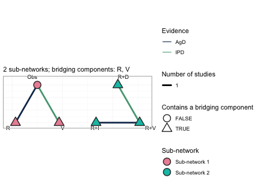

plot of chunk network-plot

This is the central figure of the vignette. Each sub-network is laid out
on its own circle and the circles are placed side by side, so the
disconnection is shown rather than asserted: no edge runs between the
two groups. Node fill gives the sub-network. Edges are colored by the
evidence behind them, so the two trials for which we hold individual
patient data (`OLD-2`, the `Obs` versus `V` edge on the left, and
`NEW-1`, the `R+V` versus `R+D` edge on the right) are distinguished
from the two published aggregate trials. The triangular nodes are the
treatments that contain a *bridging* component, which here is every
treatment except `Obs`, and the subtitle names the bridging components
themselves: `R` and `V`. Those two components are what the sub-networks
hold in common. `R` is given alone in the old trials and sits inside
every regimen of the new ones; `V` is given alone in the old trials and
sits inside `R+V` in the new ones. An additive model assigns each
component a single parameter, shared across the gap, and that shared
parameter is the entire mechanism by which the network is reconnected.

``` r

plot(net, weight_edges = FALSE)
```

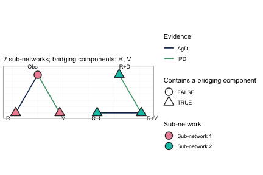

plot of chunk network-plain

Every comparison in this network is informed by exactly one trial, so
scaling edge width by the number of studies conveys nothing here;
`weight_edges = FALSE` removes that legend and leaves a cleaner reading
of the same network. On a network with several trials per comparison the
default is the more informative of the two.

## 2. cNMA reconnects the network, but leaves the populations unadjusted

An additive component NMA (Rücker et al. 2020, 2021) estimates the four
component effects from the four observed contrasts and reconstructs any
treatment effect as `theta_t = C_t' beta`. Because the component
parameters are shared between the sub-networks, the reconstruction
reaches across the gap. This is the connection layer of cpaic, and on
aggregate data alone it is already enough to produce a cross-gap number.

``` r

br <- cnma_bridge(net)
br
#> cpaic component-NMA bridge (random effects, sm = OR)
#>   Additive-model fit (Cochran Q): Q = 0, df = 0, p = NA
#> 
#> Component effects (OR scale, link/log):
#>  component estimate    se lower upper         pval
#>          D    0.743 0.125 0.497 0.989 3.125963e-09
#>          I    0.850 0.180 0.496 1.203 2.463056e-06
#>          R    0.497 0.153 0.197 0.797 1.147239e-03
#>          V    0.467 0.082 0.306 0.629 1.400840e-08
```

Note the Cochran Q line: four contrasts and four components leave zero
degrees of freedom, so the additive model is saturated and its fit
cannot be tested at all here. Additivity is assumed, not checked. This
is not an artifact of the simulation; it is the generic situation when a
network is only just rich enough in components to be bridged.

``` r

forest(br)
```

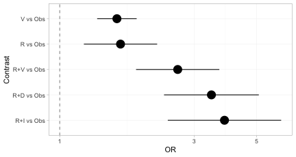

plot of chunk bridge-forest

Every treatment now has an estimate versus `Obs`, including the three
regimens in the sub-network that contains no `Obs` arm. The
disconnection has been repaired.

``` r

forest(br, what = "component")
```


plot of chunk bridge-components

The component forest shows the incremental effect of adding each
component to a regimen, on the log-odds-ratio scale. These four numbers
are what carry the evidence across the gap; every treatment effect above
is a sum of them.

``` r

knitr::kable(league_table(br),
             caption = "Aggregate cNMA league table (odds ratios, row versus column). Every cell is filled: the component bridge reconnects the network completely.")
```

|  | Obs | R | R+D | R+I | R+V | V |
|:---|:---|:---|:---|:---|:---|:---|
| Obs | Obs | 0.61 (0.45, 0.82) | 0.29 (0.20, 0.43) | 0.26 (0.16, 0.41) | 0.38 (0.27, 0.54) | 0.63 (0.53, 0.74) |
| R | 1.64 (1.22, 2.22) | R | 0.48 (0.37, 0.61) | 0.43 (0.30, 0.61) | 0.63 (0.53, 0.74) | 1.03 (0.73, 1.45) |
| R+D | 3.46 (2.35, 5.09) | 2.10 (1.64, 2.69) | R+D | 0.90 (0.62, 1.29) | 1.32 (1.09, 1.59) | 2.17 (1.52, 3.08) |
| R+I | 3.84 (2.42, 6.11) | 2.34 (1.64, 3.33) | 1.11 (0.77, 1.60) | R+I | 1.47 (1.07, 2.01) | 2.41 (1.56, 3.72) |
| R+V | 2.62 (1.87, 3.69) | 1.60 (1.36, 1.88) | 0.76 (0.63, 0.91) | 0.68 (0.50, 0.93) | R+V | 1.64 (1.22, 2.22) |
| V | 1.60 (1.36, 1.88) | 0.97 (0.69, 1.36) | 0.46 (0.32, 0.66) | 0.42 (0.27, 0.64) | 0.61 (0.45, 0.82) | V |

Aggregate cNMA league table (odds ratios, row versus column). Every cell
is filled: the component bridge reconnects the network completely.
{.table}

The league table is complete. Not one cell is empty, even though only
four of the fifteen pairwise comparisons among these six treatments were
ever made in a trial. That is the achievement of the connection layer,
and it is also the trap: nothing in this table records which population
it refers to.

``` r

plot_edge_influence(br, treatment = "R+D", comparator = "R")
```

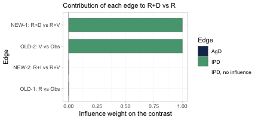

plot of chunk bridge-influence

This is the figure that decides whether population adjustment is
possible at all. It decomposes the cross-gap estimate of `R+D` versus
`R` into the weight each observed edge carries in it. Exactly two edges
carry the contrast, `OLD-2` (`V` versus `Obs`) and `NEW-1` (`R+D` versus
`R+V`), each with weight one; the other two edges have weight zero and
contribute nothing. Those two load-bearing edges are precisely the two
trials for which we hold individual patient data, one on each side of
the gap. The cross-gap contrast is therefore adjustable: the edges that
carry it are the edges we can reweight or model. Had the individual
patient data instead sat on `OLD-1` and `NEW-2`, the two edges with zero
weight, no amount of population adjustment could have moved this
contrast, however healthy the effective sample size looked.
[`plot_edge_influence()`](https://choxos.github.io/cpaic/reference/plot_edge_influence.md)
is the diagnostic that detects that, and no conventional one does.

## 3. ML-NMR adjusts the population, but does not bridge the gap

ML-NMR (Phillippo et al. 2020) is the right tool for the *population*
problem: it fits the individual-level model to the IPD and integrates it
over each aggregate study’s covariate distribution, so effect-modifier
imbalance is handled correctly rather than through study-mean
meta-regression.

But ML-NMR treats each regimen as an indivisible node. `R+D` and `R`
share no node and no trial connects them, so nothing links the two
sub-networks. A Bayesian fit will still return a posterior for the
contrast, and it will look perfectly healthy; but it is the **prior**
speaking, not the data. This is precisely the trap Wigle et al. (2026)
warn about.

## 4. cML-NMR: bridge with components, adjust by integration

The regimens are not really indivisible. `R+D` and `R` **share the
component `R`**, and `R+V` shares `R` and `V` with the old trials. The
additive component model turns shared components into shared parameters,
which reconnects the network *by construction*, while the ML-NMR
integration handles the population imbalance.

### First: what is actually estimable?

Reconnecting a network does **not** guarantee that the effect you want
is identified. Population adjustment is strictly harder than
reconnection, because the component by effect-modifier interactions have
to be identified too. Always check.

``` r

fit <- cmlnmr(ipd, agd,
              effect_modifiers = "hr",   # binary -> Bernoulli margin, automatic
              inactive = "Obs", family = "binomial",
              chains = 4, iter_warmup = 700, iter_sampling = 700, seed = 1)

estimable_effects_at(fit, newdata = data.frame(hr = 0.30))
#> Estimability of the population-adjusted relative effects
#>   Target population: hr = 0.3
#>  treatment comparator estimable identified_by          basis
#>          R        Obs     FALSE          none not identified
#>        R+D        Obs     FALSE          none not identified
#>        R+I        Obs     FALSE          none not identified
#>        R+V        Obs     FALSE          none not identified
#>          V        Obs      TRUE           IPD          exact
#> 
#>   Rows marked "not identified" carry no first-order information; a number
#>   reported for them would be the prior. relative_effects() returns NA there.
```

Read the `identified_by` column. An effect identified only from
*aggregate* data is identified by a between-study gradient across study
means, which is ecological inference; an effect identified from *IPD* is
identified by within-study covariate variation. They are not equal
currency, and cpaic keeps them apart.

[`plot_estimability()`](https://choxos.github.io/cpaic/reference/plot_estimability.md)
evaluates the same check over a grid of target populations and tiles the
answer. We ask it against `R`, the comparator the decision maker
actually wants.

``` r

plot_estimability(fit, em = "hr", values = seq(0, 1, by = 0.2),
                  reference = "R")
```

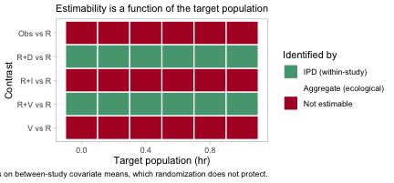

plot of chunk estimability-map

Compare this with the league table of Section 2, in which every single
cell was filled. The aggregate cNMA reconnected the network completely;
the population-adjusted model does not, and the map says which contrasts
survive. Population adjustment is strictly harder than reconnection:
reconnection needs only the component *main* effects `beta`, whereas a
population-adjusted contrast also needs the component by effect-modifier
interactions `Gamma` along the direction of the target. A contrast can
therefore be perfectly estimable in an aggregate-data cNMA and still not
be estimable as a population-adjusted effect, which is exactly what has
happened to three of the five rows here. In this particular network the
estimable set happens to be the same in every target population, so the
rows are constant across the grid; that is not guaranteed, and the point
of the figure is that it must be checked rather than assumed.

The reason is visible in the posteriors themselves.

``` r

plot_prior_posterior(fit, prior = "gamma")
```


plot of chunk prior-posterior-gamma

Each panel overlays the posterior of one component by effect-modifier
interaction (histogram) on its prior (red line). The components are
indexed alphabetically, so `gamma[1,1]` through `gamma[4,1]` are `D`,
`I`, `R` and `V`.

The interactions of `D` and of `V` are each carried by one of the two
individual-patient-data trials, and their posteriors are far tighter
than their priors: those two have been estimated. The interaction of `I`
is its prior redrawn, because no trial informs it with within-study
covariate variation; the data have said nothing about it at all.

`R` is the instructive case, and it is why this figure must not be read
on its own. Its posterior is somewhat narrower than its prior, yet `R`
is *not* identified. An aggregate arm constrains a combination of a main
effect and its interaction without pinning either one, which narrows the
marginal posterior while leaving the individual parameter free.
Narrowness is not identification. A Bayesian model returns a posterior
for all four regardless, and all four look like perfectly respectable
distributions; what may legitimately be reported is settled by the
algebraic check in
[`estimable_effects_at()`](https://choxos.github.io/cpaic/reference/estimable_effects_at.md),
not by the eye.

### The cross-gap comparison, in a named target population

Ask for the cross-gap contrast **directly**, against `R` as the
reference. This matters: `R+D` versus `Obs` and `R` versus `Obs` are
each NOT identified at a general target, because `R` is seen only in an
aggregate contrast and is therefore pinned down only at that study’s
covariate mean. Their *difference*, `R+D` versus `R`, is the component
`D`, and it IS identified. cpaic returns `NA` for the two that are not
identified and a number for the one that is, which is exactly the
behavior you want.

``` r

relative_effects(fit, reference = "R", newdata = data.frame(hr = 0.15))
#> Relative effects (OR, back-transformed)
#>   Target population: hr = 0.15
#>  treatment comparator estimate    se lower upper pr_gt0
#>        Obs          R       NA    NA    NA    NA     NA
#>        R+D          R    1.557 0.135 1.186 2.001      1
#>        R+I          R       NA    NA    NA    NA     NA
#>        R+V          R    1.741 0.084 1.474 2.047      1
#>          V          R       NA    NA    NA    NA     NA
#>   NA = not uniquely estimable from this component design (see estimable_effects()).
relative_effects(fit, reference = "R", newdata = data.frame(hr = 0.60))
#> Relative effects (OR, back-transformed)
#>   Target population: hr = 0.6
#>  treatment comparator estimate    se lower upper pr_gt0
#>        Obs          R       NA    NA    NA    NA     NA
#>        R+D          R    2.134 0.141 1.617 2.798  1.000
#>        R+I          R       NA    NA    NA    NA     NA
#>        R+V          R    1.356 0.097 1.112 1.648  0.999
#>          V          R       NA    NA    NA    NA     NA
#>   NA = not uniquely estimable from this component design (see estimable_effects()).
```

The same two tables as forest plots, one target population each.

``` r

forest(fit, reference = "R", newdata = data.frame(hr = 0.15))
```

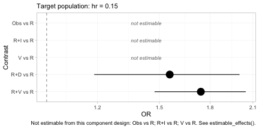

plot of chunk effects-forest

``` r

forest(fit, reference = "R", newdata = data.frame(hr = 0.60))
```

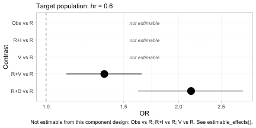

plot of chunk effects-forest

The subtitle of each panel records the target population, because
without it the estimates are meaningless. Two features deserve
attention. First, the contrasts that are not identified are drawn as
labeled empty rows rather than dropped:
[`forest()`](https://choxos.github.io/cpaic/reference/forest.md) will
not present a plot that looks complete when it is not, and the caption
repeats which rows are missing and why. Second, `R+D` versus `R` moves
between the two panels while `R+V` versus `R` moves the other way, which
is the crossing of daratumumab and bortezomib that we built into the
data generating mechanism.

``` r

theta <- function(trt, x) sum(Cmat[trt, ] * (beta_true + gamma_true * x))
for (x in c(0.15, 0.60)) {
  cat(sprintf("hr = %.2f: true log-OR(R+D vs R) = %+.3f\n",
              x, theta("R+D", x) - theta("R", x)))
}
#> hr = 0.15: true log-OR(R+D vs R) = +0.390
#> hr = 0.60: true log-OR(R+D vs R) = +0.660
```

The contrast that no trial measured, across a gap no comparator spans,
is recovered; and it is recovered *differently* in the two target
populations, because daratumumab is more effective in high-risk
patients. A single population-free number would be wrong for at least
one of them.

``` r

knitr::kable(league_table(fit, newdata = data.frame(hr = 0.60)),
             caption = "cML-NMR league table (odds ratios, row versus column) in a target population with 60% high-risk patients. Empty cells are not estimable as population-adjusted effects.")
```

|  | Obs | R | R+D | R+I | R+V | V |
|:---|:---|:---|:---|:---|:---|:---|
| Obs | Obs |  |  |  |  | 0.74 (0.61, 0.90) |
| R |  | R | 0.48 (0.36, 0.62) |  | 0.74 (0.61, 0.90) |  |
| R+D |  | 2.13 (1.62, 2.80) | R+D |  | 1.57 (1.29, 1.91) |  |
| R+I |  |  |  | R+I |  |  |
| R+V |  | 1.36 (1.11, 1.65) | 0.64 (0.52, 0.78) |  | R+V |  |
| V | 1.36 (1.11, 1.65) |  |  |  |  | V |

cML-NMR league table (odds ratios, row versus column) in a target
population with 60% high-risk patients. Empty cells are not estimable as
population-adjusted effects. {.table}

Set this against the aggregate cNMA league table of Section 2. That one
was complete; this one is mostly empty, and the difference between them
is the whole lesson of the vignette. The unadjusted bridge gives a
number for every cell and attaches it to no population at all. The
adjusted model gives a number only where the data can support one in the
population you asked about, and it declines the rest.

The cells it does fill are `V` against `Obs`, inside the old
sub-network, and the three comparisons among `R`, `R+V` and `R+D`, which
include the cross-gap contrast that prompted the analysis. The pattern
of refusals is not arbitrary. Any comparison that changes the ixazomib
content is refused, because no trial anywhere in the network provides
within-study covariate variation on `I`; and any comparison that changes
the lenalidomide content is refused for the same reason applied to `R`.
What survives is precisely the set of contrasts in which the components
with unidentified interactions cancel.

## 5. The hierarchy is population-specific

If component effects depend on the population, so do component
*rankings*. The question is not “which component is best?” but **“which
component is best in this population?”** (Wigle et al. 2026).

``` r

cpaic_ranks(fit, newdata = data.frame(hr = 0.05), what = "component")
#> Warning: Dropped from the hierarchy as not estimable in this target population: I, R.
#> Ranking them would rank the prior. See estimable_effects_at().
#> Population-adjusted component hierarchy
#>   Target population: hr = 0.05
#>  element estimate p_best median_rank mean_rank sucra
#>        V    0.607  0.979           1     1.021 0.979
#>        D    0.364  0.021           2     1.979 0.021
#>   Not estimable in this population, so not ranked: I, R
#>   Ranking metrics depend on the set ranked; report them with the effects, not instead.
cpaic_ranks(fit, newdata = data.frame(hr = 0.80), what = "component")
#> Warning: Dropped from the hierarchy as not estimable in this target population: I, R.
#> Ranking them would rank the prior. See estimable_effects_at().
#> Population-adjusted component hierarchy
#>   Target population: hr = 0.8
#>  element estimate p_best median_rank mean_rank sucra
#>        D    0.888      1           1         1     1
#>        V    0.188      0           2         2     0
#>   Not estimable in this population, so not ranked: I, R
#>   Ranking metrics depend on the set ranked; report them with the effects, not instead.
```

Two things happen here, and both are the point.

First, **`R` and `I` are dropped**. Neither is identified at a general
target population: `R` appears only in an aggregate contrast, and `I`
only in an aggregate contrast against `R+V`, so each is pinned down only
at its own study’s covariate mean. Ranking them would rank the prior.
This is Step 3 of the Wigle et al. workflow, now with an estimable set
that itself depends on the target.

Second, among the components that *are* identified, **the order
reverses**: `V` wins in a low-risk population and `D` wins in a
high-risk one.

``` r

plot(suppressWarnings(
  cpaic_ranks(fit, newdata = data.frame(hr = 0.05), what = "component")))
```

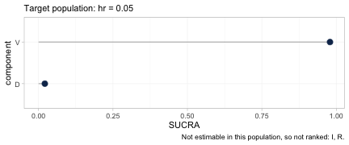

plot of chunk ranks-plot

``` r

plot(suppressWarnings(
  cpaic_ranks(fit, newdata = data.frame(hr = 0.80), what = "component")))
```

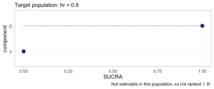

plot of chunk ranks-plot

The two hierarchies, plotted. Each carries its target population in the
subtitle and the components it refused to rank in the caption, so
neither can be quoted without them. Between the first panel and the
second the SUCRA values of `D` and `V` exchange places completely.

The full rank distribution behind those metrics is available through
[`rank_probs()`](https://choxos.github.io/cpaic/reference/rank_probs.md).
Asking for it at the level of *treatments*, which is the default,
produces a refusal.

``` r

tryCatch(
  rank_probs(fit, newdata = data.frame(hr = 0.30)),
  error = function(e) cat("rank_probs() refused:\n ", conditionMessage(e), "\n"))
#> Warning: Dropped from the hierarchy as not estimable in this target population: R, R+D,
#> R+I, R+V. Ranking them would rank the prior. See estimable_effects_at().
#> rank_probs() refused:
#>   Fewer than two elements are estimable in this target population, so no hierarchy can be formed. See estimable_effects_at().
```

The refusal is the correct answer, and it is deliberate. Of the five
treatments to be ranked against `Obs`, only `V` is estimable in a
general target population, and a hierarchy of one element is not a
hierarchy. The alternative, which most software would take, is to rank
all five from posteriors that are for the most part the prior redrawn,
and to return a confident-looking ordering built on nothing. This is
Step 3 of the Wigle et al. (2026) workflow enforced in code rather than
left to the analyst’s discipline. Ask instead for the hierarchy the
network can support, which is the one over components.

``` r

plot(suppressWarnings(
  rank_probs(fit, newdata = data.frame(hr = 0.80), what = "component")))
```

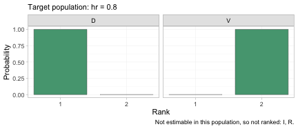

plot of chunk rankogram

The rankogram gives the posterior probability that each component
occupies each rank, among the components that are estimable in this
target population. In a population with 80% high-risk patients the
posterior is close to certain that daratumumab is the better of the two,
which is the same conclusion as the SUCRA plot above but with the
uncertainty made explicit.

``` r

plot_rank_curve(fit, em = "hr", values = seq(0, 1, by = 0.1),
                what = "component") +
  ggplot2::geom_vline(xintercept = 0.227, linetype = "dashed") +
  ggplot2::labs(
    title = "A component hierarchy is a function of the target population",
    x = "Proportion of high-risk patients in the target population")
```

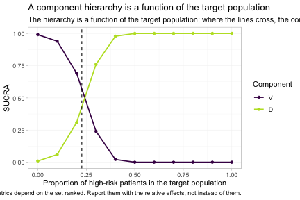

plot of chunk rankcurve

[`plot_rank_curve()`](https://choxos.github.io/cpaic/reference/plot_rank_curve.md)
traces the whole family of hierarchies at once, rather than one
hierarchy at a time. The dashed line marks the true crossover at
`hr = 0.227`, which we derived from the parameter values we set at the
top of the vignette, and the estimated curves cross close to it. To the
left of that line bortezomib leads; to the right daratumumab does. A
single component ranking, quoted without a population, is not a
well-posed answer to any question; it is an answer to the question of
what happens at one unstated point on this axis.

## Model checking

None of the above means anything if the posterior was not explored. Two
standard checks, and one that matters more than usual here.

``` r

plot(fit, type = "trace")
```

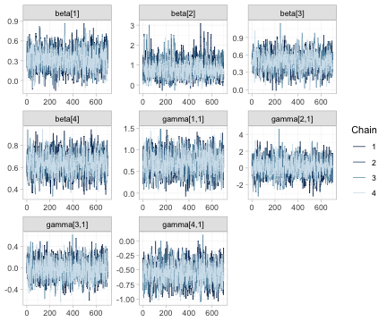

plot of chunk mcmc-trace

Trace plots of the component effects `beta` and the component by
effect-modifier interactions `gamma`. The four chains should be
indistinguishable and stationary. Note that the chains for the
unidentified interactions mix perfectly well; good mixing is evidence
about the sampler, not about identification, and it is precisely why the
identification analysis of Section 4 cannot be skipped.

``` r

plot(fit, type = "rhat")
```

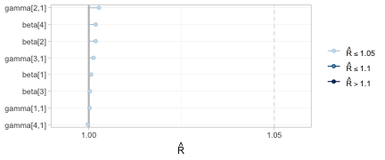

plot of chunk mcmc-rhat

All potential scale reduction factors sit at the left of the scale, so
the chains have converged.

``` r

plot_prior_posterior(fit)
```


plot of chunk prior-posterior-all

The full prior-against-posterior panel: study intercepts `mu`, component
effects `beta`, the prognostic regression coefficient `breg`, and the
interactions `gamma`. Read it as a map of what the data actually
informed. The parameters whose posteriors have collapsed relative to
their priors are the ones the network identifies; the two `gamma` panels
that still reproduce their prior are the reason `R` and `I` are dropped
from every hierarchy above.

## What to take away

| Method | Adjusts the population | Bridges the disconnection | Cross-gap effect |
|----|----|----|----|
| Standard NMA | no | no | **not estimable** |
| Aggregate cNMA | no | yes, via shared components | estimable, but population-free |
| ML-NMR | yes | no | **prior-driven, not identified** |
| cML-NMR | yes | yes, via shared components | estimable, and population-specific |

Three warnings, which are not optional reading.

1.  **The bridging assumption is untestable.** Reconnecting through
    shared components requires the component effects, *and their
    interactions with the effect modifiers*, to be the same in both
    sub-networks. There is by construction no cross-gap evidence with
    which to test that; it must be defended clinically (Veroniki et al.
    2026). In this network the additive model is saturated, so not even
    its internal fit statistic has degrees of freedom to spend on the
    question.
2.  **Estimability is not automatic.** As `R` and `I` show above, a
    contrast can be perfectly estimable as an aggregate-data component
    contrast and still not be estimable as a population-adjusted effect.
    The two league tables, one complete and one mostly empty, are the
    same network under the two criteria. Run
    [`estimable_effects_at()`](https://choxos.github.io/cpaic/reference/estimable_effects_at.md)
    and
    [`plot_estimability()`](https://choxos.github.io/cpaic/reference/plot_estimability.md),
    and believe what they say.
3.  **Where the individual patient data sit decides what can be
    adjusted.** The cross-gap contrast here is carried entirely by the
    two IPD edges, so population adjustment can reach it. Put the same
    IPD on the other two edges and the contrast becomes unadjustable,
    without any conventional diagnostic registering a complaint.
    [`plot_edge_influence()`](https://choxos.github.io/cpaic/reference/plot_edge_influence.md)
    is what shows this, and it should be consulted before the analysis
    is designed, not after.

## References

Phillippo, David M., Sofia Dias, A. E. Ades, et al. 2020. “Multilevel
Network Meta-Regression for Population-Adjusted Treatment Comparisons.”
*Journal of the Royal Statistical Society: Series A* 183 (3): 1189–210.
<https://doi.org/10.1111/rssa.12579>.

Rücker, Gerta, Maria Petropoulou, and Guido Schwarzer. 2020. “Network
Meta-Analysis of Multicomponent Interventions.” *Biometrical Journal* 62
(3): 808–21. <https://doi.org/10.1002/bimj.201800167>.

Rücker, Gerta, Susanne Schmitz, and Guido Schwarzer. 2021. “Component
Network Meta-Analysis Compared to a Matching Method in a Disconnected
Network.” *Biometrical Journal* 63 (2): 447–61.

Veroniki, Areti Angeliki, Georgios Seitidis, Sofia Tsokani, et al. 2026.
“Analysing Component Network Meta-Analysis in Disconnected Networks:
Guidance for Practice.” *BMJ*.

Wigle, Augustine, Audrey Béliveau, Adriani Nikolakopoulou, and Lifeng
Lin. 2026. *Creating Treatment and Component Hierarchies in Component
Network Meta-Analysis*.
