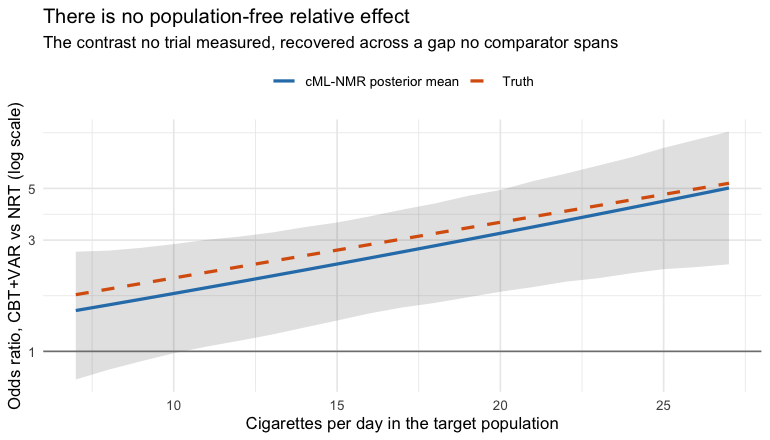

``` r
library(cpaic)
library(ggplot2)
set.seed(2026)
```

This vignette is a complete worked example for a **binary** endpoint in the
situation cpaic exists for: a treatment network that is **disconnected** *and*
whose trials enrolled **different populations**. We reconnect it through shared
treatment components and adjust it for effect-modifier imbalance at the same
time, along two routes: the frequentist two-stage route (`cstc()` / `cmaic()`
feeding `cnma_bridge()`) and the one-stage Bayesian route (`cmlnmr()`).

For the general framework see `vignette("cpaic-methods")`; for the
population-specific *hierarchies* that follow from it see
`vignette("cpaic-disconnected-myeloma")`; for a count endpoint with an exposure
offset see `vignette("count-outcomes")`.

> **The data here are entirely simulated.** The clinical setting (smoking
> cessation) supplies only the vocabulary, because cessation packages are
> genuinely multi-component: behavioral support and pharmacotherapy are combined.
> No number below is taken from any trial or publication. We set the true
> parameter values ourselves, which is exactly what lets us check whether each
> method recovers them.

## The clinical question

Write `UC` for usual care (brief advice; the inactive comparator) and use four
active components:

* `NRT` -- nicotine replacement therapy,
* `CBT` -- intensive behavioral counseling,
* `VAR` -- varenicline,
* `BUP` -- bupropion.

The outcome is **sustained abstinence at six months** (a binary success), so a
log odds ratio above zero favors the active arm.

The trials split into two groups that share **no treatment**:

* **Sub-network 1**, older trials against usual care: `UC` vs `NRT` (once), and
  `UC` vs `CBT` (three times).
* **Sub-network 2**, newer trials that give everyone counseling and randomize the
  drug on top: `CBT+NRT` vs `CBT+VAR` (twice), and `CBT+NRT` vs `CBT+BUP` (once).

No trial links the two groups. A guideline panel nevertheless has to ask:
**how does counseling plus varenicline (`CBT+VAR`) compare with nicotine
replacement alone (`NRT`)?** That contrast crosses the gap, and no randomized
comparison of any kind speaks to it.

The two groups also enrolled different smokers. The newer combination trials
recruited **heavier** smokers. We use baseline cigarettes per day as the effect
modifier, coded `cpd = (cigarettes per day - 15) / 10`, so `cpd = 0` is a
15-a-day smoker and `cpd = 1` is a 25-a-day smoker. Heavier smokers are harder
to treat (a prognostic effect) *and* respond differently to the components (an
effect-modifying one).

## The model

`cmlnmr()` fits an individual-level logistic regression to every patient,
whether that patient's data arrive as IPD or are integrated out of an aggregate
arm:
$$
\operatorname{logit}\Pr(y_{ijk} = 1 \mid x_i)
  \;=\; \mu_j + x_i^\top b \;+\; C_k^\top(\beta + \Gamma x_i),
$$
where $j$ indexes the study, $k$ the treatment, $\mu_j$ is a study intercept,
$b$ collects the prognostic effects, and $C_k$ is the row of the
treatment-by-component matrix $C$ that says which components treatment $k$
contains. The component main effects are $\beta$ and the component by
effect-modifier interactions are $\Gamma$.

Two consequences follow immediately, and they organize the whole vignette.

**1. The relative effect is population-specific.** The log odds ratio of
treatment $t$ against treatment $u$ in a population with effect-modifier value
$x$ is
$$
\theta_t(x) - \theta_u(x) \;=\; (C_t - C_u)^\top (\beta + \Gamma x).
$$
There is **no population-free relative effect** once $\Gamma \neq 0$. Asking for
one is asking a question that has no answer, so `relative_effects()` requires a
`newdata` argument naming the target population. Note also that $\beta$ on its
own is the effect at the covariate *origin* -- here, at a smoker who smokes 15 a
day. It is not a population-adjusted quantity and should not be reported as one.

**2. Sub-networks that share components share parameters.** `CBT+VAR` and `NRT`
have no trial between them, but `CBT+VAR` contains `CBT`, which the old trials
measured, and the newer trials measure `VAR` against `NRT` on a common
counseling backbone. The additive structure turns those shared components into
shared parameters, which reconnects the network by construction, while the
aggregate arms are fitted by integrating the individual model over each study's
own covariate distribution [@phillippo2020mlnmr].

### Non-collapsibility, and why it matters here

The odds ratio is **non-collapsible** [@greenland1999]. The population-average
(marginal) log odds ratio is not the average of the individual (conditional) log
odds ratios: it is pulled toward the null whenever a prognostic covariate is left
out of the model, *even when there is no effect modification at all*. That is a
property of the logit link, not a bias.

So "the log odds ratio in population $P$" is ambiguous until you say whether you
mean the conditional or the marginal one, and the methods answer differently
[@remiro2022]:

| method | estimand |
|---|---|
| `cstc()` | **conditional** log OR at the target's covariate values |
| `cmaic()` | **marginal** log OR in the target population |
| `cmlnmr()`, i.e. $(C_t - C_u)^\top(\beta + \Gamma x)$ | **conditional** log OR at $x$ |

All three can be simultaneously correct and still disagree. We will see them
disagree, in the direction non-collapsibility predicts.

## Setting up the data

We set the truth ourselves. `beta_true` are the component log odds ratios at
`cpd = 0` and `gamma_true` are their interactions with `cpd`: varenicline holds
up in heavy smokers, whereas nicotine replacement and counseling lose ground.


``` r
treatments <- c("UC", "NRT", "CBT", "CBT+NRT", "CBT+VAR", "CBT+BUP")
Cmat <- build_C_matrix(treatments, inactive = "UC")
Cmat
#>         BUP CBT NRT VAR
#> UC        0   0   0   0
#> NRT       0   0   1   0
#> CBT       0   1   0   0
#> CBT+NRT   0   1   1   0
#> CBT+VAR   0   1   0   1
#> CBT+BUP   1   1   0   0

beta_true  <- c(BUP = 0.45, CBT =  0.55, NRT =  0.50, VAR = 0.95)  # at cpd = 0
gamma_true <- c(BUP = 0.05, CBT = -0.20, NRT = -0.40, VAR = 0.35)  # x cpd
b_prog     <- -0.35        # heavier smokers quit less often, whatever the arm

# theta_t(x) = C_t' (beta + Gamma x): the TRUE conditional log-OR vs UC.
theta <- function(trt, x) {
  ct <- Cmat[trt, ]
  comps <- names(ct)
  sum(ct * beta_true[comps]) + sum(ct * gamma_true[comps]) * x
}
```

The headline contrast is therefore, exactly,
$$
\theta_{\texttt{CBT+VAR}}(x) - \theta_{\texttt{NRT}}(x)
 = \underbrace{(0.55 + 0.95 - 0.50)}_{1.00}
 + \underbrace{(-0.20 + 0.35 + 0.40)}_{0.55}\, x ,
$$
which runs from an odds ratio of 2.18 in a
10-a-day population to 4.71 in a 25-a-day one.
One number cannot serve both.

Seven trials. Two of them are ours, so we hold IPD; the other five are published,
so we hold only aggregate data. The IPD trials enrolled a real spread of smokers,
because a component by effect-modifier interaction is identified from covariate
variation **within** a trial: a trial in which everybody smokes 20 a day carries
no information about how the effect varies with smoking rate, however many
patients it has.


``` r
design <- data.frame(
  study = c("BRIEF-1", "BRIEF-2", "BRIEF-3", "BRIEF-4",
            "COMBO-1", "COMBO-2", "COMBO-3"),
  arm1  = c("UC", "UC", "UC", "UC", "CBT+NRT", "CBT+NRT", "CBT+NRT"),
  arm2  = c("NRT", "CBT", "CBT", "CBT", "CBT+VAR", "CBT+BUP", "CBT+VAR"),
  n     = c(900, 700, 700, 500, 700, 800, 600),          # per arm
  mu    = c(-1.9, -1.9, -1.8, -2.0, -1.9, -1.9, -1.8),   # study intercept
  cpd_m = c(-0.7, 0.0, 0.0, 0.2, 0.6, 0.9, 0.5),         # covariate mean
  cpd_s = c(0.55, 0.85, 0.60, 0.60, 0.85, 0.55, 0.60),   # covariate SD
  ipd   = c(FALSE, TRUE, FALSE, FALSE, TRUE, FALSE, FALSE),
  stringsAsFactors = FALSE
)
knitr::kable(design, caption = "Trial design. BRIEF-* are older; COMBO-* newer.")
```


Table: Trial design. BRIEF-* are older; COMBO-* newer.

|study   |arm1    |arm2    |   n|   mu| cpd_m| cpd_s|ipd   |
|:-------|:-------|:-------|---:|----:|-----:|-----:|:-----|
|BRIEF-1 |UC      |NRT     | 900| -1.9|  -0.7|  0.55|FALSE |
|BRIEF-2 |UC      |CBT     | 700| -1.9|   0.0|  0.85|TRUE  |
|BRIEF-3 |UC      |CBT     | 700| -1.8|   0.0|  0.60|FALSE |
|BRIEF-4 |UC      |CBT     | 500| -2.0|   0.2|  0.60|FALSE |
|COMBO-1 |CBT+NRT |CBT+VAR | 700| -1.9|   0.6|  0.85|TRUE  |
|COMBO-2 |CBT+NRT |CBT+BUP | 800| -1.9|   0.9|  0.55|FALSE |
|COMBO-3 |CBT+NRT |CBT+VAR | 600| -1.8|   0.5|  0.60|FALSE |


Note which edges are aggregate-only, because it will matter a great deal later:
**`NRT` versus `UC` is measured by exactly one trial (`BRIEF-1`, aggregate), and
bupropion by exactly one (`COMBO-2`, aggregate).** Counseling and varenicline, by
contrast, are each measured by an IPD trial.


``` r
gen_arm <- function(study, trt, n, mu, m, s) {
  cpd <- rnorm(n, m, s)
  eta <- mu + b_prog * cpd + vapply(cpd, function(x) theta(trt, x), numeric(1))
  data.frame(.study = study, .trt = trt, .y = rbinom(n, 1, plogis(eta)),
             cpd = cpd, stringsAsFactors = FALSE)
}
patients <- do.call(rbind, lapply(seq_len(nrow(design)), function(i) {
  d <- design[i, ]
  rbind(gen_arm(d$study, d$arm1, d$n, d$mu, d$cpd_m, d$cpd_s),
        gen_arm(d$study, d$arm2, d$n, d$mu, d$cpd_m, d$cpd_s))
}))
is_ipd <- patients$.study %in% design$study[design$ipd]
```

The two routes want the data in **different shapes**, and it is worth being
explicit about that.

`cmlnmr()` takes patient rows plus **arm-level** aggregate rows (events `r`,
sample size `n`, and each effect modifier's `_mean` and `_sd`), because it
rebuilds the aggregate likelihood from the individual model:


``` r
ipd <- patients[is_ipd, ]
agd <- do.call(rbind, lapply(
  split(patients[!is_ipd, ], ~ .study + .trt, drop = TRUE),
  function(d) data.frame(
    .study = d$.study[1], .trt = d$.trt[1],
    r = sum(d$.y), n = nrow(d),
    cpd_mean = mean(d$cpd), cpd_sd = sd(d$cpd), stringsAsFactors = FALSE)))
agd <- agd[order(agd$.study, agd$.trt), ]
rownames(agd) <- NULL
knitr::kable(agd, digits = 3, caption = "Aggregate arms, the shape cmlnmr() wants")
```


Table: Aggregate arms, the shape cmlnmr() wants

|.study  |.trt    |   r|   n| cpd_mean| cpd_sd|
|:-------|:-------|---:|---:|--------:|------:|
|BRIEF-1 |NRT     | 266| 900|   -0.712|  0.517|
|BRIEF-1 |UC      | 157| 900|   -0.687|  0.547|
|BRIEF-3 |CBT     | 155| 700|    0.030|  0.637|
|BRIEF-3 |UC      |  98| 700|   -0.002|  0.611|
|BRIEF-4 |CBT     |  90| 500|    0.225|  0.603|
|BRIEF-4 |UC      |  70| 500|    0.193|  0.597|
|COMBO-2 |CBT+BUP | 158| 800|    0.904|  0.547|
|COMBO-2 |CBT+NRT | 140| 800|    0.902|  0.573|
|COMBO-3 |CBT+NRT | 135| 600|    0.503|  0.596|
|COMBO-3 |CBT+VAR | 251| 600|    0.508|  0.580|


`cpaic_network()` takes **contrast-level** aggregate data (one row per
comparison: `TE`, `seTE`), the convention of `netmeta::discomb()`. Every study
appears, including the two IPD ones, whose *unadjusted* contrasts `cstc()` and
`cmaic()` will overwrite with adjusted ones:


``` r
contrast_of <- function(d, a1, a2) {
  cell <- function(a) { s <- d[d$.trt == a, ]; c(r = sum(s$.y), n = nrow(s)) }
  x2 <- cell(a2); x1 <- cell(a1)
  logodds <- function(v) log(v["r"] / (v["n"] - v["r"]))
  data.frame(
    studlab = d$.study[1], treat1 = a2, treat2 = a1,
    TE   = unname(logodds(x2) - logodds(x1)),
    seTE = unname(sqrt(1 / x2["r"] + 1 / (x2["n"] - x2["r"]) +
                       1 / x1["r"] + 1 / (x1["n"] - x1["r"]))),
    stringsAsFactors = FALSE)
}
agd_contr <- do.call(rbind, lapply(seq_len(nrow(design)), function(i) {
  d <- design[i, ]
  contrast_of(patients[patients$.study == d$study, ], d$arm1, d$arm2)
}))
knitr::kable(agd_contr, digits = 3,
             caption = "Unadjusted contrasts, the shape cpaic_network() wants")
```


Table: Unadjusted contrasts, the shape cpaic_network() wants

|studlab |treat1  |treat2  |    TE|  seTE|
|:-------|:-------|:-------|-----:|-----:|
|BRIEF-1 |NRT     |UC      | 0.686| 0.114|
|BRIEF-2 |CBT     |UC      | 0.227| 0.138|
|BRIEF-3 |CBT     |UC      | 0.558| 0.142|
|BRIEF-4 |CBT     |UC      | 0.299| 0.174|
|COMBO-1 |CBT+VAR |CBT+NRT | 0.836| 0.121|
|COMBO-2 |CBT+BUP |CBT+NRT | 0.149| 0.129|
|COMBO-3 |CBT+VAR |CBT+NRT | 0.907| 0.128|


The network is disconnected, and `cpaic_connectivity()` says so, along with the
components that could bridge it:


``` r
net <- cpaic_network(agd_contr, ipd = ipd, sm = "OR", family = "binomial",
                     inactive = "UC", ipd_covariates = "cpd")
cpaic_connectivity(net)
#> cpaic connectivity
#>   Connected network: FALSE
#>   Sub-networks:      2
#>     [1] 3 treatments
#>     [2] 3 treatments
#>   Bridging components: CBT, NRT
#>   Component design:  rank(X) = 4 / 4 components -> all component effects identified
#>   Estimable effects: 5 / 5 vs UC
```

Two sub-networks, bridged by `CBT` and `NRT`, and the component design matrix
$X = BC$ has full column rank. **Hold that thought.** Full rank means every
component effect is identified *as an aggregate-data component NMA would define
it* [@Wigle2026]. It does not mean every population-adjusted effect is
identified, and the difference turns out to be the whole story.

## Covariate balance

Population adjustment exists because the trial populations differ. They do:


``` r
balance <- do.call(rbind, lapply(split(patients, patients$.study), function(d)
  data.frame(Study = d$.study[1],
             Cigarettes_per_day = 15 + 10 * mean(d$cpd),
             cpd_mean = mean(d$cpd), cpd_sd = sd(d$cpd),
             Quit_rate = mean(d$.y))))
knitr::kable(balance, digits = 2, row.names = FALSE,
             caption = "Effect-modifier balance across the five trials")
```


Table: Effect-modifier balance across the five trials

|Study   | Cigarettes_per_day| cpd_mean| cpd_sd| Quit_rate|
|:-------|------------------:|--------:|------:|---------:|
|BRIEF-1 |               8.00|    -0.70|   0.53|      0.23|
|BRIEF-2 |              14.65|    -0.03|   0.84|      0.19|
|BRIEF-3 |              15.14|     0.01|   0.62|      0.18|
|BRIEF-4 |              17.09|     0.21|   0.60|      0.16|
|COMBO-1 |              21.20|     0.62|   0.85|      0.30|
|COMBO-2 |              24.03|     0.90|   0.56|      0.19|
|COMBO-3 |              20.06|     0.51|   0.59|      0.32|


`BRIEF-1` recruited 8-a-day smokers; `COMBO-2` recruited 24-a-day smokers. A
comparison that ignores this is comparing the wrong people.

We must therefore name a **target population**. Take the caseload a stop-smoking
service actually sees: a mean of 18 cigarettes a day, i.e. `cpd = 0.3`. We will
also ask for a lighter-smoking population, `cpd = -0.4` (11 a day), to show that
the answer moves.


``` r
target      <- data.frame(cpd = 0.3)    # 18 cigarettes/day: the decision population
target_light <- data.frame(cpd = -0.4)  # 11 cigarettes/day
```

## Fitting

### Route 1: two stages, frequentist

`cstc()` fits, in each IPD study, an outcome regression with treatment main
effects, prognostic main effects, and treatment-by-effect-modifier interactions,
with the effect modifiers **centered at the target**. The treatment coefficient
is then the anchored, population-adjusted contrast in the target population.
`cmaic()` instead reweights each IPD study so its effect-modifier distribution
matches the target [@signorovitch2010] and refits. Both then hand their
adjusted contrasts to `cnma_bridge()`, which combines everything through the
additive component model [@rucker2020cnma].


``` r
fit_stc <- cstc(net, target = c(cpd = 0.3), effect_modifiers = "cpd")

fit_maic <- cmaic(net, target = c(cpd = 0.3), target_sd = c(cpd = 0.7),
                  effect_modifiers = "cpd", n_boot = 200, seed = 7)
effective_sample_size(fit_maic)
#> BRIEF-2 COMBO-1 
#> 1178.60 1200.33
```

Matching costs information. The effective sample sizes above are what is left of
each IPD trial after reweighting; `COMBO-1`, which is furthest from the target,
pays the most. (We pass `target_sd` as well as the mean so that MAIC matches the
target's *variance* too, not only its center.)

### Two routes, two estimands

Before reading any numbers, be clear about what each route is estimating. On a
non-collapsible scale this is not a detail:

* `cstc()` reports the coefficient on treatment in a regression that also
  contains `cpd`. That is a **conditional** log odds ratio, at `cpd = 0.3`.
* `cmaic()` reports the coefficient on treatment in a weighted regression with
  **no covariates**, fitted to a sample reweighted to look like the target. That
  is a **marginal** log odds ratio in the target population.
* `cmlnmr()`'s $(C_t - C_u)^\top(\beta + \Gamma x)$ is, like `cstc()`,
  **conditional** at `x`.

Non-collapsibility says the marginal effect is closer to the null than the
conditional one. So `cmaic()` should come out *smaller* than `cstc()` here, and
that is not a sign that either has gone wrong.

### Route 2: one stage, Bayesian

`cmlnmr()` does the connecting and the adjusting in a single likelihood. The
individual-level model above is fitted directly to the IPD, and each aggregate
arm's likelihood is that same model **integrated over that study's own covariate
distribution** using quasi-Monte-Carlo points. Nothing is plugged in at a study
mean, which matters because the logit link is nonlinear:
$\mathbb{E}[\operatorname{logit}^{-1}(\eta)] \neq \operatorname{logit}^{-1}(\mathbb{E}[\eta])$.

We use `trt_effects = "random"`, which adds a study-arm deviation around the
component-implied effect, so the component model is not forced to fit every trial
exactly.


``` r
fit <- cmlnmr(ipd, agd,
              effect_modifiers = "cpd",
              inactive = "UC", family = "binomial",
              trt_effects = "random",
              chains = 4, iter_warmup = 500, iter_sampling = 500,
              n_int = 64, seed = 1, show_exceptions = FALSE)
fit
#> cpaic: component-additive ML-NMR (Bayesian, binomial)
#>   Treatment effects: random (noncentered)
#>   Effect modifiers: cpd [normal]
#>   Component effects below are at the covariate origin (x = 0).
#>   For a target population use relative_effects(fit, newdata = ...).
#> 
#>  component estimate    se  lower upper
#>        BUP   -0.277 0.894 -2.215 1.299
#>        CBT    0.337 0.158 -0.036 0.621
#>        NRT    0.077 0.262 -0.485 0.553
#>        VAR    0.574 0.331 -0.120 1.201
```

Note what the print method insists on: those component effects are at the
covariate **origin**, not in any population you care about.

### Priors

Every prior is recorded on the fitted object, because with a weakly identified
$\Gamma$ the interaction prior does real work and you should be able to see
exactly how much:


``` r
knitr::kable(do.call(rbind, lapply(names(fit$priors), function(p) {
  s <- fit$priors[[p]]
  data.frame(parameter = p, distribution = s$distribution,
             location = s$location, scale = s$scale)
})), caption = "The complete prior specification, as passed to Stan")
```


Table: The complete prior specification, as passed to Stan

|parameter  |distribution | location| scale|
|:----------|:------------|--------:|-----:|
|intercept  |normal       |        0|   2.5|
|beta       |normal       |        0|   2.5|
|regression |normal       |        0|   1.0|
|gamma      |normal       |        0|   1.0|
|tau        |half-normal  |        0|   1.0|


The defaults are the Stan prior-choice recommendations: normal(0, 2.5) on
component effects and study intercepts, normal(0, 1) on the component by
effect-modifier interactions, and half-normal(0, 1) on the heterogeneity
standard deviation `tau`. On the log-odds scale a normal(0, 2.5) is already
permissive; a normal(0, 1) on an interaction says that a one-unit change in
`cpd` (10 cigarettes a day) is unlikely to swing a component's log odds ratio by
more than about two.

### Convergence


``` r
data.frame(
  divergences   = fit$diagnostics$divergences,
  max_treedepth = fit$diagnostics$max_treedepth,
  max_rhat      = round(fit$diagnostics$max_rhat, 4),
  min_ess_bulk  = round(min(fit$fit$summary(c("beta", "gamma", "mu",
                                              "tau"))$ess_bulk, na.rm = TRUE))
)
#>   divergences max_treedepth max_rhat min_ess_bulk
#> 1           0             0   1.0095          408
```

## Estimability: reconnecting is not identifying

`cpaic_connectivity()` told us the component design has full column rank, so the
frequentist bridge will happily print an estimate for every cell of the league
table. That is exactly the trap.

Population adjustment is **strictly harder** than reconnection, because the
estimand $(C_t - C_u)^\top(\beta + \Gamma x)$ needs the *interactions* $\Gamma$
to be identified too, and an aggregate two-arm trial supplies **one** number per
contrast: it pins down $m^\top(\beta + \Gamma \bar x_j)$ at its own covariate
mean $\bar x_j$ and cannot separate $m^\top\beta$ from $m^\top\Gamma$.
`estimable_effects_at()` runs that algebra for a named target population.


``` r
estimable_effects_at(fit, newdata = target, reference = "NRT")
#>   treatment comparator estimable identified_by
#> 1       CBT        NRT     FALSE          none
#> 2   CBT+BUP        NRT     FALSE          none
#> 3   CBT+NRT        NRT      TRUE           IPD
#> 4   CBT+VAR        NRT      TRUE           IPD
#> 5        UC        NRT     FALSE          none
```

Read the `identified_by` column. `CBT+NRT` and `CBT+VAR` are identified **from
IPD**, meaning from covariate variation *within* a trial. The other three are not
identified at all:

* `UC` and `CBT` against `NRT` each need the `NRT` component **on its own**, and
  only `BRIEF-1` measured that -- as an aggregate contrast, at its own mean of
  8 cigarettes a day.
* `CBT+BUP` against `NRT` needs bupropion-minus-nicotine-replacement, and only
  `COMBO-2` measured that -- again aggregate, at its own mean of 24 a day.

Those two quantities are pinned down at *those trials' covariate means*, and 18
cigarettes a day is neither of them. An aggregate two-arm trial gives you one
equation; separating a component's main effect from its interaction takes two.

The dependence on the target is real, not a technicality. `BRIEF-1` enrolled
8-a-day smokers; ask for that population and `NRT` becomes estimable again:


``` r
estimable_effects_at(fit, newdata = data.frame(cpd = -0.7), reference = "UC")
#>   treatment comparator estimable identified_by
#> 1       CBT         UC      TRUE           IPD
#> 2   CBT+BUP         UC     FALSE          none
#> 3   CBT+NRT         UC     FALSE          none
#> 4   CBT+VAR         UC     FALSE          none
#> 5       NRT         UC     FALSE          none
```

The same algebra reaches the component effects. In the target population, only
`CBT` is separately identified; even `VAR` is not, because varenicline was only
ever measured *against* nicotine replacement:


``` r
component_effects(fit, newdata = target)
#>   component  estimate        se      lower     upper
#> 1       BUP        NA        NA         NA        NA
#> 2       CBT 0.2123009 0.1687804 -0.1716484 0.5236244
#> 3       NRT        NA        NA         NA        NA
#> 4       VAR        NA        NA         NA        NA
```

That looks like a defeat and is not. The headline contrast does not need `VAR`
alone: `CBT+VAR` versus `NRT` is `CBT` plus (`VAR` minus `NRT`), and *both of
those pieces come from IPD*. cpaic returns `NA` for what it cannot identify and a
number for what it can, which is the behavior you want from a tool that will
otherwise hand you the prior with a straight face [@Wigle2026].

## Results

### Recovered against the truth

`relative_effects()` needs `newdata`, because there is no population-free answer.
Here is the target population, against `NRT`:


``` r
relative_effects(fit, reference = "NRT", newdata = target)
#> Relative effects (OR, back-transformed)
#>   Target population: cpd = 0.3
#>  treatment comparator estimate    se lower upper pr_gt0
#>        CBT        NRT       NA    NA    NA    NA     NA
#>    CBT+BUP        NRT       NA    NA    NA    NA     NA
#>    CBT+NRT        NRT    1.254 0.169 0.842 1.688  0.922
#>    CBT+VAR        NRT    2.839 0.243 1.614 4.310  0.996
#>         UC        NRT       NA    NA    NA    NA     NA
#>   NA = not uniquely estimable from this component design (see estimable_effects()).
```

And the same network in a lighter-smoking population:


``` r
relative_effects(fit, reference = "NRT", newdata = target_light)
#> Relative effects (OR, back-transformed)
#>   Target population: cpd = -0.4
#>  treatment comparator estimate    se lower upper pr_gt0
#>        CBT        NRT       NA    NA    NA    NA     NA
#>    CBT+BUP        NRT       NA    NA    NA    NA     NA
#>    CBT+NRT        NRT    1.678 0.167 1.153 2.241  0.990
#>    CBT+VAR        NRT    1.875 0.276 1.048 3.009  0.981
#>         UC        NRT       NA    NA    NA    NA     NA
#>   NA = not uniquely estimable from this component design (see estimable_effects()).
```

Now put every method next to the truth we planted. The truth is the conditional
log odds ratio $(C_t - C_u)^\top(\beta + \Gamma x)$, which is what `cstc()` and
`cmlnmr()` target; `cmaic()` targets the marginal effect, so it is expected to
sit closer to the null.


``` r
truth <- function(t1, t2, x) theta(t1, x) - theta(t2, x)

# pull one cell (as plain numbers) out of a relative_effects() table
grab <- function(tab, t1, ref, what = "estimate") {
  as.numeric(tab[[what]][tab$treatment == t1 & tab$comparator == ref])
}
re_bayes <- relative_effects(fit, reference = "NRT", newdata = target)
re_stc   <- relative_effects(fit_stc,  reference = "NRT")
re_maic  <- relative_effects(fit_maic, reference = "NRT")

recovery <- do.call(rbind, lapply(c("CBT+NRT", "CBT+VAR"), function(t1) {
  data.frame(
    Contrast       = paste(t1, "vs NRT"),
    True_OR        = exp(truth(t1, "NRT", 0.3)),
    cSTC           = grab(re_stc,   t1, "NRT"),
    cMAIC          = grab(re_maic,  t1, "NRT"),
    `cML-NMR`      = grab(re_bayes, t1, "NRT"),
    `cML-NMR 95% CrI` = sprintf("(%.2f, %.2f)",
                                grab(re_bayes, t1, "NRT", "lower"),
                                grab(re_bayes, t1, "NRT", "upper")),
    check.names = FALSE)
}))
knitr::kable(recovery, digits = 2, row.names = FALSE,
  caption = "Odds ratios in the target population (cpd = 0.3), against the truth")
```


Table: Odds ratios in the target population (cpd = 0.3), against the truth

|Contrast       | True_OR| cSTC| cMAIC| cML-NMR|cML-NMR 95% CrI |
|:--------------|-------:|----:|-----:|-------:|:---------------|
|CBT+NRT vs NRT |    1.63| 1.37|  1.38|    1.25|(0.84, 1.69)    |
|CBT+VAR vs NRT |    3.21| 3.19|  2.95|    2.84|(1.61, 4.31)    |


All three land on the planted truth for the two contrasts that are estimable,
with `cmaic()` shaded toward the null exactly as non-collapsibility predicts.
The population dependence is recovered too:


``` r
grid <- seq(-0.8, 1.2, by = 0.1)
curve <- do.call(rbind, lapply(grid, function(x) {
  re <- relative_effects(fit, reference = "NRT", newdata = data.frame(cpd = x))
  r <- re[re$treatment == "CBT+VAR", ]
  data.frame(cpd = x, est = r$estimate, lo = r$lower, hi = r$upper,
             truth = exp(truth("CBT+VAR", "NRT", x)))
}))
ggplot(curve, aes(15 + 10 * cpd)) +
  geom_ribbon(aes(ymin = lo, ymax = hi), alpha = 0.15) +
  geom_line(aes(y = est, colour = "cML-NMR posterior mean"), linewidth = 1) +
  geom_line(aes(y = truth, colour = "Truth"), linetype = "dashed",
            linewidth = 1) +
  geom_hline(yintercept = 1, colour = "grey50") +
  scale_y_log10() +
  scale_colour_manual(values = c("cML-NMR posterior mean" = "#2c7fb8",
                                 "Truth" = "#d95f0e")) +
  labs(x = "Cigarettes per day in the target population",
       y = "Odds ratio, CBT+VAR vs NRT (log scale)", colour = NULL,
       title = "There is no population-free relative effect",
       subtitle = "The contrast no trial measured, recovered across a gap no comparator spans") +
  theme_minimal() + theme(legend.position = "top")
```

<div class="figure" style="text-align: center">

<p class="caption">plot of chunk pop-curve</p>
</div>

### The contrasts the frequentist bridge gets quietly wrong

Now the uncomfortable part, and the reason the estimability check is not
optional. `cstc()` and `cmaic()` adjust the **IPD** edges to the target. They
cannot adjust the aggregate edges, because there is no IPD for those trials; the
aggregate contrasts enter `cnma_bridge()` **in their own populations**. Nothing
warns you. Compare against `UC`, where the `NRT` edge (`BRIEF-1`, 8-a-day
smokers) is doing the work:


``` r
re_stc_uc  <- relative_effects(fit_stc,  reference = "UC")
re_maic_uc <- relative_effects(fit_maic, reference = "UC")
re_bay_uc  <- relative_effects(fit, reference = "UC", newdata = target)

cmp <- do.call(rbind, lapply(setdiff(treatments, "UC"), function(t1) {
  data.frame(
    Contrast   = paste(t1, "vs UC"),
    True_OR    = exp(truth(t1, "UC", 0.3)),
    cSTC       = grab(re_stc_uc,  t1, "UC"),
    cMAIC      = grab(re_maic_uc, t1, "UC"),
    `cML-NMR`  = grab(re_bay_uc,  t1, "UC"),
    check.names = FALSE)
}))
knitr::kable(cmp, digits = 2, row.names = FALSE,
  caption = "Odds ratios vs usual care in the target population (cpd = 0.3)")
```


Table: Odds ratios vs usual care in the target population (cpd = 0.3)

|Contrast      | True_OR| cSTC| cMAIC| cML-NMR|
|:-------------|-------:|----:|-----:|-------:|
|NRT vs UC     |    1.46| 1.99|  1.99|      NA|
|CBT vs UC     |    1.63| 1.37|  1.38|    1.25|
|CBT+NRT vs UC |    2.39| 2.73|  2.74|      NA|
|CBT+VAR vs UC |    4.69| 6.33|  5.85|      NA|
|CBT+BUP vs UC |    2.60| 3.17|  3.18|      NA|


The frequentist bridge prints a confident number for every row. For `NRT` versus
`UC` it prints roughly the odds ratio that held in `BRIEF-1`'s light-smoking
population, when the truth in the *target* population is materially smaller,
because nicotine replacement loses ground in heavy smokers
($\Gamma_{\texttt{NRT}} = -0.40$). Every row that inherits that edge inherits
the error.

`cmlnmr()` returns `NA` for exactly those rows. The set of contrasts it refuses
to report is precisely the set the two-stage route is quietly getting wrong. That
correspondence is not a coincidence: it is the same algebra, read once as a
warning and once as a silent assumption.

### Random effects and model comparison

The random-effects model lets each study-arm deviate from the component-implied
effect; `tau` measures how much. With five contrasts and four components there is
very little information about `tau`, so its posterior leans on the
half-normal(0, 1) prior. Say so, rather than reporting it as a finding.


``` r
knitr::kable(fit$fit$summary("tau")[, c("variable", "mean", "sd", "q5", "q95",
                                        "rhat", "ess_bulk")], digits = 3)
```


|variable |  mean|    sd|    q5|   q95|  rhat| ess_bulk|
|:--------|-----:|-----:|-----:|-----:|-----:|--------:|
|tau[1]   | 0.166| 0.161| 0.008| 0.491| 1.002|  408.128|


Compare the random-effects fit against a fixed-effect one by leave-one-out
cross-validation [@vehtari2017] and DIC [@spiegelhalter2002dic]:


``` r
fit_fixed <- cmlnmr(ipd, agd, effect_modifiers = "cpd", inactive = "UC",
                    family = "binomial", trt_effects = "fixed",
                    chains = 4, iter_warmup = 500, iter_sampling = 500,
                    n_int = 64, seed = 1, show_exceptions = FALSE)

loo::loo_compare(list(random = loo::loo(fit), fixed = loo::loo(fit_fixed)))
#>   model elpd_diff se_diff p_worse       diag_diff      diag_elpd
#>   fixed       0.0     0.0      NA                 5 k_psis > 0.7
#>  random      -1.1     1.1    0.86 |elpd_diff| < 4 8 k_psis > 0.7

knitr::kable(data.frame(
  model = c("random", "fixed"),
  DIC   = c(dic(fit)$dic, dic(fit_fixed)$dic),
  p_eff = c(dic(fit)$p_eff, dic(fit_fixed)$p_eff)),
  digits = 1, caption = "Deviance information criterion")
```


Table: Deviance information criterion

|model  |    DIC| p_eff|
|:------|------:|-----:|
|random | 2983.1|  16.1|
|fixed  | 2982.7|  15.3|


The two models should sit close together, and here they do: the data really were
generated by an additive component model with no extra study-arm noise, so the
random-effects model is paying for flexibility it does not need. It is still the
safer default, because in a real network you do not get to know that. Note also
that neither criterion can test the assumption that actually bridges the gap; see
`additivity_test()` and the limitations below.

### Prior sensitivity

Prior movement is the empirical definition of identification: a contrast that
moves when you change a prior it should not depend on was never data-driven.
`prior_sensitivity()` refits under a tighter and a looser interaction prior and
reports how far each contrast travels. **It deliberately reports movement for
non-estimable contrasts too**, bypassing the `NA` mask, so you can see the
mechanism rather than take it on trust.


``` r
ps <- prior_sensitivity(fit, newdata = target, reference = "NRT",
                        prior = "gamma", tighter = 0.5, looser = 2,
                        chains = 2, iter_warmup = 250, iter_sampling = 250)
ps
#> cML-NMR prior sensitivity: gamma prior
#>  treatment comparator estimate tighter looser move_tighter move_looser max_movement estimable
#>        CBT        NRT    0.354   0.311  0.357        0.043       0.003        0.043     FALSE
#>    CBT+BUP        NRT    0.041   0.055  0.176        0.014       0.135        0.135     FALSE
#>    CBT+NRT        NRT    0.212   0.226  0.224        0.014       0.011        0.014      TRUE
#>    CBT+VAR        NRT    1.016   1.022  1.033        0.007       0.017        0.017      TRUE
#>         UC        NRT    0.142   0.085  0.133        0.057       0.009        0.057     FALSE
```

The estimable contrasts barely move. The non-estimable ones move with the prior,
which is what "not identified" *means*: there is no likelihood ridge holding them
in place. This is the same diagnostic the package's own validation script uses to
check the estimability criterion against the ground truth of Bayesian
identification.

## What to take away

| | Adjusts the population | Bridges the gap | Reports non-identified effects |
|---|---|---|---|
| Standard NMA | no | no | -- (cannot estimate them at all) |
| ML-NMR | yes | no | yes, as prior-driven numbers |
| `cstc()` / `cmaic()` + `cnma_bridge()` | IPD edges only | yes | **yes, silently** |
| `cmlnmr()` | yes, all edges | yes | no: returns `NA` |

* **Name the population.** With effect modifiers there is no population-free
  relative effect. `relative_effects()` will not let you pretend otherwise, and
  the odds ratio for `CBT+VAR` versus `NRT` genuinely runs from about 2 to about
  5 across plausible target populations.
* **Reconnecting is not identifying.** The component design here has full column
  rank, so an aggregate-data component NMA identifies every component effect; the
  *population-adjusted* effects are still not all identified, because the
  interactions are not. Run `estimable_effects_at()` and believe it.
* **Pick your estimand deliberately.** `cstc()` and `cmlnmr()` give a conditional
  odds ratio; `cmaic()` gives a marginal one. On a non-collapsible scale they
  differ even when all three are right.

Three honest limitations.

1. **The bridging assumption is untestable.** Reconnecting through shared
   components requires component effects *and their interactions with the effect
   modifiers* to be the same in both sub-networks. There is, by construction, no
   cross-gap evidence with which to test that. `additivity_test()` tests
   additivity *within* what the data can see and cannot touch this; the
   assumption must be defended clinically [@Veroniki2026].
2. **The two-stage route leaves the aggregate edges unadjusted.** `cstc()` and
   `cmaic()` adjust only the edges where you hold IPD. Every aggregate edge
   enters the bridge in its own trial's population, and the additive model then
   propagates that mismatch into any contrast that leans on it -- with no
   warning, and with a confidence interval that does not cover the truth. Use the
   two-stage route when the aggregate edges are close to the target or their
   components are not effect-modified; otherwise prefer `cmlnmr()`.
3. **cMAIC's marginal contrasts are not additive.** The additive component model
   is a model for *conditional*, link-scale effects. Marginal log odds ratios do
   not add across components, so feeding `cmaic()` contrasts to `cnma_bridge()`
   mixes currencies on a non-collapsible scale. The mismatch is small here and
   larger when effects are large. It largely disappears on a collapsible measure;
   see `vignette("count-outcomes")`, where the rate ratio is collapsible and the
   two routes converge.

## References
