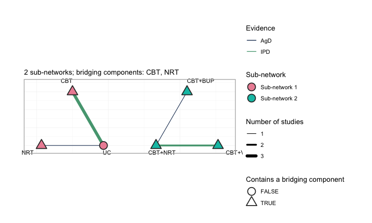
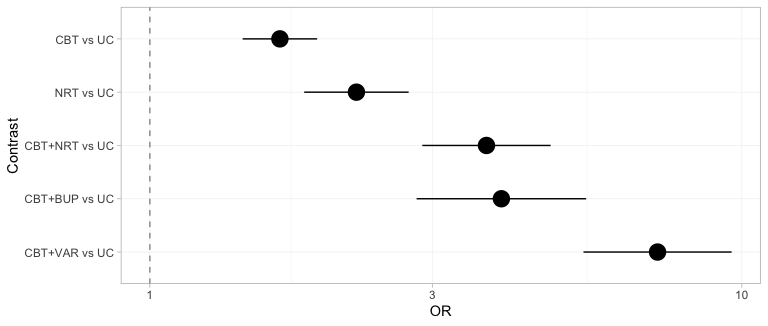
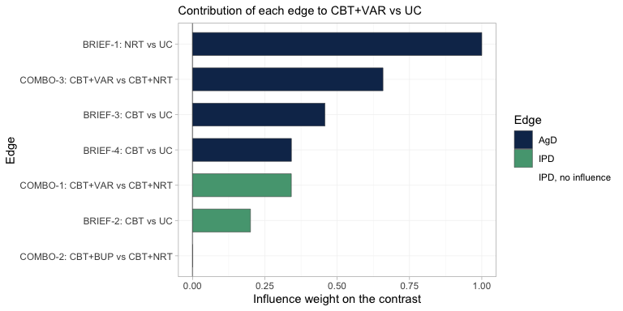

``` r
library(cpaic)
library(ggplot2)
set.seed(2026)
```

This vignette is a complete worked example for a **binary** endpoint in the
situation cpaic exists for: a treatment network that is **disconnected** *and*
whose trials enrolled **different populations**. We reconnect it through shared
treatment components and adjust it for effect-modifier imbalance at the same
time, along two routes: the frequentist two-stage route (`cstc()` / `cmaic()`
feeding `cnma_bridge()`) and the one-stage Bayesian route (`cmlnmr()`).

For the general framework see `vignette("cpaic-methods")`; for the
population-specific *hierarchies* that follow from it see
`vignette("cpaic-disconnected-myeloma")`; for a count endpoint with an exposure
offset see `vignette("count-outcomes")`.

> **The data here are entirely simulated.** The clinical setting (smoking
> cessation) supplies only the vocabulary, because cessation packages are
> genuinely multi-component: behavioral support and pharmacotherapy are combined.
> No number below is taken from any trial or publication. We set the true
> parameter values ourselves, which is exactly what lets us check whether each
> method recovers them.

## The clinical question

Write `UC` for usual care (brief advice; the inactive comparator) and use four
active components:

* `NRT`: nicotine replacement therapy,
* `CBT`: intensive behavioral counseling,
* `VAR`: varenicline,
* `BUP`: bupropion.

The outcome is **sustained abstinence at six months** (a binary success), so a
log odds ratio above zero favors the active arm.

The trials split into two groups that share **no treatment**:

* **Sub-network 1**, older trials against usual care: `UC` vs `NRT` (once), and
  `UC` vs `CBT` (three times).
* **Sub-network 2**, newer trials that give everyone counseling and randomize the
  drug on top: `CBT+NRT` vs `CBT+VAR` (twice), and `CBT+NRT` vs `CBT+BUP` (once).

No trial links the two groups. A guideline panel nevertheless has to ask:
**how does counseling plus varenicline (`CBT+VAR`) compare with nicotine
replacement alone (`NRT`)?** That contrast crosses the gap, and no randomized
comparison of any kind speaks to it.

The two groups also enrolled different smokers. The newer combination trials
recruited **heavier** smokers. We use baseline cigarettes per day as the effect
modifier, coded `cpd = (cigarettes per day - 15) / 10`, so `cpd = 0` is a
15-a-day smoker and `cpd = 1` is a 25-a-day smoker. Heavier smokers are harder
to treat (a prognostic effect) *and* respond differently to the components (an
effect-modifying one).

## The model

`cmlnmr()` fits an individual-level logistic regression to every patient,
whether that patient's data arrive as IPD or are integrated out of an aggregate
arm:
$$
\operatorname{logit}\Pr(y_{ijk} = 1 \mid x_i)
  \;=\; \mu_j + x_i^\top b \;+\; C_k^\top(\beta + \Gamma x_i),
$$
where $j$ indexes the study, $k$ the treatment, $\mu_j$ is a study intercept,
$b$ collects the prognostic effects, and $C_k$ is the row of the
treatment-by-component matrix $C$ that says which components treatment $k$
contains. The component main effects are $\beta$ and the component by
effect-modifier interactions are $\Gamma$.

Two consequences follow immediately, and they organize the whole vignette.

**1. The relative effect is population-specific.** The log odds ratio of
treatment $t$ against treatment $u$ in a population with effect-modifier value
$x$ is
$$
\theta_t(x) - \theta_u(x) \;=\; (C_t - C_u)^\top (\beta + \Gamma x).
$$
There is **no population-free relative effect** once $\Gamma \neq 0$. Asking for
one is asking a question that has no answer, so `relative_effects()` requires a
`newdata` argument naming the target population. Note also that $\beta$ on its
own is the effect at the covariate *origin*: here, at a smoker who smokes 15 a
day. It is not a population-adjusted quantity and should not be reported as one.

**2. Sub-networks that share components share parameters.** `CBT+VAR` and `NRT`
have no trial between them, but `CBT+VAR` contains `CBT`, which the old trials
measured, and the newer trials measure `VAR` against `NRT` on a common
counseling backbone. The additive structure turns those shared components into
shared parameters, which reconnects the network by construction, while the
aggregate arms are fitted by integrating the individual model over each study's
own covariate distribution [@phillippo2020mlnmr].

### Non-collapsibility, and why it matters here

The odds ratio is **non-collapsible** [@greenland1999]. The population-average
(marginal) log odds ratio is not the average of the individual (conditional) log
odds ratios: it is pulled toward the null whenever a prognostic covariate is left
out of the model, *even when there is no effect modification at all*. That is a
property of the logit link, not a bias.

So "the log odds ratio in population $P$" is ambiguous until you say whether you
mean the conditional or the marginal one, and the methods answer differently
[@remiro2022]:

| method | estimand |
|---|---|
| `cstc()` | **conditional** log OR at the target's covariate values |
| `cmaic()` | **marginal** log OR in the target population |
| `cmlnmr()`, i.e. $(C_t - C_u)^\top(\beta + \Gamma x)$ | **conditional** log OR at $x$ |

All three can be simultaneously correct and still disagree. We will see them
disagree, and we will measure the disagreement against the truth we planted.

## Setting up the data

We set the truth ourselves. `beta_true` are the component log odds ratios at
`cpd = 0` and `gamma_true` are their interactions with `cpd`: varenicline holds
up in heavy smokers, whereas nicotine replacement and counseling lose ground.


``` r
treatments <- c("UC", "NRT", "CBT", "CBT+NRT", "CBT+VAR", "CBT+BUP")
Cmat <- build_C_matrix(treatments, inactive = "UC")
Cmat
#>         BUP CBT NRT VAR
#> UC        0   0   0   0
#> NRT       0   0   1   0
#> CBT       0   1   0   0
#> CBT+NRT   0   1   1   0
#> CBT+VAR   0   1   0   1
#> CBT+BUP   1   1   0   0

beta_true  <- c(BUP = 0.45, CBT =  0.55, NRT =  0.50, VAR = 0.95)  # at cpd = 0
gamma_true <- c(BUP = 0.05, CBT = -0.20, NRT = -0.40, VAR = 0.35)  # x cpd
b_prog     <- -0.35        # heavier smokers quit less often, whatever the arm

# theta_t(x) = C_t' (beta + Gamma x): the TRUE conditional log-OR vs UC.
theta <- function(trt, x) {
  ct <- Cmat[trt, ]
  comps <- names(ct)
  sum(ct * beta_true[comps]) + sum(ct * gamma_true[comps]) * x
}
```

The headline contrast is therefore, exactly,
$$
\theta_{\texttt{CBT+VAR}}(x) - \theta_{\texttt{NRT}}(x)
 = \underbrace{(0.55 + 0.95 - 0.50)}_{1.00}
 + \underbrace{(-0.20 + 0.35 + 0.40)}_{0.55}\, x ,
$$
which runs from an odds ratio of 2.18 in a
10-a-day population to 4.71 in a 25-a-day one.
One number cannot serve both.

Seven trials. Two of them are ours, so we hold IPD; the other five are published,
so we hold only aggregate data. The IPD trials enrolled a real spread of smokers,
because a component by effect-modifier interaction is identified from covariate
variation **within** a trial: a trial in which everybody smokes 20 a day carries
no information about how the effect varies with smoking rate, however many
patients it has.


``` r
design <- data.frame(
  study = c("BRIEF-1", "BRIEF-2", "BRIEF-3", "BRIEF-4",
            "COMBO-1", "COMBO-2", "COMBO-3"),
  arm1  = c("UC", "UC", "UC", "UC", "CBT+NRT", "CBT+NRT", "CBT+NRT"),
  arm2  = c("NRT", "CBT", "CBT", "CBT", "CBT+VAR", "CBT+BUP", "CBT+VAR"),
  n     = c(1200, 700, 1200, 1000, 700, 1100, 1200),     # per arm
  mu    = c(-1.9, -1.9, -1.8, -2.0, -1.9, -1.9, -1.8),   # study intercept
  cpd_m = c(-0.7, 0.0, 0.0, 0.2, 0.6, 0.9, 0.5),         # covariate mean
  cpd_s = c(0.55, 0.85, 0.60, 0.60, 0.85, 0.55, 0.60),   # covariate SD
  ipd   = c(FALSE, TRUE, FALSE, FALSE, TRUE, FALSE, FALSE),
  stringsAsFactors = FALSE
)
knitr::kable(design, caption = "Trial design. BRIEF-* are older; COMBO-* newer.")
```


Table: Trial design. BRIEF-* are older; COMBO-* newer.

|study   |arm1    |arm2    |    n|   mu| cpd_m| cpd_s|ipd   |
|:-------|:-------|:-------|----:|----:|-----:|-----:|:-----|
|BRIEF-1 |UC      |NRT     | 1200| -1.9|  -0.7|  0.55|FALSE |
|BRIEF-2 |UC      |CBT     |  700| -1.9|   0.0|  0.85|TRUE  |
|BRIEF-3 |UC      |CBT     | 1200| -1.8|   0.0|  0.60|FALSE |
|BRIEF-4 |UC      |CBT     | 1000| -2.0|   0.2|  0.60|FALSE |
|COMBO-1 |CBT+NRT |CBT+VAR |  700| -1.9|   0.6|  0.85|TRUE  |
|COMBO-2 |CBT+NRT |CBT+BUP | 1100| -1.9|   0.9|  0.55|FALSE |
|COMBO-3 |CBT+NRT |CBT+VAR | 1200| -1.8|   0.5|  0.60|FALSE |


Note which edges are aggregate-only, because it will matter a great deal later:
**`NRT` versus `UC` is measured by exactly one trial (`BRIEF-1`, aggregate), and
bupropion by exactly one (`COMBO-2`, aggregate).** Counseling and varenicline, by
contrast, are each measured by an IPD trial.


``` r
gen_arm <- function(study, trt, n, mu, m, s) {
  cpd <- rnorm(n, m, s)
  eta <- mu + b_prog * cpd + vapply(cpd, function(x) theta(trt, x), numeric(1))
  data.frame(.study = study, .trt = trt, .y = rbinom(n, 1, plogis(eta)),
             cpd = cpd, stringsAsFactors = FALSE)
}
patients <- do.call(rbind, lapply(seq_len(nrow(design)), function(i) {
  d <- design[i, ]
  rbind(gen_arm(d$study, d$arm1, d$n, d$mu, d$cpd_m, d$cpd_s),
        gen_arm(d$study, d$arm2, d$n, d$mu, d$cpd_m, d$cpd_s))
}))
is_ipd <- patients$.study %in% design$study[design$ipd]
```

The two routes want the data in **different shapes**, and it is worth being
explicit about that.

`cmlnmr()` takes patient rows plus **arm-level** aggregate rows (events `r`,
sample size `n`, and each effect modifier's `_mean` and `_sd`), because it
rebuilds the aggregate likelihood from the individual model:


``` r
ipd <- patients[is_ipd, ]
agd <- do.call(rbind, lapply(
  split(patients[!is_ipd, ], ~ .study + .trt, drop = TRUE),
  function(d) data.frame(
    .study = d$.study[1], .trt = d$.trt[1],
    r = sum(d$.y), n = nrow(d),
    cpd_mean = mean(d$cpd), cpd_sd = sd(d$cpd), stringsAsFactors = FALSE)))
agd <- agd[order(agd$.study, agd$.trt), ]
rownames(agd) <- NULL
knitr::kable(agd, digits = 3, caption = "Aggregate arms, the shape cmlnmr() wants")
```


Table: Aggregate arms, the shape cmlnmr() wants

|.study  |.trt    |   r|    n| cpd_mean| cpd_sd|
|:-------|:-------|---:|----:|--------:|------:|
|BRIEF-1 |NRT     | 355| 1200|   -0.724|  0.535|
|BRIEF-1 |UC      | 190| 1200|   -0.689|  0.546|
|BRIEF-3 |CBT     | 283| 1200|    0.011|  0.608|
|BRIEF-3 |UC      | 171| 1200|    0.024|  0.624|
|BRIEF-4 |CBT     | 191| 1000|    0.192|  0.602|
|BRIEF-4 |UC      | 127| 1000|    0.219|  0.586|
|COMBO-2 |CBT+BUP | 219| 1100|    0.931|  0.559|
|COMBO-2 |CBT+NRT | 209| 1100|    0.897|  0.570|
|COMBO-3 |CBT+NRT | 319| 1200|    0.515|  0.596|
|COMBO-3 |CBT+VAR | 501| 1200|    0.495|  0.586|


`cpaic_network()` takes **contrast-level** aggregate data (one row per
comparison: `TE`, `seTE`), the convention of `netmeta::discomb()`. Every study
appears, including the two IPD ones, whose *unadjusted* contrasts `cstc()` and
`cmaic()` will overwrite with adjusted ones:


``` r
contrast_of <- function(d, a1, a2) {
  cell <- function(a) { s <- d[d$.trt == a, ]; c(r = sum(s$.y), n = nrow(s)) }
  x2 <- cell(a2); x1 <- cell(a1)
  logodds <- function(v) log(v["r"] / (v["n"] - v["r"]))
  data.frame(
    studlab = d$.study[1], treat1 = a2, treat2 = a1,
    TE   = unname(logodds(x2) - logodds(x1)),
    seTE = unname(sqrt(1 / x2["r"] + 1 / (x2["n"] - x2["r"]) +
                       1 / x1["r"] + 1 / (x1["n"] - x1["r"]))),
    stringsAsFactors = FALSE)
}
agd_contr <- do.call(rbind, lapply(seq_len(nrow(design)), function(i) {
  d <- design[i, ]
  contrast_of(patients[patients$.study == d$study, ], d$arm1, d$arm2)
}))
knitr::kable(agd_contr, digits = 3,
             caption = "Unadjusted contrasts, the shape cpaic_network() wants")
```


Table: Unadjusted contrasts, the shape cpaic_network() wants

|studlab |treat1  |treat2  |    TE|  seTE|
|:-------|:-------|:-------|-----:|-----:|
|BRIEF-1 |NRT     |UC      | 0.803| 0.101|
|BRIEF-2 |CBT     |UC      | 0.424| 0.142|
|BRIEF-3 |CBT     |UC      | 0.619| 0.107|
|BRIEF-4 |CBT     |UC      | 0.484| 0.124|
|COMBO-1 |CBT+VAR |CBT+NRT | 0.699| 0.119|
|COMBO-2 |CBT+BUP |CBT+NRT | 0.058| 0.108|
|COMBO-3 |CBT+VAR |CBT+NRT | 0.683| 0.088|


The network is disconnected, and `cpaic_connectivity()` says so, along with the
components that could bridge it:


``` r
net <- cpaic_network(agd_contr, ipd = ipd, sm = "OR", family = "binomial",
                     inactive = "UC", ipd_covariates = "cpd")
cpaic_connectivity(net)
#> cpaic connectivity
#>   Connected network: FALSE
#>   Sub-networks:      2
#>     [1] 3 treatments
#>     [2] 3 treatments
#>   Bridging components: CBT, NRT
#>     (components that OCCUR in more than one sub-network; occurrence is
#>      not identifiability, homogeneity, or influence for any contrast.)
#>   Component design:  rank(X) = 4 / 4 components -> all component effects identified
#>   Estimable effects: 5 / 5 vs UC
```

`plot()` draws the same verdict. Each sub-network is laid out on its own circle,
so a disconnected network looks disconnected; edges are colored by whether the
comparison carries any individual patient data, and their width is the number of
studies contributing to it.


``` r
# the panel is widened so that the outer treatment labels are not clipped
plot(net)
```

<div class="figure" style="text-align: center">

<p class="caption">plot of chunk network-plot</p>
</div>

Three things to read off it. First, the two groups sit side by side with **no
edge between them**: no comparator, direct or indirect, joins `UC`, `NRT` and
`CBT` to `CBT+NRT`, `CBT+VAR` and `CBT+BUP`. Second, every treatment except `UC`
is drawn as a triangle, meaning it contains one of the two bridging components,
`CBT` or `NRT`; it is through those shared components, and not through any
comparator, that the additive model will carry information across the gap. Third,
only two comparisons are green, the color reserved for a comparison on which at
least one study holds individual patient data: `UC` versus `CBT`, which three
studies inform but only `BRIEF-2` informs with patient records, and `CBT+NRT`
versus `CBT+VAR`, where `COMBO-1` does the same. **Every adjustment the
frequentist route can perform happens on those two edges.** The remaining five
edges enter the analysis exactly as their publications reported them.

The component design matrix $X = BC$ nevertheless has full column rank. **Hold
that thought.** Full rank means every component effect is identified *as an
aggregate-data component NMA would define it* [@Wigle2026]. It does not mean
every population-adjusted effect is identified, and the difference turns out to
be the whole story.

## Covariate balance

Population adjustment exists because the trial populations differ. They do:


``` r
balance <- do.call(rbind, lapply(split(patients, patients$.study), function(d)
  data.frame(Study = d$.study[1],
             Cigarettes_per_day = 15 + 10 * mean(d$cpd),
             cpd_mean = mean(d$cpd), cpd_sd = sd(d$cpd),
             Quit_rate = mean(d$.y))))
knitr::kable(balance, digits = 2, row.names = FALSE,
             caption = "Effect-modifier balance across the five trials")
```


Table: Effect-modifier balance across the five trials

|Study   | Cigarettes_per_day| cpd_mean| cpd_sd| Quit_rate|
|:-------|------------------:|--------:|------:|---------:|
|BRIEF-1 |               7.94|    -0.71|   0.54|      0.23|
|BRIEF-2 |              15.06|     0.01|   0.85|      0.18|
|BRIEF-3 |              15.17|     0.02|   0.62|      0.19|
|BRIEF-4 |              17.05|     0.21|   0.59|      0.16|
|COMBO-1 |              20.92|     0.59|   0.85|      0.30|
|COMBO-2 |              24.14|     0.91|   0.56|      0.19|
|COMBO-3 |              20.05|     0.51|   0.59|      0.34|


`BRIEF-1` recruited 8-a-day smokers; `COMBO-2` recruited 24-a-day smokers. A
comparison that ignores this is comparing the wrong people.

We must therefore name a **target population**. Take the caseload a stop-smoking
service actually sees: a mean of 18 cigarettes a day, i.e. `cpd = 0.3`. We will
also ask for a lighter-smoking population, `cpd = -0.4` (11 a day), to show that
the answer moves.


``` r
target      <- data.frame(cpd = 0.3)    # 18 cigarettes/day: the decision population
target_light <- data.frame(cpd = -0.4)  # 11 cigarettes/day
```

## Fitting

### Route 1: two stages, frequentist

`cstc()` fits, in each IPD study, an outcome regression with treatment main
effects, prognostic main effects, and treatment-by-effect-modifier interactions,
with the effect modifiers **centered at the target**. The treatment coefficient
is then the anchored, population-adjusted contrast in the target population.
`cmaic()` instead reweights each IPD study so its effect-modifier distribution
matches the target [@signorovitch2010] and refits. Both then hand their
adjusted contrasts to `cnma_bridge()`, which combines everything through the
additive component model [@rucker2020cnma].


``` r
fit_stc <- cstc(net, target = c(cpd = 0.3), effect_modifiers = "cpd")

fit_maic <- cmaic(net, target = c(cpd = 0.3), target_sd = c(cpd = 0.7),
                  effect_modifiers = "cpd", n_boot = 200, seed = 7)
effective_sample_size(fit_maic)
#>  BRIEF-2  COMBO-1 
#> 1212.364 1208.169
```

Matching costs information. The effective sample sizes above are what is left of
each IPD trial after reweighting; `COMBO-1`, which is furthest from the target,
pays the most. (We pass `target_sd` as well as the mean so that MAIC matches the
target's *variance* too, not only its center.)

`forest()` displays the bridged result. Read it once for the answers and once for
what it does **not** say.


``` r
forest(fit_stc)
```

<div class="figure" style="text-align: center">

<p class="caption">plot of chunk forest-stc</p>
</div>

Every contrast against usual care receives a point estimate and an interval, the
three that cross the gap included, and nothing on the plot distinguishes a
contrast the data determine from one they do not. That is not a defect of
`forest()`; it is a faithful rendering of what the frequentist bridge believes.
The `NRT` versus `UC` row, which sits comfortably clear of the null, is the one
to remember: we return to it once we have the machinery to see what is wrong with
it.

### Two routes, two estimands

Before reading any numbers, be clear about what each route is estimating. On a
non-collapsible scale this is not a detail:

* `cstc()` reports the coefficient on treatment in a regression that also
  contains `cpd`. That is a **conditional** log odds ratio, at `cpd = 0.3`.
* `cmaic()` reports the coefficient on treatment in a weighted regression with
  **no covariates**, fitted to a sample reweighted to look like the target. That
  is a **marginal** log odds ratio in the target population.
* `cmlnmr()`'s $(C_t - C_u)^\top(\beta + \Gamma x)$ is, like `cstc()`,
  **conditional** at `x`.

These are different numbers, and we can prove it before fitting anything. The
adjusted contrast each method hands to the bridge is stored on the fitted object,
so we can line it up against the truth it is *supposed* to be estimating. The true
conditional effect is $(C_t - C_u)^\top(\beta + \Gamma x)$, in closed form; the
true marginal effect we get by G-computation over the target population. (Because
MAIC's weights are exponential in `cpd` and `cpd`$^2$, reweighting a normal
covariate returns exactly a normal, so the target really is
$\mathrm{N}(0.3,\,0.7^2)$ and this Monte Carlo is exact.)


``` r
edge <- function(fitobj, study) {
  a <- fitobj$bridge$network$agd
  a$TE[a$studlab == study]
}
mu_of <- function(s) design$mu[design$study == s]

# the TRUE conditional log-OR: (C_t - C_u)' (beta + Gamma x), in closed form
truth <- function(t1, t2, x) theta(t1, x) - theta(t2, x)

# true MARGINAL log-OR in the target population, by G-computation
mc_marginal <- function(mu, t1, t2, m = 0.3, s = 0.7, M = 2e5) {
  x <- rnorm(M, m, s)
  p <- function(t) mean(plogis(mu + b_prog * x +
                               vapply(x, function(z) theta(t, z), numeric(1))))
  qlogis(p(t1)) - qlogis(p(t2))
}

knitr::kable(data.frame(
  Edge = c("BRIEF-2: CBT vs UC", "COMBO-1: CBT+VAR vs CBT+NRT"),
  true_conditional = c(truth("CBT", "UC", 0.3),
                       truth("CBT+VAR", "CBT+NRT", 0.3)),
  cSTC             = c(edge(fit_stc, "BRIEF-2"), edge(fit_stc, "COMBO-1")),
  true_marginal    = c(mc_marginal(mu_of("BRIEF-2"), "CBT", "UC"),
                       mc_marginal(mu_of("COMBO-1"), "CBT+VAR", "CBT+NRT")),
  cMAIC            = c(edge(fit_maic, "BRIEF-2"), edge(fit_maic, "COMBO-1"))),
  digits = 3, row.names = FALSE,
  caption = "Adjusted log odds ratios each method hands to the bridge, against the estimand it targets")
```


Table: Adjusted log odds ratios each method hands to the bridge, against the estimand it targets

|Edge                        | true_conditional|  cSTC| true_marginal| cMAIC|
|:---------------------------|----------------:|-----:|-------------:|-----:|
|BRIEF-2: CBT vs UC          |            0.490| 0.284|         0.513| 0.359|
|COMBO-1: CBT+VAR vs CBT+NRT |            0.675| 0.632|         0.579| 0.620|


Read that table by rows, and note that the *direction* of the estimand gap is not
fixed:

* On `COMBO-1`, where the effect modification is strong, the marginal truth sits
  well below the conditional one (a gap near 0.10 on the log scale, about 10% on
  the odds-ratio scale), and `cmaic()` duly comes out below `cstc()`.
* On `BRIEF-2` the marginal truth sits slightly *above* the conditional one, and
  `cmaic()` duly comes out above `cstc()`.

Each method tracks its own estimand, gap direction included. The naive summary
"the marginal effect is attenuated toward the null" is only half the story: pure
non-collapsibility does attenuate, but once a component is effect-modified, the
marginal effect also re-weights the conditional effects across the covariate
distribution, and that can push either way.

The *levels* in the table are noisy: with a binary outcome and 700 patients per
arm, an edge carries a standard error around 0.15, and the `BRIEF-2` estimates
both sit about a standard error below their targets. The ordering is the signal
here, not the third decimal place. **The two methods are estimating different
quantities, and both are estimating them correctly.**

Watch what the bridge then does with that difference, though. Each adjusted IPD
edge is pooled with the *unadjusted aggregate* edges that sit on the same
contrast (`BRIEF-3` and `BRIEF-4` on `CBT`; `COMBO-3` on `VAR` versus `NRT`), and
those aggregate contrasts are identical in both routes. The estimand difference
therefore survives into the bridged answer only in proportion to how much of the
edge's weight the IPD trial carries. In a network with plenty of aggregate
evidence, the two routes can come out close together **not because the estimands
agree, but because the adjustment is a minority of the weight.** That is worth
knowing before you conclude from a small STC-MAIC gap that the choice did not
matter.

### Route 2: one stage, Bayesian

`cmlnmr()` does the connecting and the adjusting in a single likelihood. The
individual-level model above is fitted directly to the IPD, and each aggregate
arm's likelihood is that same model **integrated over that study's own covariate
distribution** using quasi-Monte-Carlo points. Nothing is plugged in at a study
mean, which matters because the logit link is nonlinear:
$\mathbb{E}[\operatorname{logit}^{-1}(\eta)] \neq \operatorname{logit}^{-1}(\mathbb{E}[\eta])$.

We use `trt_effects = "random"`, which adds a study-arm deviation around the
component-implied effect, so the component model is not forced to fit every trial
exactly.


``` r
fit <- cmlnmr(ipd, agd,
              effect_modifiers = "cpd",
              inactive = "UC", family = "binomial",
              trt_effects = "random",
              chains = 4, iter_warmup = 500, iter_sampling = 500,
              n_int = 64, seed = 1, show_exceptions = FALSE)
#> Error in `x@mode`:
#> ! no applicable method for `@` applied to an object of class "try-error"
fit
#> Error:
#> ! object 'fit' not found
```

Note what the print method insists on: those component effects are at the
covariate **origin**, not in any population you care about.

### Priors

Every prior is recorded on the fitted object, because with a weakly identified
$\Gamma$ the interaction prior does real work and you should be able to see
exactly how much:


``` r
knitr::kable(do.call(rbind, lapply(names(fit$priors), function(p) {
  s <- fit$priors[[p]]
  data.frame(parameter = p, distribution = s$distribution,
             location = s$location, scale = s$scale)
})), caption = "The complete prior specification, as passed to Stan")
#> Error:
#> ! object 'fit' not found
```

The defaults are the Stan prior-choice recommendations: normal(0, 2.5) on
component effects and study intercepts, normal(0, 1) on the component by
effect-modifier interactions, and half-normal(0, 1) on the heterogeneity
standard deviation `tau`. On the log-odds scale a normal(0, 2.5) is already
permissive; a normal(0, 1) on an interaction says that a one-unit change in
`cpd` (10 cigarettes a day) is unlikely to swing a component's log odds ratio by
more than about two.

Stating a prior is not the same as knowing what it did. `plot_prior_posterior()`
answers that: it draws each posterior as a histogram and its prior as a line, so
a parameter the data informed is one whose histogram has pulled away from the
line beneath it.


``` r
plot_prior_posterior(fit)
#> Error:
#> ! object 'fit' not found
```

The study intercepts `mu` and the component effects `beta` are sharp against
broad priors, as they should be with several thousand patients. The components
are indexed alphabetically, so `beta[1]` is bupropion, and it is conspicuously
the widest of the four: bupropion is carried by a single aggregate trial. The
telling panel, though, is `gamma[1,1]`, the bupropion by `cpd` interaction, whose
histogram lies underneath its prior curve almost exactly. That is the visual
signature of a parameter the likelihood does not constrain at all, and we take it
up in earnest below.

### Convergence


``` r
data.frame(
  divergences   = fit$diagnostics$divergences,
  max_treedepth = fit$diagnostics$max_treedepth,
  max_rhat      = round(fit$diagnostics$max_rhat, 4),
  min_ess_bulk  = round(min(fit$fit$summary(c("beta", "gamma", "mu",
                                              "tau"))$ess_bulk, na.rm = TRUE))
)
#> Error:
#> ! object 'fit' not found
```

The trace plot shows the same thing chain by chain.


``` r
plot(fit, type = "trace")
#> Error:
#> ! object 'fit' not found
```


``` r
plot(fit, type = "rhat")
#> Error:
#> ! object 'fit' not found
```

All four chains overlap and are stationary in every panel, and every $\hat{R}$
sits in the lowest band. Note that the *width* of a trace is not a convergence
problem but an information statement: `beta[1]` and `gamma[1,1]`, bupropion and
its interaction, wander over a range several times wider than the others, because
one aggregate two-arm trial is all the evidence there is about bupropion. This is
the distinction that governs the rest of the vignette: **convergence is a
property of the sampler, not of the evidence.** A parameter the data say nothing
about will converge perfectly well onto its prior.

Sampling is not the only numerical approximation here. Each aggregate arm's
likelihood is an integral of the individual model over that study's covariate
distribution, evaluated at `n_int = 64` quasi-Monte-Carlo points, and
`plot_integration_error()` traces how far the integral at `N` points sits from
the integral at all 64.


``` r
plot_integration_error(fit)
#> Error:
#> ! object 'fit' not found
```

In every aggregate arm the error is already well inside the dashed `1/N` envelope
by twenty points and keeps shrinking toward sixty-four, so `n_int = 64` is ample
for this model. `COMBO-2`'s bupropion arm is the noisiest of the ten, which is
consistent with it being the arm the model knows least about. Had any panel still
been drifting at the right-hand edge, the remedy would have been to refit with
more integration points, not to reinterpret the answer.

## Estimability: reconnecting is not identifying

`cpaic_connectivity()` told us the component design has full column rank, so the
frequentist bridge will happily print an estimate for every cell of the league
table. That is exactly the trap.

Population adjustment is **strictly harder** than reconnection, because the
estimand $(C_t - C_u)^\top(\beta + \Gamma x)$ needs the *interactions* $\Gamma$
to be identified too, and an aggregate two-arm trial supplies **one** number per
contrast: it pins down $m^\top(\beta + \Gamma \bar x_j)$ at its own covariate
mean $\bar x_j$ and cannot separate $m^\top\beta$ from $m^\top\Gamma$.
`estimable_effects_at()` runs that algebra for a named target population.


``` r
estimable_effects_at(fit, newdata = target, reference = "NRT")
#> Error:
#> ! object 'fit' not found
```

Read the `identified_by` column. `CBT+NRT` and `CBT+VAR` are identified **from
IPD**, meaning from covariate variation *within* a trial. The other three are not
identified at all:

* `UC` and `CBT` against `NRT` each need the `NRT` component **on its own**, and
  only `BRIEF-1` measured that, and did so as an aggregate contrast, at its own mean of
  8 cigarettes a day.
* `CBT+BUP` against `NRT` needs bupropion-minus-nicotine-replacement, and only
  `COMBO-2` measured that, again as an aggregate contrast, at its own mean of 24 a day.

Those two quantities are pinned down at *those trials' covariate means*, and 18
cigarettes a day is neither of them. An aggregate two-arm trial gives you one
equation; separating a component's main effect from its interaction takes two.

That table is one target population. `plot_estimability()` runs the same algebra
across a whole grid of them, which is the only way to see that estimability is
not a fixed property of the network.


``` r
plot_estimability(fit, em = "cpd", values = seq(-1, 1, by = 0.25),
                  reference = "NRT")
#> Error:
#> ! object 'fit' not found
```

The good news is the two green rows, and they are the rows that matter: the
headline contrast `CBT+VAR` versus `NRT` is identified from within-trial
covariate variation at **every** target population in the plausible range, from
5-a-day smokers to 25-a-day ones, and so is `CBT+NRT` versus `NRT`. The
population-adjusted comparison across the gap is available wherever a guideline
panel might want to stand. The three red rows are equally uniform, and equally
informative: no choice of target rescues them.

The dependence on the target is real, not a technicality. `BRIEF-1` enrolled
8-a-day smokers; ask for **exactly that** population and `NRT` becomes estimable
again. Note "exactly": the criterion holds at the trial's realized covariate mean,
so we read that mean off the aggregate data rather than typing in the nominal
`-0.7` we simulated from.


``` r
own <- data.frame(cpd = mean(agd$cpd_mean[agd$.study == "BRIEF-1"]))
own
#>          cpd
#> 1 -0.7061574
estimable_effects_at(fit, newdata = own, reference = "UC")
#> Error:
#> ! object 'fit' not found
```

That is the whole of what an aggregate two-arm trial can tell you: its own
contrast, in its own population. Everything else is extrapolation through
$\Gamma$, and $\Gamma$ has to come from somewhere.

Redraw the map on a grid that passes exactly through `BRIEF-1`'s own covariate
mean, and the point becomes a picture. This time we take the comparisons against
usual care, which is where the aggregate `NRT` edge does its work.


``` r
plot_estimability(fit, em = "cpd", values = own$cpd + 0.25 * (-1:7))
#> Error:
#> ! object 'fit' not found
```

One column of the map, and one only, is different: at `BRIEF-1`'s own population
three further contrasts become estimable, and they come up **yellow**, not green.
Yellow is `identified_by = "aggregate"`, which is to say identified
*ecologically*, from between-study differences in covariate means rather than
from randomized within-study variation. Randomization does not protect an
ecological comparison, and `estimable_effects_at()` labels its basis a
"first-order screen" precisely to warn that on a nonlinear link the criterion may
be optimistic there. Estimability is therefore not one property but two: whether a
contrast can be identified at all, and on what kind of evidence. One step either
side of that column, every one of those three contrasts is red again.

The same algebra reaches the component effects. In the target population, only
`CBT` is separately identified; even `VAR` is not, because varenicline was only
ever measured *against* nicotine replacement:


``` r
component_effects(fit, newdata = target)
#> Error:
#> ! object 'fit' not found
```

`forest()` renders the same table, and renders the `NA`s as what they are.


``` r
forest(fit, what = "component", newdata = target)
#> Error:
#> ! object 'fit' not found
```

Three of the four components are printed as empty rows marked *not estimable*
rather than dropped. Dropping them would leave a plot that looked complete when
it was not, which is the single most consequential design decision in the
package's plotting surface.

That looks like a defeat and is not. The headline contrast does not need `VAR`
alone: `CBT+VAR` versus `NRT` is `CBT` plus (`VAR` minus `NRT`), and *both of
those pieces come from IPD*. cpaic returns `NA` for what it cannot identify and a
number for what it can, which is the behavior you want from a tool that will
otherwise hand you the prior with a straight face [@Wigle2026].

### Which edges actually carry the answer

The frequentist bridge has no `NA`s to return, but the same linear algebra still
governs it, and `plot_edge_influence()` exposes it from the other side. A bridged
contrast is a weighted combination of the observed edges, with weights chosen by
the component design rather than by any path through the network. Those weights
are worth looking at before trusting the contrast.


``` r
plot_edge_influence(fit_stc, treatment = "CBT+VAR")
```

<div class="figure" style="text-align: center">

<p class="caption">plot of chunk edge-influence</p>
</div>

Read the bars from the top. The edge that contributes **most** to `CBT+VAR`
versus `UC` is `BRIEF-1`, the aggregate trial in 8-a-day smokers; it carries more
weight than any other edge in the network. It reaches this contrast because
varenicline was only ever measured *against* nicotine replacement, so the `NRT`
component has to be supplied from somewhere, and `BRIEF-1` is the only place it
exists. Yet `BRIEF-1` is aggregate, so neither `cstc()` nor `cmaic()` can touch
it, and it enters the bridge in its own light-smoking population. Meanwhile the
two edges that *were* adjusted, `COMBO-1` and `BRIEF-2`, are the green ones, and
between them they carry a minority of the weight.

The last bar is instructive in the opposite direction: `COMBO-2`, the bupropion
trial, has an influence of exactly zero. `CBT+VAR` versus `UC` contains no
bupropion, so no amount of evidence about bupropion can move it. This is the
diagnostic that the conventional population-adjustment checks cannot perform: an
effective sample size tells you how much of a trial survived reweighting, but it
cannot tell you that reweighting that trial was incapable of changing your answer
in the first place.

## Results

### Recovered against the truth

`relative_effects()` needs `newdata`, because there is no population-free answer.
Here is the target population, against `NRT`:


``` r
relative_effects(fit, reference = "NRT", newdata = target)
#> Error:
#> ! object 'fit' not found
```


``` r
forest(fit, reference = "NRT", newdata = target)
#> Error:
#> ! object 'fit' not found
```

Two contrasts, an interval each, and three rows that decline to answer. The
headline result is the bottom row: `CBT+VAR` versus `NRT`, a comparison no trial
in this network made and no comparator connects, estimated in a named population
with an interval that reflects how much the data actually say. Compare this plot
with the frequentist forest above, which had five filled rows and no empty ones.
Same network, same target, same question.

And the same network in a lighter-smoking population:


``` r
relative_effects(fit, reference = "NRT", newdata = target_light)
#> Error:
#> ! object 'fit' not found
```

Now put every method next to the truth we planted. The truth is the conditional
log odds ratio $(C_t - C_u)^\top(\beta + \Gamma x)$, which is what `cstc()` and
`cmlnmr()` target; `cmaic()` targets the marginal effect, so it is expected to
sit closer to the null.


``` r
# pull one cell (as plain numbers) out of a relative_effects() table
grab <- function(tab, t1, ref, what = "estimate") {
  as.numeric(tab[[what]][tab$treatment == t1 & tab$comparator == ref])
}
re_bayes <- relative_effects(fit, reference = "NRT", newdata = target)
#> Error:
#> ! object 'fit' not found
re_stc   <- relative_effects(fit_stc,  reference = "NRT")
re_maic  <- relative_effects(fit_maic, reference = "NRT")

recovery <- do.call(rbind, lapply(c("CBT+NRT", "CBT+VAR"), function(t1) {
  data.frame(
    Contrast       = paste(t1, "vs NRT"),
    True_OR        = exp(truth(t1, "NRT", 0.3)),
    cSTC           = grab(re_stc,   t1, "NRT"),
    cMAIC          = grab(re_maic,  t1, "NRT"),
    `cML-NMR`      = grab(re_bayes, t1, "NRT"),
    `cML-NMR 95% CrI` = sprintf("(%.2f, %.2f)",
                                grab(re_bayes, t1, "NRT", "lower"),
                                grab(re_bayes, t1, "NRT", "upper")),
    check.names = FALSE)
}))
#> Error in `FUN()`:
#> ! object 're_bayes' not found
knitr::kable(recovery, digits = 2, row.names = FALSE,
  caption = "Odds ratios in the target population (cpd = 0.3), against the truth")
#> Error:
#> ! object 'recovery' not found
```

Both estimable contrasts are recovered: the point estimates sit near the planted
truth and the credible intervals cover it. The `CBT+VAR` row is the one to dwell
on, because *no trial in the network measured it*.

The bridged `cSTC` and `cMAIC` answers come out close together, for the reason set
out above: the estimand gap lives on the two IPD edges, and the bridge dilutes it
with unadjusted aggregate evidence on the same contrasts. The place to look for
the difference is the edge table, not the league table.

`league_table()` lays out every pairwise comparison at the target population. It
is worth printing in full, because what it leaves out is as informative as what it
contains.


``` r
lg <- league_table(fit, newdata = target)
#> Error:
#> ! object 'fit' not found
knitr::kable(lg, caption = paste("League table at cpd = 0.3 (row versus column).",
                                 "Empty cells are not estimable."))
#> Error:
#> ! object 'lg' not found
```


