``` r
library(cpaic)
library(ggplot2)
set.seed(2026)
```

This vignette is a complete worked example for a **continuous** outcome: a
treatment network that is **disconnected** *and* whose trials enrolled
**different populations**. We reconnect it through shared treatment components
(additive cNMA) and adjust it for effect-modifier imbalance, by two routes:
the frequentist two-stage route (`cstc()` / `cmaic()` feeding `cnma_bridge()`)
and the one-stage Bayesian route (`cmlnmr()`). For the disconnection story in
the abstract see `vignette("cpaic-disconnected-myeloma")`; for the survival
analogue see `vignette("survival-outcomes")`.

> **The data here are entirely simulated.** The clinical setting (glucose
> lowering in type 2 diabetes) is used only for its vocabulary, because
> antidiabetic regimens are genuinely multi-component: they are built by adding
> agents onto a backbone. No data, effect estimate, or result below is taken
> from any publication. We set the true parameter values ourselves, which is
> exactly what lets us check whether each method recovers them.

## The clinical question

The outcome is the **change in HbA1c from baseline at 26 weeks** (percentage
points, lower is better), so the summary measure is a **mean difference** (MD)
on an identity link.

Write `Diet` for lifestyle advice alone (the inactive comparator) and use four
active components: `Met` (metformin), `SU` (a sulfonylurea), `SGLT2` (an SGLT2
inhibitor), and `DPP4` (a DPP-4 inhibitor). The evidence splits into two groups
of trials that share **no treatment at all**:

* **Sub-network 1**, older monotherapy trials against lifestyle advice:
  `Diet` vs `Met`, `Diet` vs `SU`.
* **Sub-network 2**, newer add-on trials on a metformin backbone:
  `Met+SU` vs `Met+SGLT2`, `Met+SU` vs `Met+DPP4`.

No trial links the two groups. A guideline committee nevertheless has to ask:
**how much extra HbA1c lowering do you get by adding an SGLT2 inhibitor to
metformin, compared with metformin alone?** That is `Met+SGLT2` versus `Met`,
and it crosses the gap. No trial measured it.

The two groups of trials also enrolled different patients. **Baseline HbA1c**
is the effect modifier: agents that act through insulin secretion lower HbA1c
much more in patients who start higher, while the SGLT2 inhibitor's effect is
comparatively flat. The newer add-on trials enrolled patients with worse
glycemic control than the older monotherapy trials, so the imbalance is real
and it matters.

## The model

Component-additive ML-NMR marries two ideas. From additive cNMA
[@rucker2020cnma; @rucker2021disconnected] it takes the treatment-by-component
decomposition, which is what lets shared components carry information across a
gap that no comparator spans. From ML-NMR [@phillippo2020mlnmr] it takes the
integration of an individual-level model over each aggregate study's covariate
distribution, which is what makes the adjustment correct rather than ecological.
The closest prior art for the combination is the Bayesian aggregate-plus-IPD cNMA
of @efthimiou2022, which allows component by covariate interactions in a
connected network.

Every treatment's relative effect is the sum of its component effects, and every
component effect has an interaction with the effect modifier. The estimand is
therefore **population-specific**:

$$
\theta_t(x) \;=\; C_t' \left( \beta + \Gamma x \right),
$$

where $C_t$ is the row of the treatment-by-component matrix for treatment $t$,
$\beta$ holds the component main effects, $\Gamma$ holds the component by
effect-modifier interactions, and $x$ is the effect-modifier value of the
**target** population. There is no population-free relative effect here, and
cpaic will not let you ask for one: `relative_effects()` requires `newdata`.

Because $\beta$ is the vector of effects at $x = 0$, the covariate origin has
to be somewhere meaningful. We therefore center baseline HbA1c at **8.0%** and
work with `bhba1c_c` = baseline HbA1c minus 8. An uncentered covariate would
make $\beta$ the effect "at a baseline HbA1c of zero", which is not a patient.

We pass `inactive = "Diet"`, so lifestyle advice is coded as the all-zero row of
$C$ and the components are read against it. When no treatment in the network is a
genuine inactive comparator, `inactive = NULL` selects the *unanchored* component
parameterization of @wigle2022 instead, in which every unit receives its own
parameter and the anchor is data-driven.


``` r
treatments <- c("Diet", "Met", "SU", "Met+SU", "Met+SGLT2", "Met+DPP4")
Cmat <- build_C_matrix(treatments, inactive = "Diet")
Cmat
#>           DPP4 Met SGLT2 SU
#> Diet         0   0     0  0
#> Met          0   1     0  0
#> SU           0   0     0  1
#> Met+SU       0   1     0  1
#> Met+SGLT2    0   1     1  0
#> Met+DPP4     1   1     0  0

# TRUTH (mean difference in HbA1c change, percentage points; lower is better).
beta_true  <- c(DPP4 = -0.65, Met = -1.10, SGLT2 = -0.60, SU = -0.70)
# Baseline dependence: strong for the insulin-secretion agents, flat for SGLT2.
gamma_true <- c(DPP4 = -0.20, Met = -0.30, SGLT2 = -0.08, SU = -0.40)
stopifnot(identical(names(beta_true), colnames(Cmat)))
```

Note already that `SU` and `SGLT2` must **cross**. Their component effects are
$\theta_{SU}(x) = -0.70 - 0.40x$ and $\theta_{SGLT2}(x) = -0.60 - 0.08x$, equal
at $x = -0.3125$, that is, at a baseline HbA1c of **7.69%**. Below that the
SGLT2 inhibitor lowers HbA1c more; above it the sulfonylurea does. A single
population-free number would be wrong for one side or the other.

## Simulating the evidence

We hold individual patient data (IPD) for three trials and only published
aggregate data (AgD) for three others. The IPD trials matter disproportionately:
a component by effect-modifier interaction is identified from the covariate
variation **within** a trial, so a trial with IPD and a decent spread of
baseline HbA1c is worth far more than its sample size suggests.


``` r
gen_arm <- function(study, trt, n, mu0, hba1c_mean, hba1c_sd = 1.2,
                    sigma = 0.9, prognostic = -0.45) {
  x  <- rnorm(n, hba1c_mean, hba1c_sd) - 8.0        # centered baseline HbA1c
  tc <- Cmat[trt, ]
  mu <- mu0 + prognostic * x +
    sum(tc * beta_true) + sum(tc * gamma_true) * x
  data.frame(.study = study, .trt = trt,
             .y = rnorm(n, mu, sigma), bhba1c_c = x)
}

# What a publication reports for a continuous outcome: an arm mean, its
# standard error, and a baseline-characteristics table.
agg <- function(d) data.frame(
  .study = d$.study[1], .trt = d$.trt[1],
  .y = mean(d$.y), se = sd(d$.y) / sqrt(nrow(d)), n = nrow(d),
  bhba1c_c_mean = mean(d$bhba1c_c), bhba1c_c_sd = sd(d$bhba1c_c))

ipd <- rbind(
  gen_arm("MONO-3", "Diet",      200, 0.05, 8.2),   # sub-network 1
  gen_arm("MONO-3", "SU",        200, 0.05, 8.2),
  gen_arm("ADD-1",  "Met+SU",    200, 0.10, 8.6),   # sub-network 2
  gen_arm("ADD-1",  "Met+SGLT2", 200, 0.10, 8.6),
  gen_arm("ADD-2",  "Met+SU",    200, 0.00, 8.5),
  gen_arm("ADD-2",  "Met+SGLT2", 200, 0.00, 8.5))

agd <- rbind(
  agg(gen_arm("MONO-1", "Diet",     220, 0.00, 7.6)),
  agg(gen_arm("MONO-1", "Met",      220, 0.00, 7.6)),
  agg(gen_arm("MONO-2", "Diet",     200, 0.15, 8.4)),
  agg(gen_arm("MONO-2", "Met",      200, 0.15, 8.4)),
  agg(gen_arm("ADD-3",  "Met+SU",   240, 0.05, 8.7)),
  agg(gen_arm("ADD-3",  "Met+DPP4", 240, 0.05, 8.7)))
knitr::kable(agd, digits = 3, caption = "Aggregate arms: exactly what a paper prints")
```


Table: Aggregate arms: exactly what a paper prints

|.study |.trt     |     .y|    se|   n| bhba1c_c_mean| bhba1c_c_sd|
|:------|:--------|------:|-----:|---:|-------------:|-----------:|
|MONO-1 |Diet     |  0.033| 0.074| 220|        -0.278|       1.200|
|MONO-1 |Met      | -0.772| 0.085| 220|        -0.570|       1.259|
|MONO-2 |Diet     |  0.011| 0.072| 200|         0.384|       1.234|
|MONO-2 |Met      | -1.267| 0.091| 200|         0.487|       1.243|
|ADD-3  |Met+SU   | -2.417| 0.109| 240|         0.639|       1.164|
|ADD-3  |Met+DPP4 | -2.372| 0.098| 240|         0.672|       1.247|


The network really is in two pieces:


``` r
edges <- data.frame(
  treat1 = c("Met", "Met", "SU", "Met+SGLT2", "Met+SGLT2", "Met+DPP4"),
  treat2 = c("Diet", "Diet", "Diet", "Met+SU", "Met+SU", "Met+SU"))
g <- igraph::graph_from_data_frame(unique(edges), directed = FALSE)
igraph::components(g)$no     # number of connected components
#> [1] 2
```

Two components, so a standard network meta-analysis cannot estimate
`Met+SGLT2` versus `Met` at all. The estimate does not exist; it is not merely
imprecise. What reconnects the network is that the regimens are not indivisible:
`Met+SGLT2` and `Met` **share the component `Met`**, and `Met+SU` shares `Met`
and `SU` with the old monotherapy trials. Shared components become shared
parameters.

## Covariate balance

Population adjustment exists because the trial populations differ. Here they
differ exactly along the effect modifier:


``` r
ipd_bal <- aggregate(bhba1c_c ~ .study, data = ipd, FUN = mean)
agd_bal <- aggregate(bhba1c_c_mean ~ .study, data = agd, FUN = mean)
balance <- rbind(
  data.frame(study = ipd_bal$.study, source = "IPD",
             baseline_HbA1c = 8 + ipd_bal$bhba1c_c),
  data.frame(study = agd_bal$.study, source = "AgD",
             baseline_HbA1c = 8 + agd_bal$bhba1c_c_mean))
balance$subnetwork <- ifelse(grepl("^MONO", balance$study), 1, 2)
knitr::kable(balance[order(balance$subnetwork, balance$study), ], digits = 2,
             row.names = FALSE,
             caption = "Mean baseline HbA1c (%) by trial: the imbalance to adjust for")
```


Table: Mean baseline HbA1c (%) by trial: the imbalance to adjust for

|study  |source | baseline_HbA1c| subnetwork|
|:------|:------|--------------:|----------:|
|MONO-1 |AgD    |           7.58|          1|
|MONO-2 |AgD    |           8.44|          1|
|MONO-3 |IPD    |           8.29|          1|
|ADD-1  |IPD    |           8.51|          2|
|ADD-2  |IPD    |           8.50|          2|
|ADD-3  |AgD    |           8.66|          2|


The add-on trials run about half a percentage point higher than the monotherapy
trials. Since the sulfonylurea effect changes by $-0.40$ per point of baseline
HbA1c, that gap alone shifts the `SU` component by roughly $0.2$ points, which is
*twice* the difference between the two add-on agents at the covariate origin
($-0.70$ versus $-0.60$). The imbalance is bigger than the thing we are trying to
measure. Ignoring it is not an option.

## Setting up the data

The two routes want the data in two different shapes, and this is not an
accident: it is the difference between the methods.

The **one-stage Bayesian model** takes the IPD as patient rows and the
aggregate arms as arm rows carrying their covariate summaries. It fits the
individual-level model to the IPD and integrates that same model over each
aggregate study's covariate distribution.

The **two-stage frequentist route** takes contrast-level aggregate data, one
row per pairwise comparison, exactly as `netmeta::discomb()` does. The IPD
studies appear here as ordinary (unadjusted) contrasts; `cstc()` and `cmaic()`
then overwrite them with population-adjusted ones before bridging.


``` r
ipd_arms <- do.call(rbind, lapply(split(ipd, ipd$.study), function(d)
  do.call(rbind, lapply(split(d, d$.trt), agg))))
arms <- rbind(agd, ipd_arms)

contrast_of <- function(s, t1, t2) {
  a <- arms[arms$.study == s & arms$.trt == t1, ]
  b <- arms[arms$.study == s & arms$.trt == t2, ]
  data.frame(studlab = s, treat1 = t1, treat2 = t2,
             TE = a$.y - b$.y, seTE = sqrt(a$se^2 + b$se^2))
}
contrasts <- rbind(
  contrast_of("MONO-1", "Met",       "Diet"),
  contrast_of("MONO-2", "Met",       "Diet"),
  contrast_of("MONO-3", "SU",        "Diet"),
  contrast_of("ADD-1",  "Met+SGLT2", "Met+SU"),
  contrast_of("ADD-2",  "Met+SGLT2", "Met+SU"),
  contrast_of("ADD-3",  "Met+DPP4",  "Met+SU"))

net <- cpaic_network(contrasts, ipd = ipd, sm = "MD", family = "gaussian",
                     ipd_covariates = "bhba1c_c", inactive = "Diet")
net
#> cpaic component network
#>   Summary measure:   MD
#>   Treatments:        6
#>   Components:        4 (DPP4, Met, SGLT2, SU)
#>   AgD comparisons:   6
#>   Reference:         Diet
#>   Inactive:          Diet
#>   IPD studies:       3 (gaussian; 1200 patients)
#>   Connected:         FALSE | components bridgeable: TRUE
cpaic_connectivity(net)
#> cpaic connectivity
#>   Connected network: FALSE
#>   Sub-networks:      2
#>     [1] 3 treatments
#>     [2] 3 treatments
#>   Bridging components: Met, SU
#>   Component design:  rank(X) = 4 / 4 components -> all component effects identified
#>   Estimable effects: 5 / 5 vs Diet
```

`cpaic_connectivity()` makes the bridge explicit: the network is disconnected,
but `Met` and `SU` appear on both sides of the gap, the component design matrix
$X = BC$ has full rank, and so every *component main effect* is identified.
Hold on to the phrase "component main effect"; it is not the same as the
population-adjusted effect, and the difference is the subject of the Results
section.

`plot()` draws what those numbers assert.


``` r
plot(net)
```

<div class="figure" style="text-align: center">
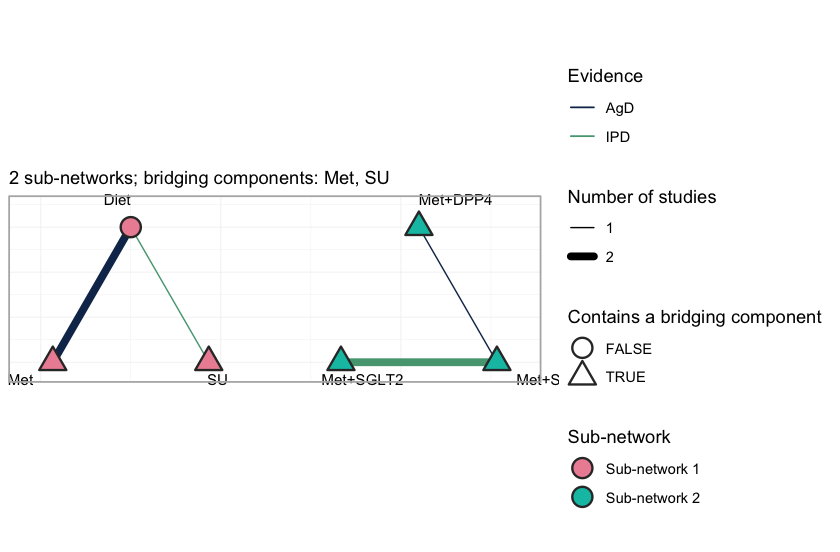
<p class="caption">plot of chunk netplot</p>
</div>

Each sub-network is laid out on its own circle, so a disconnected network looks
disconnected: no edge crosses from one to the other, and no amount of standard
network meta-analysis will make one appear. Edge color records the evidence
behind each comparison, separating the three studies that carry IPD (`MONO-3`,
`ADD-1`, `ADD-2`) from the three that report aggregate results only. The
triangular nodes contain a bridging component; here that is every treatment
except `Diet`, because every active regimen contains `Met` or `SU`, and those two
components occur on both sides of the gap. They are what the reconstruction runs
on. A shared component is a shared parameter, and a shared parameter carries
information across a gap that no comparator spans.

### Two target populations

Everything below is reported in a **named target population**. We use two,
chosen to straddle the crossover point:


``` r
target_early <- c(bhba1c_c = -0.5)   # baseline HbA1c 7.5%: early intensification
target_late  <- c(bhba1c_c =  1.0)   # baseline HbA1c 9.0%: late intensification

# cstc() and cmaic() take the target as a named vector; the Bayesian model takes
# it as a one-row data frame. Same two populations, two calling conventions.
early <- data.frame(bhba1c_c = -0.5)
late  <- data.frame(bhba1c_c =  1.0)

theta <- function(trt, x) sum(Cmat[trt, ] * (beta_true + gamma_true * x))
truth <- function(t1, t2, x) theta(t1, x) - theta(t2, x)
data.frame(
  target = c("HbA1c 7.5%", "HbA1c 9.0%"),
  `Met+SGLT2 vs Met` = c(truth("Met+SGLT2", "Met", -0.5),
                         truth("Met+SGLT2", "Met",  1.0)),
  `Met+SU vs Met`    = c(truth("Met+SU", "Met", -0.5),
                         truth("Met+SU", "Met",  1.0)),
  check.names = FALSE)
#>       target Met+SGLT2 vs Met Met+SU vs Met
#> 1 HbA1c 7.5%            -0.56          -0.5
#> 2 HbA1c 9.0%            -0.68          -1.1
```

So the truth is that in the *early* population the SGLT2 inhibitor adds slightly
more than the sulfonylurea, and in the *late* population it adds a good deal
less. A method that reports one number for both is guaranteed to be wrong once.

## Fitting

### Route 1: the frequentist two-stage bridge

`cstc()` fits, in each IPD study, an outcome regression with treatment main
effects, prognostic main effects, and treatment-by-effect-modifier interactions,
with the effect modifier **centered at the target population**. The treatment
coefficient is then the population-adjusted contrast, and the interaction terms
vanish at the centered origin. `cmaic()` instead reweights each IPD study with
`maicplus::estimate_weights()` so that its effect-modifier distribution matches
the target, and reads the contrast off a weighted model. Both then hand their
adjusted contrasts to `cnma_bridge()`, which runs `netmeta::discomb()`.


``` r
stc_early  <- cstc(net,  target = target_early, effect_modifiers = "bhba1c_c")
maic_early <- cmaic(net, target = target_early, effect_modifiers = "bhba1c_c",
                    n_boot = 200, seed = 7)

relative_effects(stc_early,  reference = "Met")
#> Relative effects (MD, link scale)
#>  treatment comparator estimate    se  lower  upper      z     p
#>       Diet        Met    1.040 0.182  0.683  1.398  5.706 0.000
#>   Met+DPP4        Met   -0.505 0.372 -1.235  0.225 -1.356 0.175
#>  Met+SGLT2        Met   -0.567 0.311 -1.177  0.043 -1.821 0.069
#>     Met+SU        Met   -0.550 0.253 -1.045 -0.055 -2.176 0.030
#>         SU        Met    0.491 0.312 -0.120  1.101  1.575 0.115
relative_effects(maic_early, reference = "Met")
#> Relative effects (MD, link scale)
#>  treatment comparator estimate    se  lower upper      z     p
#>       Diet        Met    1.041 0.207  0.636 1.446  5.036 0.000
#>   Met+DPP4        Met   -0.557 0.435 -1.411 0.296 -1.280 0.201
#>  Met+SGLT2        Met   -0.541 0.396 -1.316 0.235 -1.367 0.172
#>     Met+SU        Met   -0.602 0.310 -1.209 0.005 -1.945 0.052
#>         SU        Met    0.438 0.372 -0.291 1.168  1.178 0.239
```

Two things to read off. First, `cstc()` and `cmaic()` agree closely, which is
not a coincidence and is discussed under Results. Second, `cmaic()` pays for its
reweighting in precision, and the price is visible in the effective sample size:


``` r
effective_sample_size(maic_early)
#>   MONO-3    ADD-1    ADD-2 
#> 264.8834 196.8659 197.4866
```

The add-on trials sit around a baseline HbA1c of 8.5% to 8.6% and the target is
7.5%, so matching to the target throws away real information. The monotherapy
IPD trial (`MONO-3`, mean 8.2%) is closer and loses less.

`forest()` draws the two-stage answer.


``` r
forest(stc_early, reference = "Met")
```

<div class="figure" style="text-align: center">
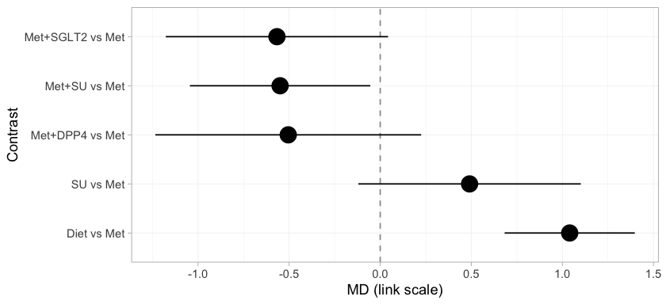
<p class="caption">plot of chunk stc-forest</p>
</div>

Every treatment is placed against metformin, and the subtitle records the target
population, because a `cstc()` fit is defined only relative to one. Three of these
rows cross the gap: `Met+SGLT2`, `Met+SU`, and `Met+DPP4` versus `Met`. No trial
measured any of them, and they are on the page at all only because the component
design supplies them. Every row is populated, because the bridge identifies all
four component main effects. That will not survive the move to the Bayesian model,
where the estimand is population-adjusted and the identification criterion is
correspondingly stricter.

A forest plot reports the answers but not their provenance. In a component bridge
a contrast is a weighted combination of the observed edges, with weights chosen by
the component design rather than by any path through the network, and it is worth
knowing which edges actually carried the contrast you asked for.


``` r
suppressWarnings(
  plot_edge_influence(stc_early, treatment = "Met+SGLT2", comparator = "Met"))
```

<div class="figure" style="text-align: center">
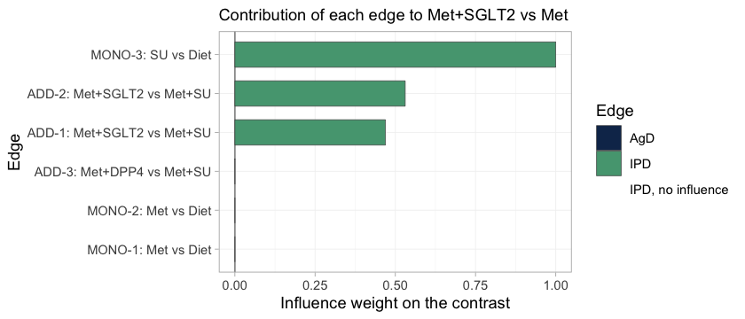
<p class="caption">plot of chunk edge-influence</p>
</div>

This is the bridge written out edge by edge. `Met+SGLT2` versus `Met` reduces to
the `SGLT2` component alone, and three edges carry it. The add-on trials `ADD-1`
and `ADD-2` each supply `SGLT2` minus `SU`; the monotherapy trial `MONO-3` supplies
`SU`, which cancels the unwanted `SU` term and leaves `SGLT2` by itself. All three
edges hold IPD, and they straddle the gap: `MONO-3` sits in the monotherapy
sub-network, `ADD-1` and `ADD-2` in the add-on sub-network. The two aggregate
metformin trials receive no weight at all, because `Met` cancels out of this
particular contrast, and `ADD-3` receives none either.

Two things follow. The contrast we came for is carried entirely by edges we are
able to adjust, which is the most favorable configuration population adjustment
can be in. And the effective sample size above is worth reading precisely because
the edges it describes have influence: reweighting an edge of zero influence
cannot move the estimate, whatever its ESS reports, and no ESS will ever tell you
so.

### Route 2: the one-stage Bayesian model

`cmlnmr()` fits everything at once: the individual-level model to the IPD, the
same model integrated over each aggregate study's covariate distribution, and
the component-additive structure that ties the two sub-networks together. We fit
a fixed-effect and a random-effects version.


``` r
fit <- cmlnmr(ipd, agd, effect_modifiers = "bhba1c_c", inactive = "Diet",
              family = "gaussian",
              chains = 4, iter_warmup = 500, iter_sampling = 500, seed = 2026)
#> Chain 4 Informational Message: The current Metropolis proposal is about to be rejected because of the following issue:
#> Chain 4 Exception: normal_lpdf: Scale parameter is 0, but must be positive! (in '/var/folders/2h/yqztgsf96gsbkqn60cymgsjr0000gn/T/RtmpRgTwMG/model-c021487aa276.stan', line 123, column 19 to column 50)
#> Chain 4 If this warning occurs sporadically, such as for highly constrained variable types like covariance matrices, then the sampler is fine,
#> Chain 4 but if this warning occurs often then your model may be either severely ill-conditioned or misspecified.
#> Chain 4
#> Chain 4 Informational Message: The current Metropolis proposal is about to be rejected because of the following issue:
#> Chain 4 Exception: normal_lpdf: Scale parameter is 0, but must be positive! (in '/var/folders/2h/yqztgsf96gsbkqn60cymgsjr0000gn/T/RtmpRgTwMG/model-c021487aa276.stan', line 123, column 19 to column 50)
#> Chain 4 If this warning occurs sporadically, such as for highly constrained variable types like covariance matrices, then the sampler is fine,
#> Chain 4 but if this warning occurs often then your model may be either severely ill-conditioned or misspecified.
#> Chain 4
fit
#> cpaic: component-additive ML-NMR (Bayesian, gaussian)
#>   Treatment effects: fixed
#>   Effect modifiers: bhba1c_c [normal]
#>   Component effects below are at the covariate origin (x = 0).
#>   For a target population use relative_effects(fit, newdata = ...).
#> 
#>  component estimate    se  lower  upper
#>       DPP4   -0.877 0.666 -2.126  0.469
#>        Met   -1.095 0.083 -1.257 -0.928
#>      SGLT2   -0.617 0.110 -0.825 -0.387
#>         SU   -0.757 0.089 -0.926 -0.581
```


``` r
fit_re <- cmlnmr(ipd, agd, effect_modifiers = "bhba1c_c", inactive = "Diet",
                 family = "gaussian", trt_effects = "random",
                 chains = 4, iter_warmup = 500, iter_sampling = 500,
                 seed = 2026, adapt_delta = 0.95)
#> Chain 4 Informational Message: The current Metropolis proposal is about to be rejected because of the following issue:
#> Chain 4 Exception: normal_lpdf: Scale parameter is 0, but must be positive! (in '/var/folders/2h/yqztgsf96gsbkqn60cymgsjr0000gn/T/RtmpRgTwMG/model-c021487aa276.stan', line 123, column 19 to column 50)
#> Chain 4 If this warning occurs sporadically, such as for highly constrained variable types like covariance matrices, then the sampler is fine,
#> Chain 4 but if this warning occurs often then your model may be either severely ill-conditioned or misspecified.
#> Chain 4
#> Warning: 4 of 2000 (0.0%) transitions ended with a divergence.
#> See https://mc-stan.org/misc/warnings for details.
#> Warning: 4 divergent transition(s) in cmlnmr(); results may be unreliable (consider
#> higher adapt_delta or more iterations).
fit_re$fit$summary("tau")
#> # A tibble: 1 × 10
#>   variable  mean median    sd    mad      q5   q95  rhat ess_bulk ess_tail
#>   <chr>    <dbl>  <dbl> <dbl>  <dbl>   <dbl> <dbl> <dbl>    <dbl>    <dbl>
#> 1 tau[1]   0.149  0.102 0.160 0.0997 0.00852 0.455  1.01     415.     563.
```

The random-effects model adds study-arm deviations around the component-implied
relative effects (non-centered by default), with a half-normal(0, 1) prior on the
heterogeneity standard deviation `tau`. With six studies and four components
there are only two degrees of freedom for heterogeneity, so `tau` is weakly
identified and leans on its prior. That is a real limitation, not a fixable one,
and we return to it under *Model comparison*. We report the fixed-effect model as
primary and use the random-effects model as a sensitivity analysis.

#### A quirk of the identity link

For the identity link the aggregate likelihood is **exact at the covariate
means**. Integrating a linear predictor over a covariate distribution just
substitutes the mean:
$\int (\mu + x^\top b)\, f(x)\, dx = \mu + \bar{x}^\top b$. cpaic detects this
and quietly sets `n_int = 1`; the standard deviation columns (`bhba1c_c_sd`) are
carried in the aggregate data for completeness but are not used. This is
collapsibility of the mean difference showing up in the machinery, and it is why
the continuous family is the easy one. There is consequently no integration-error
figure in this vignette: `plot_integration_error()`, which traces the
quasi-Monte-Carlo error against the number of integration points in the binary,
count, and survival vignettes, declines to draw anything for a Gaussian model with
normal margins and says why, since with a single integration point there is no
integration error to trace. On a logit or a log link the same integral is not the
mean, aggregation bias appears, and the quasi-Monte-Carlo grid earns its keep.

### Priors

Every prior is recorded on the fitted object, because interaction priors do real
regularization whenever $\Gamma$ is weakly identified:


``` r
str(fit$priors)
#> List of 5
#>  $ intercept :List of 3
#>   ..$ distribution: chr "normal"
#>   ..$ location    : num 0
#>   ..$ scale       : num 2.5
#>  $ beta      :List of 3
#>   ..$ distribution: chr "normal"
#>   ..$ location    : num 0
#>   ..$ scale       : num 2.5
#>  $ regression:List of 3
#>   ..$ distribution: chr "normal"
#>   ..$ location    : num 0
#>   ..$ scale       : num 1
#>  $ gamma     :List of 4
#>   ..$ distribution: chr "normal"
#>   ..$ location    : num 0
#>   ..$ scale       : num 1
#>   ..$ df          : num 4
#>  $ tau       :List of 4
#>   ..$ distribution: chr "half-normal"
#>   ..$ location    : num 0
#>   ..$ scale       : num 1
#>   ..$ df          : num 4
```

The defaults are weakly informative: normal(0, 2.5) on study intercepts and
component effects, normal(0, 1) on the component by effect-modifier interactions
and on the prognostic regression, and half-normal(0, 1) on `tau`. The
interaction prior is the one to watch, because a component whose interaction is
informed only by aggregate data has little else holding it up.

Whether a prior did any work is an empirical question, and `plot_prior_posterior()`
answers it directly: each panel puts the posterior, as a histogram, against the
prior it was given, as a line.


``` r
plot_prior_posterior(fit)
```

<div class="figure" style="text-align: center">
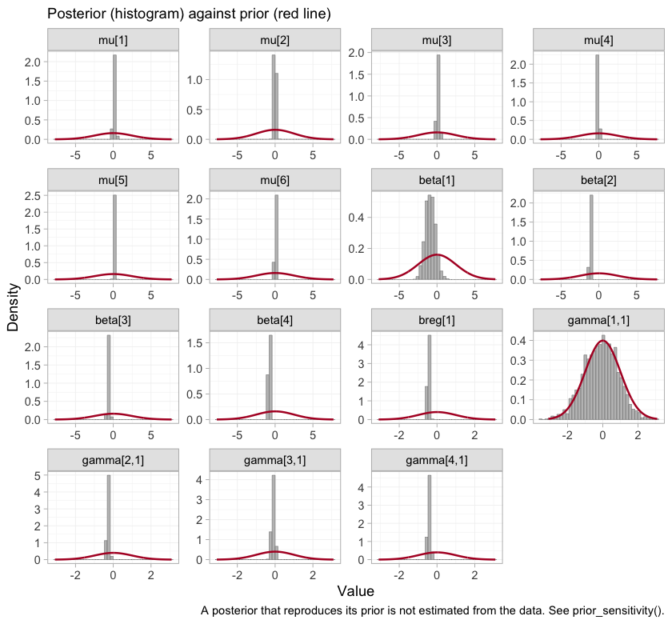
<p class="caption">plot of chunk prior-posterior</p>
</div>

Where a posterior simply reproduces its prior, the data have said nothing about
that parameter, and any quantity leaning on it restates the prior rather than
estimating anything. The study intercepts `mu`, the component effects `beta`, and
the prognostic coefficient `breg` are all far narrower than the priors drawn over
them. So are three of the four interactions. The fourth is not, and identifying
which one, and what follows from it, occupies much of the rest of this vignette.

### Convergence


``` r
data.frame(
  divergences   = fit_re$diagnostics$divergences,
  max_treedepth = fit_re$diagnostics$max_treedepth,
  max_rhat      = round(fit_re$diagnostics$max_rhat, 4),
  min_ess_bulk  = round(min(fit_re$fit$summary(
    c("beta", "gamma", "mu", "tau"))$ess_bulk, na.rm = TRUE)))
#>   divergences max_treedepth max_rhat min_ess_bulk
#> 1           4             0   1.0144          415
```

Those are the summaries. The chains themselves are the evidence.


``` r
plot(fit, type = "trace")
```

<div class="figure" style="text-align: center">
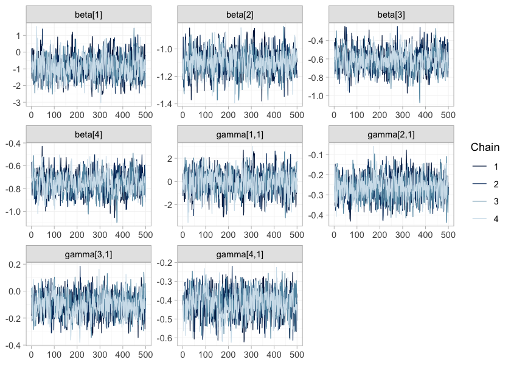
<p class="caption">plot of chunk trace</p>
</div>


``` r
plot(fit, type = "rhat")
```

<div class="figure" style="text-align: center">
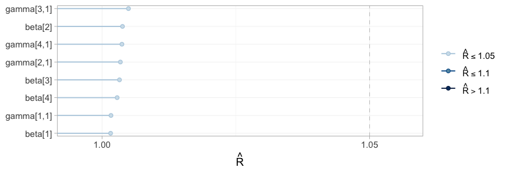
<p class="caption">plot of chunk rhat</p>
</div>

`plot()` on a `cmlnmr()` fit defaults to the parameters everything downstream is
built from: the component effects `beta` and the component by effect-modifier
interactions `gamma`. The four chains are indistinguishable from one another and
show no drift, and every $\hat{R}$ falls in the lowest band of the scale, so the
posterior has been explored.

It has been explored, and that is the whole of what a traceplot can certify.
Convergence is a property of the sampler, not of the evidence: a parameter about
which the data say nothing converges perfectly well, and quickly, onto its prior.
One of these eight parameters is exactly that, and because each panel is drawn on
its own vertical scale, its trace is as clean, as stationary, and as convincing as
any other on the page. Only the numbers on its axis give it away. Which parameter
it is, and how to tell, is settled below by the estimability algebra and by the
comparison of each prior with its posterior. No traceplot will ever settle it.

## Results

### What is actually estimable?

Reconnecting a network does **not** guarantee that the effect you want is
identified. In an aggregate-data cNMA a relative effect is estimable exactly when
its contrast lies in the row space of the design $X = BC$ [@Wigle2026].
Population adjustment is strictly harder, because the component by
effect-modifier interactions have to be identified too, and the criterion then
depends on the target population. Always check, and check *at the target*.


``` r
estimable_effects_at(fit, newdata = data.frame(bhba1c_c = -0.5),
                     reference = "Met")
#> Estimability of the population-adjusted relative effects
#>   Target population: bhba1c_c = -0.5
#>  treatment comparator estimable identified_by          basis
#>       Diet        Met      TRUE     aggregate          exact
#>   Met+DPP4        Met     FALSE          none not identified
#>  Met+SGLT2        Met      TRUE           IPD          exact
#>     Met+SU        Met      TRUE           IPD          exact
#>         SU        Met      TRUE     aggregate          exact
#> 
#>   Rows marked "not identified" carry no first-order information; a number
#>   reported for them would be the prior. relative_effects() returns NA there.
```

Read the `identified_by` column; it is doing real work.

* `Met+SGLT2` and `Met+SU` are identified from **IPD**. Their contrasts against
  `Met` are the components `SGLT2` and `SU`, which are pinned down by
  within-trial covariate variation in `MONO-3`, `ADD-1`, and `ADD-2`. These are
  the contrasts we came for, and they are honest.
* `Diet` and `SU` are identified only from **aggregate** data. The `Met`
  component appears only in `MONO-1` and `MONO-2`, which are aggregate. A single
  aggregate two-arm study pins its contrast down at **its own covariate mean**
  and nowhere else; it takes *two* such studies at *different* means to trace out
  a slope, and that slope is a between-study gradient. Randomization identifies
  each trial's own effect, but nothing randomizes the covariate *means across*
  trials, so a between-study gradient is confounded in a way a within-trial slope
  is not: this is ecological bias [@berlin2002ecological]. It is not the same
  currency as a within-trial interaction, and cpaic refuses to pretend otherwise.
* `Met+DPP4` is **not estimable at all** and comes back as `NA`. The `DPP4`
  component enters through one aggregate contrast (`ADD-3`) and is therefore
  pinned at that study's covariate mean only. A Bayesian model will happily
  return a healthy-looking posterior for it. That posterior is the prior
  speaking, and `NA` is the right answer.


``` r
relative_effects(fit, reference = "Met",
                 newdata = data.frame(bhba1c_c = -0.5))
#> Relative effects (MD, link scale)
#>   Target population: bhba1c_c = -0.5
#>  treatment comparator estimate    se  lower  upper pr_gt0
#>       Diet        Met    0.962 0.087  0.790  1.139  1.000
#>   Met+DPP4        Met       NA    NA     NA     NA     NA
#>  Met+SGLT2        Met   -0.567 0.127 -0.801 -0.310  0.000
#>     Met+SU        Met   -0.549 0.101 -0.736 -0.337  0.000
#>         SU        Met    0.413 0.140  0.145  0.701  0.997
#>   NA = not uniquely estimable from this component design (see estimable_effects()).
```

Estimability is not a property of the network alone. It is a property of the
network *and* the target population, so a single check at a single target is not
enough: it should be run across the range of populations anyone might reasonably
ask about. `plot_estimability()` does that and tiles the result.


``` r
pop_grid <- seq(-1.0, 1.4, by = 0.2)
plot_estimability(fit, em = "bhba1c_c", values = pop_grid, reference = "Met")
```

<div class="figure" style="text-align: center">
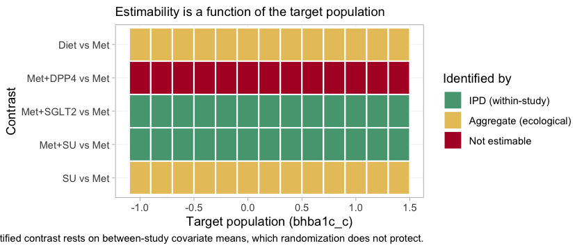
<p class="caption">plot of chunk estimability-map</p>
</div>

The information is in the category of each tile, not in its presence. Three bands
appear, and they correspond exactly to the three bullets above. `Met+SGLT2` and
`Met+SU` are marked *IPD (within-study)* at every target: they rest on covariate
variation inside a randomized trial. `Diet` and `SU` are marked *aggregate
(ecological)* at every target: they rest on the gradient between two aggregate
studies' covariate means, and nothing randomized those means. `Met+DPP4` is *not
estimable* at every target.

That last row is uniform for a reason worth stating precisely. The `DPP4`
interaction enters through a single aggregate study, `ADD-3`, which pins the
contrast at its own covariate mean and at no other population whatsoever. The one
population in which `Met+DPP4` versus `Met` is identified is thus the population
`ADD-3` happened to enroll, which is not a population anyone asked about, and no
target on this axis coincides with it. A Bayesian model will return a
healthy-looking posterior at every tile in that row. Every one of them would be
the prior.

### The cross-gap contrast, in two target populations

Now the question we came for, against `Met` as the reference, in each target
population, next to the truth.


``` r
report <- function(fitobj, t1, x, label) {
  re <- relative_effects(fitobj, reference = "Met",
                         newdata = data.frame(bhba1c_c = x))
  r <- re[re$treatment == t1, ]
  data.frame(target = label, contrast = paste(t1, "vs Met"),
             estimate = r$estimate, lower = r$lower, upper = r$upper,
             truth = truth(t1, "Met", x))
}
res <- rbind(
  report(fit, "Met+SGLT2", -0.5, "HbA1c 7.5%"),
  report(fit, "Met+SU",    -0.5, "HbA1c 7.5%"),
  report(fit, "Met+SGLT2",  1.0, "HbA1c 9.0%"),
  report(fit, "Met+SU",     1.0, "HbA1c 9.0%"))
knitr::kable(res, digits = 3, row.names = FALSE,
             caption = "cML-NMR: recovered vs true mean differences")
```


Table: cML-NMR: recovered vs true mean differences

|target     |contrast         | estimate|  lower|  upper| truth|
|:----------|:----------------|--------:|------:|------:|-----:|
|HbA1c 7.5% |Met+SGLT2 vs Met |   -0.567| -0.801| -0.310| -0.56|
|HbA1c 7.5% |Met+SU vs Met    |   -0.549| -0.736| -0.337| -0.50|
|HbA1c 9.0% |Met+SGLT2 vs Met |   -0.716| -0.941| -0.481| -0.68|
|HbA1c 9.0% |Met+SU vs Met    |   -1.174| -1.364| -0.977| -1.10|


The contrast that no trial measured, across a gap no comparator spans, is
recovered; and it is recovered *differently* in the two target populations,
which is the whole point. In the early-intensification population the SGLT2
inhibitor adds a little more than the sulfonylurea; in the late-intensification
population it adds substantially less.

`forest()` shows the whole set of contrasts that table was drawn from.


``` r
forest(fit, newdata = early, reference = "Met")
```

<div class="figure" style="text-align: center">
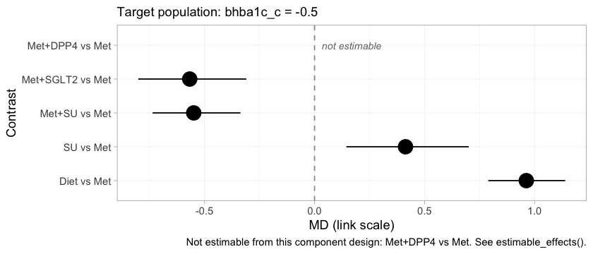
<p class="caption">plot of chunk mlnmr-forest</p>
</div>

`Met+SGLT2` and `Met+SU` sit close together in the early-intensification
population, which is what the crossing of their component effects requires, and
both lower HbA1c appreciably more than metformin alone. `Met+DPP4` is drawn as an
empty row labeled *not estimable* rather than dropped from the figure. That
choice is deliberate. A forest plot that silently omitted the row would look
complete while concealing that the network cannot answer part of the question put
to it, and a reader would have no way to tell the two situations apart.

### Component effects and the full league table

Treatments are sums of components, so the component effects are the more primitive
object, and they are where the crossover actually lives.


``` r
forest(fit, what = "component", newdata = early)
```

<div class="figure" style="text-align: center">
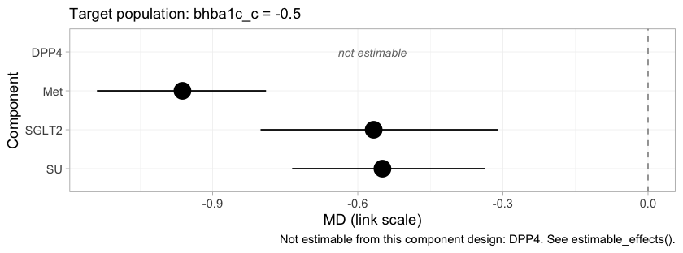
<p class="caption">plot of chunk component-forest</p>
</div>

Each row is the incremental effect of adding one component to a regimen, in the
early-intensification population. `Met` contributes much the largest reduction,
which is why it is the backbone. `SGLT2` and `SU` are nearly indistinguishable
here, and the near-tie between `Met+SGLT2` and `Met+SU` in the forest above is
inherited directly from them, since those two regimens differ only in which of the
two is added to that backbone. `DPP4` is again *not estimable*, and it is worth
being explicit that this is a statement about the evidence and not about the drug.

The league table gives every pairwise contrast at once, in the same population.


``` r
knitr::kable(league_table(fit, newdata = early),
             caption = "League table at baseline HbA1c 7.5%: mean difference (95% CrI) of the row treatment versus the column treatment")
```


Table: League table at baseline HbA1c 7.5%: mean difference (95% CrI) of the row treatment versus the column treatment

|          |Diet                 |Met                  |Met+DPP4 |Met+SGLT2          |Met+SU              |SU                   |
|:---------|:--------------------|:--------------------|:--------|:------------------|:-------------------|:--------------------|
|Diet      |Diet                 |0.96 (0.79, 1.14)    |         |1.53 (1.24, 1.81)  |1.51 (1.26, 1.76)   |0.55 (0.34, 0.74)    |
|Met       |-0.96 (-1.14, -0.79) |Met                  |         |0.57 (0.31, 0.80)  |0.55 (0.34, 0.74)   |-0.41 (-0.70, -0.14) |
|Met+DPP4  |                     |                     |Met+DPP4 |                   |                    |                     |
|Met+SGLT2 |-1.53 (-1.81, -1.24) |-0.57 (-0.80, -0.31) |         |Met+SGLT2          |-0.02 (-0.17, 0.13) |-0.98 (-1.20, -0.77) |
|Met+SU    |-1.51 (-1.76, -1.26) |-0.55 (-0.74, -0.34) |         |0.02 (-0.13, 0.17) |Met+SU              |-0.96 (-1.14, -0.79) |
|SU        |-0.55 (-0.74, -0.34) |0.41 (0.14, 0.70)    |         |0.98 (0.77, 1.20)  |0.96 (0.79, 1.14)   |SU                   |


The `Met+DPP4` row and column are empty throughout. This is the same refusal as
before, propagated to every comparison the treatment takes part in, and it is the
correct behavior: an empty cell here is a finding about the evidence, not a
failure of the table.

### The effect is a function of the target population

Since the estimand is a function of $x$, plot it as one.


``` r
grid <- seq(-1.0, 1.4, by = 0.1)
curve <- do.call(rbind, lapply(grid, function(x) {
  re <- relative_effects(fit, reference = "Met",
                         newdata = data.frame(bhba1c_c = x))
  re <- re[re$treatment %in% c("Met+SGLT2", "Met+SU"), ]
  data.frame(x = x, treatment = re$treatment, estimate = re$estimate,
             lower = re$lower, upper = re$upper)
}))
curve$truth <- mapply(truth, curve$treatment, "Met", curve$x)

ggplot(curve, aes(8 + x, estimate, color = treatment, fill = treatment)) +
  geom_hline(yintercept = 0, linewidth = 0.3) +
  geom_ribbon(aes(ymin = lower, ymax = upper), alpha = 0.15, color = NA) +
  geom_line(linewidth = 0.9) +
  geom_line(aes(y = truth), linetype = "22", linewidth = 0.7) +
  geom_vline(xintercept = 7.69, linetype = "dotted") +
  labs(x = "Baseline HbA1c of the target population (%)",
       y = "Mean difference in HbA1c change (points) vs metformin",
       color = NULL, fill = NULL,
       title = "A population-adjusted effect is a curve, not a number",
       subtitle = paste("Solid: cML-NMR posterior mean with 95% CrI.",
                        "Dashed: the truth. Dotted: the true crossover (7.69%).")) +
  theme_minimal(base_size = 11) +
  theme(legend.position = "bottom")
```

<div class="figure" style="text-align: center">
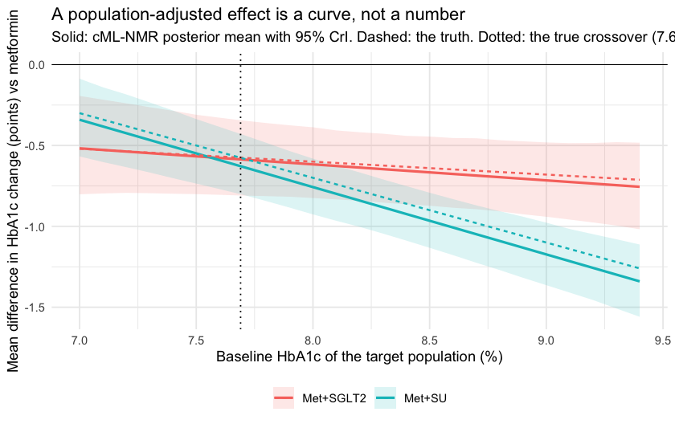
<p class="caption">plot of chunk curve</p>
</div>

The two curves cross close to where they should. Report a single mean difference
for "adding an SGLT2 inhibitor" and you have quietly picked a population without
saying so.

### The hierarchy is a function of the target population too

If the effects move with the target population, so does the ordering they induce.
`cpaic_ranks()` builds the hierarchy in a named population, and builds it only
over the treatments that population actually identifies. A lower HbA1c is better,
so `lower_is_better = TRUE`.


``` r
ranks_early <- cpaic_ranks(fit, newdata = early, lower_is_better = TRUE)
#> Warning: Dropped from the hierarchy as not estimable in this target population: Met+DPP4.
#> Ranking them would rank the prior. See estimable_effects_at().
ranks_early
#> Population-adjusted treatment hierarchy
#>   Target population: bhba1c_c = -0.5
#>    element estimate p_best median_rank mean_rank sucra
#>  Met+SGLT2   -1.530   0.59           1     1.411 0.897
#>     Met+SU   -1.511   0.41           2     1.589 0.853
#>        Met   -0.962   0.00           3     3.003 0.499
#>         SU   -0.549   0.00           4     3.997 0.251
#>       Diet    0.000   0.00           5     5.000 0.000
#>   Not estimable in this population, so not ranked: Met+DPP4
#>   Ranking metrics depend on the set ranked; report them with the effects, not instead.
plot(ranks_early)
```

<div class="figure" style="text-align: center">
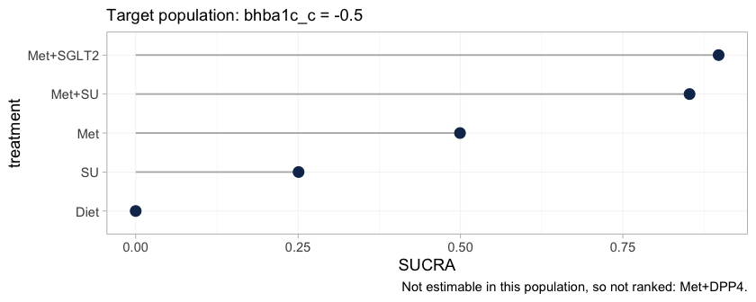
<p class="caption">plot of chunk ranks-early</p>
</div>

The warning is not noise; it is the result. It implements Step 3 of the hierarchy
workflow of @Wigle2026: `Met+DPP4` is not estimable at this target, so it is
removed from the ranking set rather than ranked. Ranking it would rank the prior,
and a SUCRA computed from a prior looks exactly like a SUCRA computed from data
while carrying none of the evidence. The plot's caption records what was dropped,
so a reader who sees only the figure is not misled by its absence.

Ranking metrics compress a whole distribution into one number, so it is worth
looking at the distribution.


``` r
plot(rank_probs(fit, newdata = early, lower_is_better = TRUE))
```

<div class="figure" style="text-align: center">
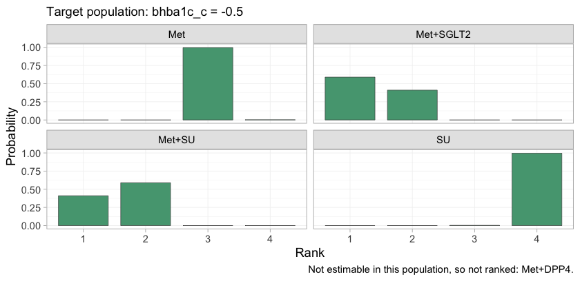
<p class="caption">plot of chunk rankogram</p>
</div>

The rankogram gives the posterior probability that each treatment takes each rank.
`Met+SGLT2` and `Met+SU` divide the top two ranks between them and take no other
rank; `Met`, `SU`, and `Diet` are nearly certain of ranks three, four, and five.
The lower part of the hierarchy is therefore settled and uninteresting, and all
of the uncertainty that matters is concentrated in the contest for first place,
which is precisely the contest the crossover governs.

So the hierarchy cannot be quoted without its population either. Tracing SUCRA
across target populations shows how much of it is at stake.


``` r
plot_rank_curve(fit, em = "bhba1c_c", values = pop_grid, lower_is_better = TRUE)
```

<div class="figure" style="text-align: center">
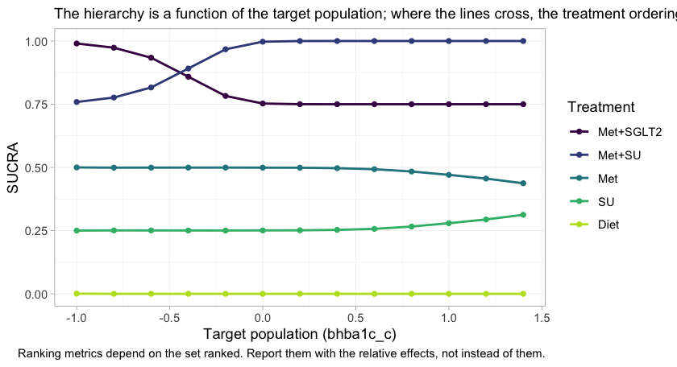
<p class="caption">plot of chunk rank-curve</p>
</div>

The `Met+SGLT2` and `Met+SU` curves cross. In lower-baseline target populations the
SGLT2 inhibitor leads; in higher-baseline ones the sulfonylurea does, and by the
top of the range its SUCRA has reached the ceiling. The crossing sits close to the
crossover of the component effects, where it has to be, because the contrast
between the two regimens is exactly `SGLT2` minus `SU`. `Met+DPP4` appears nowhere
on this figure at any target, for the reason the estimability map gave.

A treatment hierarchy quoted without a target population is therefore not a
cautious summary of this network. It is a claim about a population that has not
been named, and which of these two regimens it endorses is decided by that
unnamed choice rather than by the evidence.

### Conditional, marginal, and why they agree here

`cstc()` and `cmaic()` do **not** estimate the same thing in general.

* `cstc()` reports the **conditional** effect at the target effect-modifier
  values: the treatment coefficient of a regression in which the modifiers are
  centered at the target.
* `cmaic()` reports the **marginal** effect in the target population: the
  contrast you would see from an unadjusted analysis of a trial run in that
  population [@phillippo2018; @remiro2022].

For a **collapsible** measure the two coincide, because averaging a linear
predictor over a population and evaluating it at the population mean give the
same answer. The mean difference is collapsible. So here `cstc()` and `cmaic()`
should agree up to sampling noise, and cpaic's `cmlnmr()` (which targets the
conditional contrast $m'(\beta + \Gamma x)$) should agree with both.


``` r
pick <- function(x, t1) {
  r <- x[x$treatment == t1, ]
  c(estimate = r$estimate, lower = r$lower, upper = r$upper)
}
bayes_early <- relative_effects(fit, reference = "Met",
                                newdata = data.frame(bhba1c_c = -0.5))
compare <- rbind(
  data.frame(method = "cSTC (conditional)",
             t(pick(relative_effects(stc_early,  reference = "Met"), "Met+SGLT2"))),
  data.frame(method = "cMAIC (marginal)",
             t(pick(relative_effects(maic_early, reference = "Met"), "Met+SGLT2"))),
  data.frame(method = "cML-NMR (conditional)",
             t(pick(bayes_early, "Met+SGLT2"))))
compare$truth <- truth("Met+SGLT2", "Met", -0.5)
knitr::kable(compare, digits = 3, row.names = FALSE,
             caption = "Met+SGLT2 vs Met at baseline HbA1c 7.5%: three routes, one estimand")
```


Table: Met+SGLT2 vs Met at baseline HbA1c 7.5%: three routes, one estimand

|method                | estimate|  lower|  upper| truth|
|:---------------------|--------:|------:|------:|-----:|
|cSTC (conditional)    |   -0.567| -1.177|  0.043| -0.56|
|cMAIC (marginal)      |   -0.541| -1.316|  0.235| -0.56|
|cML-NMR (conditional) |   -0.567| -0.801| -0.310| -0.56|


All three land on the same value, and it is the right one. Do not carry this
reassurance into the survival vignette: the hazard ratio is **not** collapsible,
and there `cstc()` and `cmaic()` genuinely target different quantities.

Notice, though, how much wider the two frequentist intervals are. That is not an
accident either, and it is the subject of the next section.

### What the two-stage route cannot do

The two-stage route adjusts only the edges where you hold IPD. The aggregate
edges enter exactly as published, at **their own** populations, and nothing in
the machinery can move them. The two aggregate metformin trials show what this
costs, because they enrolled populations 0.8 percentage points apart:


``` r
study_mean <- tapply(agd$bhba1c_c_mean, agd$.study, mean)
mono <- contrasts[contrasts$studlab %in% c("MONO-1", "MONO-2"), ]
mono$study_HbA1c <- 8 + study_mean[mono$studlab]
mono$true_effect_in_own_population <-
  vapply(study_mean[mono$studlab], function(x) truth("Met", "Diet", x),
         numeric(1))
mono$true_effect_at_target <- truth("Met", "Diet", -0.5)
knitr::kable(mono[, c("studlab", "study_HbA1c", "TE", "seTE",
                      "true_effect_in_own_population", "true_effect_at_target")],
             digits = 3, row.names = FALSE,
             caption = "The two aggregate metformin trials measure different things")
```


Table: The two aggregate metformin trials measure different things

|studlab | study_HbA1c|     TE|  seTE| true_effect_in_own_population| true_effect_at_target|
|:-------|-----------:|------:|-----:|-----------------------------:|---------------------:|
|MONO-1  |    7.575756| -0.805| 0.113|                        -0.973|                 -0.95|
|MONO-2  |    8.435552| -1.278| 0.116|                        -1.231|                 -0.95|


They are not disagreeing by chance. Metformin genuinely lowers HbA1c more in the
higher-baseline trial, and the two trials are each estimating their own
population's effect correctly. But the additive bridge has no idea that is what
is happening: it sees two estimates of "the `Met` component" that do not match,
calls the mismatch heterogeneity, and pays for it twice.


``` r
comp <- component_effects(stc_early)
comp$truth_at_target <- (beta_true + gamma_true * (-0.5))[comp$component]
knitr::kable(comp[, c("component", "estimate", "lower", "upper",
                      "truth_at_target")],
             digits = 3, row.names = FALSE,
             caption = "cSTC component effects vs the truth at baseline HbA1c 7.5%")
```


Table: cSTC component effects vs the truth at baseline HbA1c 7.5%

|component | estimate|  lower|  upper| truth_at_target|
|:---------|--------:|------:|------:|---------------:|
|DPP4      |   -0.505| -1.235|  0.225|           -0.55|
|Met       |   -1.040| -1.398| -0.683|           -0.95|
|SGLT2     |   -0.567| -1.177|  0.043|           -0.56|
|SU        |   -0.550| -1.045| -0.055|           -0.50|


``` r
additivity_test(stc_early)
#> Additive component model: fit statistics
#>   Total lack of fit (Q.additive): Q = 10.209, df = 2, p = 0.00607
#>   Additivity restrictions (Q.diff): not available; no standard NMA
#>     is estimable on a disconnected network.
#>   Note: neither statistic tests whether component effects are constant
#>   ACROSS sub-networks, which is the assumption that bridges the gap.
#>   That assumption is untestable from the data and must be justified
#>   clinically.
```

The bill arrives in two parts. **In bias**: `Met` is pulled toward the value it
takes in the aggregate trials' own populations (a mean baseline of 8.0%) rather
than the 7.5% we asked for, and `DPP4` inherits the same problem through
`ADD-3`. **In precision**: the mismatch inflates the random-effects
heterogeneity, which widens *every* interval in the bridge, including the two
that were adjusted properly. That is why the cSTC and cMAIC intervals in the
table above are roughly twice the width of the cML-NMR one, for the same
estimand.

And note what `additivity_test()` is careful *not* to claim. The lack of fit is
real, but it is not evidence against additivity; it is a population difference
wearing heterogeneity's clothes. No Cochran Q can tell those apart. The one-stage
model does not need to: it integrates the individual-level model over each
study's own covariate distribution, so the two metformin trials are *predicted*
to differ, and the disagreement stops being noise and starts being information.

### Prior sensitivity

Prior movement is an empirical identification diagnostic. A contrast that shifts
when you halve or double a prior scale is not being driven by the data.


``` r
ps <- prior_sensitivity(fit, newdata = data.frame(bhba1c_c = -0.5),
                        prior = "gamma", reference = "Met",
                        chains = 2, iter_warmup = 300, iter_sampling = 300)
ps
#> cML-NMR prior sensitivity: gamma prior
#>  treatment comparator estimate tighter looser move_tighter move_looser max_movement
#>       Diet        Met    0.962   0.960  0.956        0.003       0.006        0.006
#>   Met+DPP4        Met   -0.819  -0.961 -0.476        0.142       0.344        0.344
#>  Met+SGLT2        Met   -0.567  -0.579 -0.572        0.012       0.005        0.012
#>     Met+SU        Met   -0.549  -0.552 -0.547        0.003       0.002        0.003
#>         SU        Met    0.413   0.407  0.409        0.006       0.004        0.006
#>  estimable
#>       TRUE
#>      FALSE
#>       TRUE
#>       TRUE
#>       TRUE
```

The IPD-identified contrasts (`Met+SGLT2`, `Met+SU`) barely move when the
interaction prior scale is halved and doubled. `Met+DPP4` is flagged as not
estimable, and its raw number moves by an order of magnitude more, which is what
"prior-driven" looks like from the outside. This is the empirical counterpart of
the algebraic check in `estimable_effects_at()`, and the two agree.

The same conclusion can be reached without refitting anything, by looking at the
interaction priors against their posteriors.


``` r
plot_prior_posterior(fit, prior = "gamma")
```

<div class="figure" style="text-align: center">
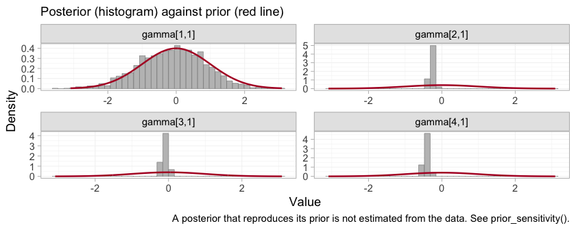
<p class="caption">plot of chunk prior-posterior-gamma</p>
</div>

Each panel is one component by effect-modifier interaction, indexed by component in
the order of the columns of $C$: `DPP4`, `Met`, `SGLT2`, `SU`. Three of the four
posteriors are far tighter than the normal(0, 1) prior drawn over them. The `DPP4`
interaction, `gamma[1,1]`, is the exception: its posterior lies almost exactly on
top of its prior, which is the algebraic non-identification of the previous
sections finally made visible. The aggregate study `ADD-3` constrains a
*combination* of the `DPP4` main effect and its interaction, and leaves the
interaction itself to the prior. This is the parameter promised in the Convergence
section, whose traceplot was as well behaved as any other on the page and told us
nothing. Everything downstream that depends on `gamma[1,1]`, including the
entirely respectable-looking posterior a naive model would report for `Met+DPP4`,
inherits it.

### Model comparison


``` r
loo_fixed  <- loo::loo(fit)
#> Warning: Some Pareto k diagnostic values are too high. See help('pareto-k-diagnostic') for details.
loo_random <- loo::loo(fit_re)
#> Warning: Some Pareto k diagnostic values are too high. See help('pareto-k-diagnostic') for details.
loo::loo_compare(list(fixed = loo_fixed, random = loo_random))
#>   model elpd_diff se_diff p_worse       diag_diff      diag_elpd
#>   fixed       0.0     0.0      NA                 4 k_psis > 0.7
#>  random      -0.5     0.6    0.81 |elpd_diff| < 4 4 k_psis > 0.7
#> 
#> Diagnostic flags present.
#> See ?`loo-glossary` (sections `diag_diff` and `diag_elpd`)
#> or https://mc-stan.org/loo/reference/loo-glossary.html.
dic(fit)
#> Deviance information criterion
#>   DIC: 3054.7
#>   Mean deviance: 3039.2
#>   Effective parameters (pV): 15.6
dic(fit_re)
#> Deviance information criterion
#>   DIC: 3056
#>   Mean deviance: 3039.3
#>   Effective parameters (pV): 16.7
```

Two things to say honestly here.

First, the LOO warning is expected and is worth understanding rather than
suppressing. An aggregate arm contributes **one** observation (an arm mean) that
stands in for hundreds of patients, so it is enormously influential, and
Pareto-smoothed importance sampling flags it (high $\hat{k}$) [@vehtari2017].
That is a property of mixing IPD with aggregate data, not a bug, and it is one
reason to report DIC [@spiegelhalter2002dic] alongside.

Second, the fixed and random models are statistically indistinguishable here, and
that is the expected outcome, not a disappointment: six studies and four
components leave two degrees of freedom, so the random-effects model buys
flexibility the data cannot pay for. Its intervals are correspondingly wider:


``` r
w <- function(f, label) {
  r <- relative_effects(f, reference = "Met",
                        newdata = data.frame(bhba1c_c = -0.5))
  r <- r[r$treatment == "Met+SGLT2", ]
  data.frame(model = label, estimate = r$estimate, lower = r$lower,
             upper = r$upper, width = r$upper - r$lower)
}
knitr::kable(rbind(w(fit, "fixed"), w(fit_re, "random")), digits = 3,
             row.names = FALSE,
             caption = "Met+SGLT2 vs Met at HbA1c 7.5%: the price of random effects")
```


Table: Met+SGLT2 vs Met at HbA1c 7.5%: the price of random effects

|model  | estimate|  lower|  upper| width|
|:------|--------:|------:|------:|-----:|
|fixed  |   -0.567| -0.801| -0.310| 0.491|
|random |   -0.574| -1.035| -0.072| 0.962|


Prefer the random-effects model only if you are willing to defend the
half-normal(0, 1) prior on `tau`, because with two degrees of freedom that prior
is doing much of the work.

LOO and DIC are summaries. The comparison can also be made without one, point by
point: the dev-dev plot puts each data point's posterior mean deviance under the
fixed model against its deviance under the random-effects model.


``` r
plot(dic(fit), dic(fit_re), labels = c("fixed", "random"))
```

<div class="figure" style="text-align: center">
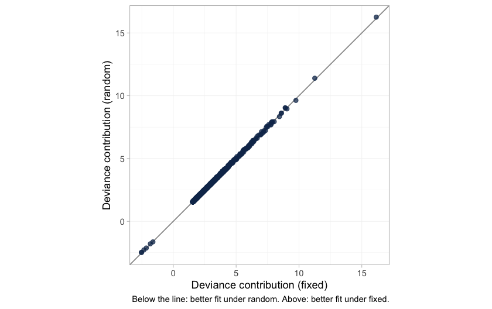
<p class="caption">plot of chunk devdev</p>
</div>

The cloud lies on the line of equality. Not one of the 1206 data points is fitted
appreciably better by the extra parameters, which is what "statistically
indistinguishable" looks like before it is compressed into a single number. It is
worth having in its own right, because the LOO comparison that reaches the same
conclusion is itself compromised by those high Pareto-$\hat{k}$ values. The next
figure shows exactly where they come from.


``` r
plot_leverage(fit)
```

<div class="figure" style="text-align: center">
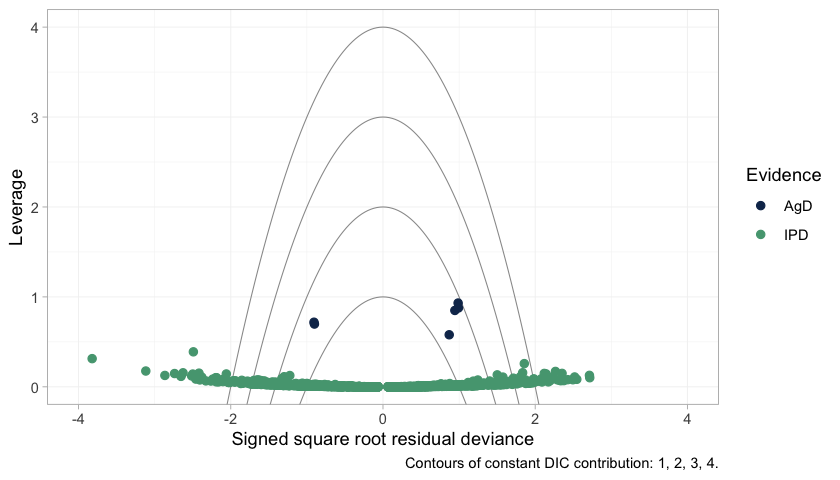
<p class="caption">plot of chunk leverage</p>
</div>

The six aggregate arms separate cleanly from everything else: **every one of them
has higher leverage than all 1200 individual patients**. That is the arithmetic of
mixing IPD with aggregate data. An aggregate arm is a single observation standing
in for hundreds of patients, so it pulls the fit toward itself far harder than any
patient can, and leaving it out changes the posterior a great deal. High leverage
is not misfit, and none of the six lies outside the `DIC = 3` contour; they are
influential without being fitted badly. But influence of that kind is exactly what
breaks leave-one-out importance sampling, which is why the $\hat{k}$ warning
appears and why it should be read as a description of the design rather than a
defect of this model.

One caution about the individual patient points. A good number of them fall beyond
the outer contours, and that is exactly what 1200 draws from a correctly specified
normal likelihood should do: an individual's residual deviance is a squared
standard normal, so roughly one point in twelve exceeds 3 on its own, with no
misfit involved. The NICE reading of these contours, in which a point outside
`DIC = 3` is spoiling the fit, was calibrated for study-level data points, of which
there are a few dozen. Applied one patient at a time it would condemn a perfectly
healthy model.

## What to take away

| | Standard NMA | Two-stage (cSTC / cMAIC + bridge) | One-stage cML-NMR |
|---|---|---|---|
| Bridges the disconnection | no | yes, via shared components | yes, via shared components |
| Adjusts the IPD edges | n/a | yes | yes |
| Adjusts the aggregate edges | n/a | **no** | yes, by integration |
| Reports NA when not identified | n/a | yes (main effects) | yes (at the target population) |
| Effect is population-specific | n/a | one target per fit | yes, any target from one fit |

Four things worth keeping.

1. **The mean difference is collapsible, so this is the easy family.** `cstc()`
   and `cmaic()` target the same estimand and agree; the aggregate likelihood is
   exact at the covariate means; no aggregation bias arises. Everything gets
   harder on a nonlinear link, and the survival vignette shows how.

2. **Estimability is not automatic.** `Met+DPP4` versus `Met` is perfectly
   estimable as a component main effect and still not estimable as a
   population-adjusted effect, because the `DPP4` interaction is pinned only at
   one aggregate study's covariate mean. Run `estimable_effects_at()` and believe
   what it says. `NA` is an answer.

3. **Not all identification is equal.** A contrast identified by within-trial
   covariate variation (`identified_by == "IPD"`) and one identified by a
   between-study gradient across aggregate means (`"aggregate"`) are not the same
   claim. The second is ecological, is confounded by everything that differs
   between those studies, and cpaic keeps it labeled.

4. **The bridging assumption is untestable.** Reconnecting through shared
   components requires the component effects *and their interactions with the
   effect modifiers* to be the same in both sub-networks. There is, by
   construction, no cross-gap evidence with which to test that; `additivity_test()`
   cannot do it and says so. It must be defended clinically
   [@Veroniki2026; @rucker2021disconnected].

An honest limitation to close on. Everything above rests on baseline HbA1c being
the *only* effect modifier. It is not: duration of diabetes, BMI, and renal
function all plausibly modify these agents' effects, and two of the three are
differentially distributed across the gap in any real network. cpaic will adjust
for whatever you name in `effect_modifiers`, and will silently assume that what
you did not name does not matter. Reconnecting a disconnected network makes that
assumption load-bearing in a way it never is inside a connected one.

## References
