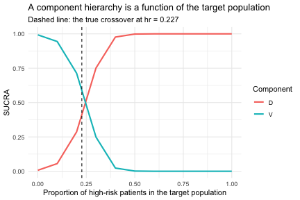

``` r
library(cpaic)
set.seed(2026)
```

This vignette walks through the situation cpaic exists for: a treatment network
that is **disconnected** *and* whose trials enrolled **different populations**. We
compare what a standard network meta-analysis can do, what a standard multilevel
network meta-regression (ML-NMR) can do, and what the component-additive version
(cML-NMR) adds.

> **The data here are entirely simulated.** The clinical setting (maintenance
> therapy in newly diagnosed multiple myeloma) is used only for its vocabulary,
> because maintenance regimens are genuinely multi-component. No data, effect
> estimate, or result is taken from any publication. We set the true parameter
> values ourselves below, which is what lets us check whether each method recovers
> them.

## The setting

Maintenance regimens combine components. Write `Obs` for observation (the inactive
comparator) and use four active components: `R` (lenalidomide), `V` (bortezomib),
`D` (daratumumab), and `I` (ixazomib).

The trials split into two groups that share **no treatment**:

* **Sub-network 1**, older trials against observation: `Obs` vs `R`, `Obs` vs `V`.
* **Sub-network 2**, newer trials on a lenalidomide backbone: `R+V` vs `R+D`,
  `R+V` vs `R+I`.

No trial links the two. A decision maker nevertheless has to ask: **how does `R+D`
compare with `R`?** That contrast crosses the gap.

The two groups also enrolled different patients. We use **high-risk cytogenetics**
(`hr`), a binary variable: the newer trials enrolled a higher-risk population
(45% versus 15%). A binary effect modifier is used deliberately, because
integrating a binary covariate as though it were normal would place integration
points outside `{0, 1}`, that is, integrate the model over patients who cannot
exist. cpaic gives a 0/1 covariate a Bernoulli margin automatically.


``` r
treatments <- c("Obs", "R", "V", "R+V", "R+D", "R+I")
Cmat <- build_C_matrix(treatments, inactive = "Obs")

# TRUTH (log-odds ratio of response), which we will try to recover.
beta_true  <- c(D = 0.30, I = 0.35, R = 0.45, V = 0.55)  # main effects
# Bortezomib does WORSE in high-risk patients; daratumumab does BETTER.
gamma_true <- c(D = 0.60, I = 0.10, R = 0.05, V = -0.50) # x effect modifier

Cmat
#>     D I R V
#> Obs 0 0 0 0
#> R   0 0 1 0
#> V   0 0 0 1
#> R+V 0 0 1 1
#> R+D 1 0 1 0
#> R+I 0 1 1 0
```

The estimand is population-specific,
`theta_t(x) = C_t' (beta + Gamma x)`, where `x` is the proportion of high-risk
patients in the **target** population. Note already that `V` and `D` must cross:
`theta_V(x) = 0.55 - 0.50x` while `theta_D(x) = 0.30 + 0.60x`, so they are equal at
`x = 0.227` and swap order either side of it.


``` r
gen_arm <- function(study, trt, n, mu0, p_hr) {
  hr <- rbinom(n, 1, p_hr)
  tc <- Cmat[trt, ]
  eta <- mu0 + 0.25 * hr + sum(tc * beta_true) + sum(tc * gamma_true) * hr
  data.frame(.study = study, .trt = trt,
             .y = rbinom(n, 1, plogis(eta)), hr = hr)
}
agg <- function(d) data.frame(.study = d$.study[1], .trt = d$.trt[1],
                              r = sum(d$.y), n = nrow(d), hr_mean = mean(d$hr))

# We hold IPD for two of our own trials, one in each sub-network. The other two
# trials are published aggregate data. The IPD trials are large, and enrolled a
# reasonable mix of risk groups, because a component by effect-modifier
# interaction is estimated from the covariate variation WITHIN a trial: a trial
# with only 15% high-risk patients carries little information about how the
# effect differs by risk, however many patients it has in total.
ipd <- rbind(gen_arm("OLD-2", "Obs", 1200, -0.2, 0.30),  # IPD, sub-network 1
             gen_arm("OLD-2", "V",   1200, -0.2, 0.30),
             gen_arm("NEW-1", "R+V", 1200,  0.1, 0.50),  # IPD, sub-network 2
             gen_arm("NEW-1", "R+D", 1200,  0.1, 0.50))

agd <- rbind(agg(gen_arm("OLD-1", "Obs", 350, -0.3, 0.15)),
             agg(gen_arm("OLD-1", "R",   350, -0.3, 0.15)),
             agg(gen_arm("NEW-2", "R+V", 400,  0.0, 0.45)),
             agg(gen_arm("NEW-2", "R+I", 400,  0.0, 0.45)))
agd
#>   .study .trt   r   n   hr_mean
#> 1  OLD-1  Obs 140 350 0.1228571
#> 2  OLD-1    R 183 350 0.1571429
#> 3  NEW-2  R+V 277 400 0.4175000
#> 4  NEW-2  R+I 307 400 0.4375000
```

## 1. Standard NMA cannot answer the question


``` r
edges <- data.frame(treat1 = c("R", "V", "R+D", "R+I"),
                    treat2 = c("Obs", "Obs", "R+V", "R+V"))
g <- igraph::graph_from_data_frame(edges, directed = FALSE)
igraph::components(g)$no    # number of connected components
#> [1] 2
```

Two components, so there is no path from `R+D` to `R`. A standard NMA cannot
estimate the contrast at all. It is not that the estimate is imprecise; it does
not exist.

## 2. ML-NMR adjusts the population, but does not bridge the gap

ML-NMR [@phillippo2020mlnmr] is the right tool for the *population* problem: it
fits the individual-level model to the IPD and integrates it over each aggregate
study's covariate distribution, so effect-modifier imbalance is handled correctly
rather than through study-mean meta-regression.

But ML-NMR treats each regimen as an indivisible node. `R+D` and `R` share no node
and no trial connects them, so nothing links the two sub-networks. A Bayesian fit
will still return a posterior for the contrast, and it will look perfectly healthy;
but it is the **prior** speaking, not the data. This is precisely the trap Wigle et
al. [-@Wigle2026] warn about.

## 3. cML-NMR: bridge with components, adjust by integration

The regimens are not really indivisible. `R+D` and `R` **share the component `R`**,
and `R+V` shares `R` and `V` with the old trials. The additive component model turns
shared components into shared parameters, which reconnects the network *by
construction*, while the ML-NMR integration handles the population imbalance.

### First: what is actually estimable?

Reconnecting a network does **not** guarantee that the effect you want is
identified. Population adjustment is strictly harder than reconnection, because the
component by effect-modifier interactions have to be identified too. Always check.


``` r
fit <- cmlnmr(ipd, agd,
              effect_modifiers = "hr",   # binary -> Bernoulli margin, automatic
              inactive = "Obs", family = "binomial",
              chains = 4, iter_warmup = 700, iter_sampling = 700, seed = 1)

estimable_effects_at(fit, newdata = data.frame(hr = 0.30))
#>   treatment comparator estimable identified_by
#> 1         R        Obs     FALSE          none
#> 2       R+D        Obs     FALSE          none
#> 3       R+I        Obs     FALSE          none
#> 4       R+V        Obs     FALSE          none
#> 5         V        Obs      TRUE           IPD
```

Read the `identified_by` column. An effect identified only from *aggregate* data is
identified by a between-study gradient across study means, which is ecological
inference; an effect identified from *IPD* is identified by within-study covariate
variation. They are not equal currency, and cpaic keeps them apart.

### The cross-gap comparison, in a named target population

Ask for the cross-gap contrast **directly**, against `R` as the reference. This
matters: `R+D` versus `Obs` and `R` versus `Obs` are each NOT identified at a
general target, because `R` is seen only in an aggregate contrast and is therefore
pinned down only at that study's covariate mean. Their *difference*, `R+D` versus
`R`, is the component `D`, and it IS identified. cpaic returns `NA` for the two
that are not identified and a number for the one that is, which is exactly the
behavior you want.


``` r
relative_effects(fit, reference = "R", newdata = data.frame(hr = 0.15))
#> Relative effects (OR, back-transformed)
#>   Target population: hr = 0.15
#>  treatment comparator estimate    se lower upper pr_gt0
#>        Obs          R       NA    NA    NA    NA     NA
#>        R+D          R    1.547 0.139 1.177 2.008  0.999
#>        R+I          R       NA    NA    NA    NA     NA
#>        R+V          R    1.739 0.086 1.464 2.047  1.000
#>          V          R       NA    NA    NA    NA     NA
#>   NA = not uniquely estimable from this component design (see estimable_effects()).
relative_effects(fit, reference = "R", newdata = data.frame(hr = 0.60))
#> Relative effects (OR, back-transformed)
#>   Target population: hr = 0.6
#>  treatment comparator estimate    se lower upper pr_gt0
#>        Obs          R       NA    NA    NA    NA     NA
#>        R+D          R    2.120 0.139 1.591 2.781  1.000
#>        R+I          R       NA    NA    NA    NA     NA
#>        R+V          R    1.352 0.098 1.112 1.638  0.999
#>          V          R       NA    NA    NA    NA     NA
#>   NA = not uniquely estimable from this component design (see estimable_effects()).
```


``` r
theta <- function(trt, x) sum(Cmat[trt, ] * (beta_true + gamma_true * x))
for (x in c(0.15, 0.60)) {
  cat(sprintf("hr = %.2f: true log-OR(R+D vs R) = %+.3f\n",
              x, theta("R+D", x) - theta("R", x)))
}
#> hr = 0.15: true log-OR(R+D vs R) = +0.390
#> hr = 0.60: true log-OR(R+D vs R) = +0.660
```

The contrast that no trial measured, across a gap no comparator spans, is
recovered; and it is recovered *differently* in the two target populations, because
daratumumab is more effective in high-risk patients. A single population-free number
would be wrong for at least one of them.

## 4. The hierarchy is population-specific

If component effects depend on the population, so do component *rankings*. The
question is not "which component is best?" but **"which component is best in this
population?"** [@Wigle2026].


``` r
cpaic_ranks(fit, newdata = data.frame(hr = 0.05), what = "component")
#> Warning: Dropped from the hierarchy as not estimable in this target population: I, R.
#> Ranking them would rank the prior. See estimable_effects_at().
#> Population-adjusted component hierarchy
#>   Target population: hr = 0.05
#>  element estimate p_best median_rank mean_rank sucra
#>        V    0.606  0.981           1     1.019 0.981
#>        D    0.356  0.019           2     1.981 0.019
#>   Not estimable in this population, so not ranked: I, R
#>   Ranking metrics depend on the set ranked; report them with the effects, not instead.
cpaic_ranks(fit, newdata = data.frame(hr = 0.80), what = "component")
#> Warning: Dropped from the hierarchy as not estimable in this target population: I, R.
#> Ranking them would rank the prior. See estimable_effects_at().
#> Population-adjusted component hierarchy
#>   Target population: hr = 0.8
#>  element estimate p_best median_rank mean_rank sucra
#>        D    0.882      1           1         1     1
#>        V    0.185      0           2         2     0
#>   Not estimable in this population, so not ranked: I, R
#>   Ranking metrics depend on the set ranked; report them with the effects, not instead.
```

Two things happen here, and both are the point.

First, **`R` and `I` are dropped**. Neither is identified at a general target
population: `R` appears only in an aggregate contrast, and `I` only in an aggregate
contrast against `R+V`, so each is pinned down only at its own study's covariate
mean. Ranking them would rank the prior. This is Step 3 of the Wigle et al.
workflow, now with an estimable set that itself depends on the target.

Second, among the components that *are* identified, **the order reverses**: `V` wins
in a low-risk population and `D` wins in a high-risk one.


``` r
curve <- rank_curve(fit, em = "hr", values = seq(0, 1, by = 0.1),
                    what = "component")
if (requireNamespace("ggplot2", quietly = TRUE)) {
  library(ggplot2)
  ggplot(curve, aes(hr, sucra, colour = element)) +
    geom_line(linewidth = 1) +
    geom_vline(xintercept = 0.227, linetype = "dashed") +
    labs(x = "Proportion of high-risk patients in the target population",
         y = "SUCRA", colour = "Component",
         title = "A component hierarchy is a function of the target population",
         subtitle = "Dashed line: the true crossover at hr = 0.227") +
    theme_minimal()
}
```



## What to take away

| Method | Adjusts the population | Bridges the disconnection | Cross-gap effect |
|---|---|---|---|
| Standard NMA | no | no | **not estimable** |
| ML-NMR | yes | no | **prior-driven, not identified** |
| cML-NMR | yes | yes, via shared components | estimable, and population-specific |

Two warnings, which are not optional reading.

1. **The bridging assumption is untestable.** Reconnecting through shared components
   requires the component effects, *and their interactions with the effect
   modifiers*, to be the same in both sub-networks. There is by construction no
   cross-gap evidence with which to test that; it must be defended clinically
   [@Veroniki2026].
2. **Estimability is not automatic.** As `R` and `I` show above, a contrast can be
   perfectly estimable as an aggregate-data component contrast and still not be
   estimable as a population-adjusted effect. Run `estimable_effects_at()` and
   believe what it says.

## References
