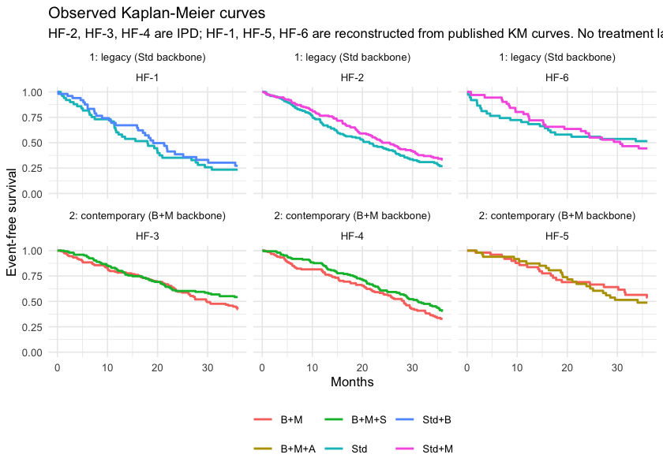
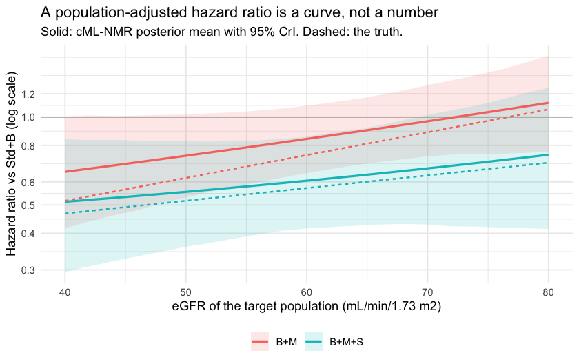

``` r
library(cpaic)
library(ggplot2)
library(survival)
set.seed(2026)
```

This vignette is the **time-to-event** counterpart of
`vignette("continuous-outcomes")`: the same problem (a treatment network that is
disconnected *and* whose trials enrolled different populations), the same two
routes (frequentist two-stage, one-stage Bayesian), but on a **non-collapsible**
scale and with an exact survival likelihood. Read the continuous vignette first
if you want the easy version; almost everything that is simple there is subtle
here.

> **The data here are entirely simulated.** The clinical setting (heart failure
> with reduced ejection fraction) is used only for its vocabulary, because
> guideline-directed heart failure therapy is genuinely additive: drugs are
> stacked onto a background regimen. No data, effect estimate, or result below
> is taken from any publication, and the interaction pattern we impose is
> invented for the illustration. We set the true parameter values ourselves,
> which is what lets us check whether each method recovers them.

## The clinical question

The outcome is **time to cardiovascular death or heart failure
hospitalization**, so the summary measure is a **hazard ratio** (HR) on a
proportional-hazards model.

Write `Std` for standard background care (the inactive comparator) and use four
add-on components: `B` (a beta-blocker), `M` (a mineralocorticoid receptor
antagonist), `S` (an SGLT2 inhibitor), and `A` (an angiotensin
receptor-neprilysin inhibitor). The trials fall into two groups that share
**no treatment**:

* **Sub-network 1**, legacy trials adding one drug to standard care:
  `Std` vs `Std+B`, `Std` vs `Std+M`.
* **Sub-network 2**, contemporary trials adding one more drug on top of a
  beta-blocker and an MRA: `B+M` vs `B+M+S`, `B+M` vs `B+M+A`.

No trial links the two. The decision maker still has to ask: **what does a
patient on a beta-blocker gain by adding an MRA and an SGLT2 inhibitor?** That
is `B+M+S` versus `Std+B`, and it crosses the gap. No trial measured it.

The effect modifier is **renal function**, `egfr_c` = (eGFR $-$ 60) / 10, in
units of 10 mL/min/1.73m$^2$ above 60. The contemporary trials enrolled patients
with worse renal function than the legacy ones, and (in our simulated truth)
the MRA's benefit shrinks as eGFR rises while the SGLT2 inhibitor's does not.
That imbalance is exactly what population adjustment is for.

## The model

The component-additive ML-NMR gives every individual the hazard

$$
h_i(t) \;=\; h_0(t)\, \exp(\eta_i), \qquad
\eta_i \;=\; \mu_{s(i)} \;+\; x_i^\top b \;+\; C_{t(i)}^\top \bigl(\beta + \Gamma x_i\bigr),
$$

so the **conditional log hazard ratio** of treatment $t$ versus $u$ in a
population with effect-modifier value $x$ is $\theta_t(x) - \theta_u(x)$ with
$\theta_t(x) = C_t^\top(\beta + \Gamma x)$. As in the continuous case the
estimand is population-specific, and `relative_effects()` will insist on
`newdata`.

### The baseline hazard, and why the likelihood is exact

cpaic writes the baseline hazard as a positive combination of basis functions,
$h_0(t) = \sum_k \lambda_k \, B_k(t)$, and evaluates **both** the basis and its
exact integral $\int_0^t B_k(u)\,du$. Two choices:

| `baseline` | $h_0(t)$ | Controlled by |
|---|---|---|
| `"piecewise"` (default) | a step function, one free level per interval | `cut_points` (`NULL` gives the exponential model) |
| `"mspline"` | a continuous cubic M-spline; the cumulative hazard uses the exact integrated I-spline basis, with a simplex constraint on the coefficients [@phillippo2025mspline] | `n_basis` |

Because the *integrated* basis is available in closed form, the cumulative
hazard $H_i(t) = \exp(\eta_i)\int_0^t h_0(u)\,du$ is exact, and so is every
likelihood contribution. There is no numerical quadrature over time anywhere in
the model. The construction follows the general-likelihood ML-NMR of
@phillippo2025surv, specialized to a component-additive treatment effect.

Write $H(t) = \exp(\eta)\int_0^t h_0(u)\,du$ for the cumulative hazard and let $a$
be the patient's entry time (`.entry`, zero unless they entered late). Everything
is conditioned on survival to $a$, so every contribution is written through the
**entry-conditioned** cumulative hazard

$$
\Lambda(t) \;=\; H(t) - H(a),
\qquad\text{so that}\qquad
\frac{S(t)}{S(a)} \;=\; e^{-\Lambda(t)} .
$$

The four status codes then contribute

$$
\ell =
\begin{cases}
-\Lambda(t) & \text{status } 0, \text{ right-censored} \\
\log h(t) - \Lambda(t) & \text{status } 1, \text{ observed event} \\
\log\bigl(1 - e^{-\Lambda(t)}\bigr) & \text{status } 2, \text{ left-censored} \\
\log\bigl(e^{-\Lambda(\text{start})} - e^{-\Lambda(t)}\bigr) & \text{status } 3, \text{ interval-censored}
\end{cases}
$$

The placement of the conditioning matters and is easy to get wrong. For an
observed event or a right-censored observation you may add $+H(a)$ afterwards and
get the same answer, because the contribution is linear in the cumulative hazard.
For a **left-censored** observation you may not: $\bigl(1 - S(t)\bigr) / S(a)$ is
not a probability and can exceed one, whereas $1 - S(t)/S(a)$ is the correct
term. The conditioning has to go *inside*. `.entry` is optional (a missing column
means everyone enters at zero), and interval-censored rows take their lower
endpoint from `.start`.

### Aggregate survival data must be pseudo-IPD

This is the part people get wrong, so it gets its own subsection.

An aggregate survival arm must be supplied to `cmlnmr()` as **reconstructed
pseudo-individual rows**: one row per (pseudo-)patient with a `.time` and a
`.y` status, exactly the object `multinma::set_agd_surv()` expects, and exactly
what the Guyot algorithm produces from a digitized Kaplan-Meier curve
[@guyot2012]. Event counts plus person-time will not do, and cpaic rejects them.

The reason is not fussiness. A published arm is a **mixture** over its covariate
distribution, and the model has to integrate the individual likelihood over that
mixture. The tempting shortcut, "expected events = total person-time times the
mean hazard", is exact within a homogeneous group and wrong for a mixture,
because hazard and person-time are negatively correlated: high-hazard patients
leave the risk set early, so most of the person-time is contributed by
low-hazard patients, and multiplying it by the *average* hazard over-counts
events. Formally $\mathbb{E}[hT] = \mathbb{E}[h]\mathbb{E}[T] + \mathrm{Cov}(h, T)$
with $\mathrm{Cov}(h,T) < 0$.

Two equal groups with hazards 0.1 and 0.4, followed to time 10:


``` r
h   <- c(0.1, 0.4)          # constant hazards in the two halves
w   <- c(0.5, 0.5)          # equal mixing weights
tau <- 10                   # administrative censoring

exact       <- sum(w * (1 - exp(-h * tau)))          # events per person
person_time <- sum(w * (1 - exp(-h * tau)) / h)      # E[min(T, tau)]
approx      <- person_time * sum(w * h)              # person-time x mean hazard

round(c(exact = exact, approximation = approx,
        inflation = approx / exact), 4)
#>         exact approximation     inflation 
#>        0.8069        1.0969        1.3594
```

The person-time approximation is biased **upward by 36%**, on a completely
ordinary amount of hazard heterogeneity. That is why the aggregate survival API
takes pseudo-IPD and integrates the likelihood row by row.

## Simulating the evidence


``` r
treatments <- c("Std", "Std+B", "Std+M", "B+M", "B+M+S", "B+M+A")
Cmat <- build_C_matrix(treatments, inactive = "Std")
Cmat
#>       A B M S
#> Std   0 0 0 0
#> Std+B 0 1 0 0
#> Std+M 0 0 1 0
#> B+M   0 1 1 0
#> B+M+S 0 1 1 1
#> B+M+A 1 1 1 0

# TRUTH (conditional log hazard ratios at eGFR 60).
beta_true  <- c(A = -0.20, B = -0.35, M = -0.30, S = -0.26)
# Invented interactions: the MRA loses ground as renal function improves;
# the SGLT2 inhibitor gains a little; the beta-blocker is unmodified.
gamma_true <- c(A =  0.05, B =  0.00, M =  0.18, S = -0.08)
stopifnot(identical(names(beta_true), colnames(Cmat)))
```

The interesting consequence, which we will have to recover: the MRA's component
effect is $-0.30 + 0.18x$, so at eGFR 50 ($x = -1$) it is a log hazard ratio of
$-0.48$, and at eGFR 70 ($x = +1$) it is only $-0.12$. Adding the SGLT2
inhibitor contributes a further $-0.26 - 0.08x$, which barely moves. In a
preserved-renal-function population the MRA has almost nothing left to give and
the SGLT2 inhibitor supplies the benefit; in a chronic-kidney-disease population
the MRA is carrying most of it. One hazard ratio cannot say both.

The data-generating model is a Weibull proportional-hazards model with an
increasing baseline hazard. Delayed entry is simulated properly, by drawing the
event time from the distribution **conditional on survival past the entry time**;
this is what left truncation is, and it is why a naive analysis that ignores
`.entry` is biased.


``` r
lambda <- 0.022; kshape <- 1.2; prognostic <- -0.35; maxt <- 36

gen_arm <- function(study, trt, n, mu0, egfr_mean, egfr_sd = 18,
                    p_late = 0, dropout = 0.008) {
  x   <- (rnorm(n, egfr_mean, egfr_sd) - 60) / 10
  tc  <- Cmat[trt, ]
  eta <- mu0 + prognostic * x +
    sum(tc * beta_true) + sum(tc * gamma_true) * x
  entry <- rep(0, n)
  if (p_late > 0) entry <- ifelse(runif(n) < p_late, runif(n, 1, 8), 0)
  u  <- runif(n)
  # Weibull PH, drawn conditional on T > entry: that is what left truncation is.
  tt <- (entry^kshape - log(u) / (lambda * exp(eta)))^(1 / kshape)
  cn <- pmin(entry + rexp(n, dropout), maxt)     # dropout + administrative
  data.frame(.study = study, .trt = trt,
             .time = pmin(tt, cn), .y = as.integer(tt <= cn),
             .entry = entry, egfr_c = x)
}

ipd <- rbind(
  gen_arm("HF-2", "Std",   150,  0.00, 66),   # sub-network 1
  gen_arm("HF-2", "Std+M", 150,  0.00, 66),
  gen_arm("HF-3", "B+M",   150,  0.00, 58),   # sub-network 2
  gen_arm("HF-3", "B+M+S", 150,  0.00, 58),
  gen_arm("HF-4", "B+M",   150,  0.00, 54),
  gen_arm("HF-4", "B+M+S", 150,  0.00, 54))
ipd$.entry <- NULL                             # nobody enters late: column optional

published <- rbind(
  gen_arm("HF-1", "Std",   50,  0.10, 68),
  gen_arm("HF-1", "Std+B", 50,  0.10, 68),
  gen_arm("HF-5", "B+M",   50, -0.05, 62),
  gen_arm("HF-5", "B+M+A", 50, -0.05, 62),
  gen_arm("HF-6", "Std",   50,  0.05, 72, p_late = 0.30),  # 30% enter late
  gen_arm("HF-6", "Std+M", 50,  0.05, 72, p_late = 0.30))
```

Now we throw away what a publication does not give us. From `published` we keep
the **Kaplan-Meier curve** (here, the pseudo-IPD rows that a Guyot
reconstruction would return) and the **baseline table** (an arm-level mean and
SD of eGFR). The individual covariate values are discarded.


``` r
covs <- do.call(rbind, lapply(
  split(published, list(published$.study, published$.trt), drop = TRUE),
  function(d) data.frame(.study = d$.study[1], .trt = d$.trt[1],
                         egfr_c_mean = mean(d$egfr_c),
                         egfr_c_sd   = sd(d$egfr_c))))

agd <- merge(published[, c(".study", ".trt", ".time", ".y", ".entry")],
             covs, by = c(".study", ".trt"), sort = FALSE)
str(agd)
#> 'data.frame':	300 obs. of  7 variables:
#>  $ .study     : chr  "HF-1" "HF-1" "HF-1" "HF-1" ...
#>  $ .trt       : chr  "Std" "Std" "Std" "Std" ...
#>  $ .time      : num  0.659 1.303 27.633 12.206 19.33 ...
#>  $ .y         : int  1 1 1 1 1 0 1 1 0 1 ...
#>  $ .entry     : num  0 0 0 0 0 0 0 0 0 0 ...
#>  $ egfr_c_mean: num  0.573 0.573 0.573 0.573 0.573 ...
#>  $ egfr_c_sd  : num  1.83 1.83 1.83 1.83 1.83 ...
```

Every aggregate row carries its arm's covariate summary, repeated. That is all
the model needs: it integrates each row's likelihood over the covariate
distribution implied by the mean and SD.


``` r
c(IPD_rows = nrow(ipd), AgD_pseudo_IPD_rows = nrow(agd),
  IPD_events = sum(ipd$.y), AgD_events = sum(agd$.y),
  delayed_entry_rows = sum(agd$.entry > 0))
#>            IPD_rows AgD_pseudo_IPD_rows          IPD_events          AgD_events 
#>                 900                 300                 485                 156 
#>  delayed_entry_rows 
#>                  30
```

## Covariate balance


``` r
mean_by_study <- function(d, col) {
  m <- tapply(d[[col]], d$.study, mean)
  data.frame(study = names(m), eGFR = 60 + 10 * as.numeric(m))
}
balance <- rbind(
  cbind(mean_by_study(ipd, "egfr_c"), source = "IPD"),
  cbind(mean_by_study(agd, "egfr_c_mean"), source = "AgD"))
balance$subnetwork <- ifelse(balance$study %in% c("HF-1", "HF-2", "HF-6"), 1, 2)
knitr::kable(balance[order(balance$subnetwork, balance$study), ], digits = 1,
             row.names = FALSE,
             caption = "Mean eGFR by trial: the imbalance across the gap")
```


Table: Mean eGFR by trial: the imbalance across the gap

|study | eGFR|source | subnetwork|
|:-----|----:|:------|----------:|
|HF-1  | 66.4|AgD    |          1|
|HF-2  | 66.5|IPD    |          1|
|HF-6  | 72.3|AgD    |          1|
|HF-3  | 59.4|IPD    |          2|
|HF-4  | 52.3|IPD    |          2|
|HF-5  | 64.2|AgD    |          2|


The legacy trials run around 66 to 72 mL/min and the contemporary ones around 54
to 62, a gap of roughly 10 mL/min. Since the MRA's log hazard ratio moves by
$+0.18$ per 10 mL/min, that gap on its own is worth about 0.18 on the log scale,
against an MRA effect of $-0.30$. The imbalance is more than half the size of the
effect we are trying to measure.

## The observed evidence


``` r
keep <- c(".study", ".trt", ".time", ".y", ".entry")
all_dat <- rbind(cbind(ipd[, setdiff(keep, ".entry")], .entry = 0),
                 agd[, keep])

km_curve <- function(d) {
  s <- survfit(Surv(.entry, .time, .y) ~ 1, data = d)
  data.frame(.study = d$.study[1], .trt = d$.trt[1],
             time = c(0, s$time), surv = c(1, s$surv))
}
km <- do.call(rbind, lapply(
  split(all_dat, list(all_dat$.study, all_dat$.trt), drop = TRUE), km_curve))
km$subnetwork <- ifelse(km$.study %in% c("HF-1", "HF-2", "HF-6"),
                        "1: legacy (Std backbone)",
                        "2: contemporary (B+M backbone)")

ggplot(km, aes(time, surv, color = .trt)) +
  geom_step(linewidth = 0.8) +
  facet_wrap(~ subnetwork + .study, nrow = 2) +
  scale_y_continuous(limits = c(0, 1)) +
  labs(x = "Months", y = "Event-free survival", color = NULL,
       title = "Observed Kaplan-Meier curves",
       subtitle = paste("HF-2, HF-3, HF-4 are IPD; HF-1, HF-5, HF-6 are",
                        "reconstructed from published KM curves.",
                        "No treatment label appears in both rows.")) +
  theme_minimal(base_size = 10) +
  theme(legend.position = "bottom")
```

<div class="figure" style="text-align: center">

<p class="caption">plot of chunk km</p>
</div>

Look across the two rows: no treatment label is shared. That is the
disconnection, and no amount of Kaplan-Meier plotting will fix it.

## Setting up the data

As in the continuous vignette, the frequentist route wants contrast-level
aggregate data. For a survival outcome the "published" contrast is the trial's
own log hazard ratio, which we obtain from each aggregate trial's reconstructed
data (and, for `HF-6`, with its delayed entry handled).


``` r
study_loghr <- function(s, t1, t2) {
  d <- all_dat[all_dat$.study == s, ]
  d$arm <- as.integer(d$.trt == t1)
  f <- coxph(Surv(.entry, .time, .y) ~ arm, data = d)
  data.frame(studlab = s, treat1 = t1, treat2 = t2,
             TE = unname(coef(f)), seTE = unname(sqrt(diag(vcov(f)))))
}
contrasts <- rbind(
  study_loghr("HF-1", "Std+B", "Std"),
  study_loghr("HF-2", "Std+M", "Std"),
  study_loghr("HF-3", "B+M+S", "B+M"),
  study_loghr("HF-4", "B+M+S", "B+M"),
  study_loghr("HF-5", "B+M+A", "B+M"),
  study_loghr("HF-6", "Std+M", "Std"))
knitr::kable(contrasts, digits = 3, row.names = FALSE,
             caption = "Unadjusted within-trial log hazard ratios, as published")
```


Table: Unadjusted within-trial log hazard ratios, as published

|studlab |treat1 |treat2 |     TE|  seTE|
|:-------|:------|:------|------:|-----:|
|HF-1    |Std+B  |Std    | -0.178| 0.249|
|HF-2    |Std+M  |Std    | -0.208| 0.148|
|HF-3    |B+M+S  |B+M    | -0.256| 0.173|
|HF-4    |B+M+S  |B+M    | -0.234| 0.155|
|HF-5    |B+M+A  |B+M    |  0.104| 0.302|
|HF-6    |Std+M  |Std    |  0.160| 0.294|


`HF-2` and `HF-6` both compare `Std+M` with `Std`, and they do not agree. They
also enrolled populations 6 mL/min apart in mean eGFR, which under our simulated
truth is worth about 0.11 on the log hazard scale. The two-stage bridge will call
that disagreement heterogeneity; the one-stage model will call it effect
modification and use it. (With only 50 pseudo-patients per arm, `HF-6` is also
just noisy, and it would be dishonest to pretend the raw numbers separate those
two explanations. Nothing below leans on them.)


``` r

net <- cpaic_network(contrasts, ipd = ipd, sm = "HR", family = "survival",
                     ipd_time = ".time", ipd_status = ".y",
                     ipd_covariates = "egfr_c", inactive = "Std")
net
#> cpaic component network
#>   Summary measure:   HR
#>   Treatments:        6
#>   Components:        4 (A, B, M, S)
#>   AgD comparisons:   6
#>   Reference:         Std
#>   Inactive:          Std
#>   IPD studies:       3 (survival; 900 patients)
#>   Connected:         FALSE | components bridgeable: TRUE
cpaic_connectivity(net)
#> cpaic connectivity
#>   Connected network: FALSE
#>   Sub-networks:      2
#>     [1] 3 treatments
#>     [2] 3 treatments
#>   Bridging components: B, M
#>   Component design:  rank(X) = 4 / 4 components -> all component effects identified
#>   Estimable effects: 5 / 5 vs Std
```

### The target population


``` r
target_ckd  <- c(egfr_c = -1)   # eGFR 50: chronic kidney disease
target_pres <- c(egfr_c =  1)   # eGFR 70: preserved renal function

theta <- function(trt, x) sum(Cmat[trt, ] * (beta_true + gamma_true * x))
truth <- function(t1, t2, x) theta(t1, x) - theta(t2, x)
data.frame(
  target = c("eGFR 50", "eGFR 70"),
  `B+M vs Std+B (true HR)`   = exp(c(truth("B+M", "Std+B", -1),
                                     truth("B+M", "Std+B",  1))),
  `B+M+S vs Std+B (true HR)` = exp(c(truth("B+M+S", "Std+B", -1),
                                     truth("B+M+S", "Std+B",  1))),
  check.names = FALSE)
#>    target B+M vs Std+B (true HR) B+M+S vs Std+B (true HR)
#> 1 eGFR 50              0.6187834                0.5168513
#> 2 eGFR 70              0.8869204                0.6312836
```

## Fitting

### Route 1: the frequentist two-stage bridge

`cstc()` fits a Cox model per IPD study with treatment, prognostic main effects,
and treatment-by-effect-modifier interactions, the modifiers centered at the
target. Its treatment coefficient is the **conditional** log hazard ratio at the
target covariate values. `cmaic()` reweights each IPD study to the target and
fits an unadjusted weighted Cox model, so its coefficient is the **marginal**
log hazard ratio in the target population [@signorovitch2010; @phillippo2018].


``` r
stc_ckd  <- cstc(net,  target = target_ckd, effect_modifiers = "egfr_c")
maic_ckd <- cmaic(net, target = target_ckd, effect_modifiers = "egfr_c",
                  n_boot = 200, seed = 7)
relative_effects(stc_ckd,  reference = "Std+B")
#> Relative effects (HR, back-transformed)
#>  treatment comparator estimate    se lower upper      z     p
#>        B+M      Std+B    0.818 0.169 0.587 1.140 -1.187 0.235
#>      B+M+A      Std+B    0.908 0.361 0.448 1.841 -0.268 0.789
#>      B+M+S      Std+B    0.621 0.219 0.404 0.953 -2.180 0.029
#>        Std      Std+B    1.195 0.269 0.705 2.023  0.662 0.508
#>      Std+M      Std+B    0.977 0.318 0.524 1.821 -0.072 0.943
relative_effects(maic_ckd, reference = "Std+B")
#> Relative effects (HR, back-transformed)
#>  treatment comparator estimate    se lower upper      z     p
#>        B+M      Std+B    0.874 0.138 0.667 1.145 -0.981 0.327
#>      B+M+A      Std+B    0.969 0.332 0.506 1.858 -0.093 0.926
#>      B+M+S      Std+B    0.703 0.183 0.490 1.007 -1.924 0.054
#>        Std      Std+B    1.195 0.249 0.733 1.946  0.714 0.475
#>      Std+M      Std+B    1.044 0.285 0.597 1.823  0.150 0.881
effective_sample_size(maic_ckd)
#>     HF-2     HF-3     HF-4 
#> 156.3300 231.1447 294.8349
```

### Route 2: the one-stage Bayesian model

We fit a piecewise-exponential baseline and a cubic M-spline baseline, then
compare them. Note what `agd` is: pseudo-IPD rows plus arm-level covariate
summaries. Nothing else.


``` r
fit_pw <- cmlnmr(ipd, agd, effect_modifiers = "egfr_c", inactive = "Std",
                 family = "survival", baseline = "piecewise",
                 cut_points = c(9, 18, 27), n_int = 8,
                 chains = 4, iter_warmup = 400, iter_sampling = 400,
                 seed = 2026)
fit_pw
#> cpaic: component-additive ML-NMR (Bayesian, survival)
#>   Treatment effects: fixed
#>   Effect modifiers: egfr_c [normal]
#>   Component effects below are at the covariate origin (x = 0).
#>   For a target population use relative_effects(fit, newdata = ...).
#> 
#>  component estimate    se  lower  upper
#>          A   -0.164 0.397 -1.026  0.530
#>          B   -0.309 0.274 -0.818  0.219
#>          M   -0.228 0.129 -0.485  0.023
#>          S   -0.344 0.126 -0.581 -0.104
```


``` r
fit_ms <- cmlnmr(ipd, agd, effect_modifiers = "egfr_c", inactive = "Std",
                 family = "survival", baseline = "mspline", n_basis = 5,
                 n_int = 8,
                 chains = 4, iter_warmup = 400, iter_sampling = 400,
                 seed = 2026)
```

Each aggregate row's likelihood is averaged over `n_int` quasi-Monte-Carlo points
drawn from its arm's covariate distribution, so the aggregate cost scales with
`n_int` times the number of pseudo-patients. With a **single** effect modifier a
Sobol' sequence in one dimension is essentially a stratified grid and `n_int = 8`
integrates a smooth function accurately. Do not copy that number into an analysis
with several correlated covariates; the default of 64 exists for a reason, and
integration error is cheap to check by refitting with more points.


``` r
fit_re <- cmlnmr(ipd, agd, effect_modifiers = "egfr_c", inactive = "Std",
                 family = "survival", baseline = "mspline", n_basis = 5,
                 n_int = 8, trt_effects = "random",
                 chains = 4, iter_warmup = 400, iter_sampling = 400,
                 seed = 2026, adapt_delta = 0.95)
#> Warning: 1 of 1600 (0.0%) transitions ended with a divergence.
#> See https://mc-stan.org/misc/warnings for details.
#> Warning: 1 divergent transition(s) in cmlnmr(); results may be unreliable (consider
#> higher adapt_delta or more iterations).
fit_re$fit$summary("tau")
#> # A tibble: 1 × 10
#>   variable  mean median    sd   mad     q5   q95  rhat ess_bulk ess_tail
#>   <chr>    <dbl>  <dbl> <dbl> <dbl>  <dbl> <dbl> <dbl>    <dbl>    <dbl>
#> 1 tau[1]   0.233  0.163 0.226 0.160 0.0136 0.656  1.01     468.     752.
```

Six studies and four components leave two degrees of freedom for heterogeneity,
so `tau` is weakly identified and leans on its half-normal(0, 1) prior. Read it
as a sensitivity setting, not as an estimate. We report the M-spline
fixed-effect model as primary.

### Priors


``` r
str(fit_ms$priors)
#> List of 5
#>  $ intercept :List of 3
#>   ..$ distribution: chr "normal"
#>   ..$ location    : num 0
#>   ..$ scale       : num 2.5
#>  $ beta      :List of 3
#>   ..$ distribution: chr "normal"
#>   ..$ location    : num 0
#>   ..$ scale       : num 2.5
#>  $ regression:List of 3
#>   ..$ distribution: chr "normal"
#>   ..$ location    : num 0
#>   ..$ scale       : num 1
#>  $ gamma     :List of 4
#>   ..$ distribution: chr "normal"
#>   ..$ location    : num 0
#>   ..$ scale       : num 1
#>   ..$ df          : num 4
#>  $ tau       :List of 4
#>   ..$ distribution: chr "half-normal"
#>   ..$ location    : num 0
#>   ..$ scale       : num 1
#>   ..$ df          : num 4
```

The component by effect-modifier prior (`gamma`) is the load-bearing one. A
component whose interaction is informed only by aggregate arms has nothing but
this prior holding it up, which is precisely why `estimable_effects_at()` exists
and why we check `prior_sensitivity()` below.

### Convergence


``` r
rbind(
  piecewise = unlist(fit_pw$diagnostics),
  mspline   = unlist(fit_ms$diagnostics),
  random    = unlist(fit_re$diagnostics))
#>           divergences max_treedepth max_rhat
#> piecewise           0             0 1.004319
#> mspline             0             0 1.006113
#> random              1             0 1.012901
```

## Results

### What is actually estimable?


``` r
estimable_effects_at(fit_ms, newdata = data.frame(egfr_c = -1),
                     reference = "Std+B")
#>   treatment comparator estimable identified_by
#> 1       B+M      Std+B      TRUE           IPD
#> 2     B+M+A      Std+B     FALSE          none
#> 3     B+M+S      Std+B      TRUE           IPD
#> 4       Std      Std+B     FALSE          none
#> 5     Std+M      Std+B     FALSE          none
```

* `B+M` and `B+M+S` against `Std+B` are the components `M` and `M + S`. Both are
  identified from **IPD** (`HF-2` for `M`; `HF-3` and `HF-4` for `S`), so their
  interactions are pinned by within-trial variation in eGFR and the contrasts are
  estimable in *any* target population. These two are the cross-gap comparisons
  we came for.
* `Std`, `Std+M` and `B+M+A` are **not estimable** and come back as `NA`. Each
  involves `B` or `A`, and each of those components enters through exactly one
  aggregate two-arm contrast (`HF-1` for `B`, `HF-5` for `A`). A single aggregate
  contrast pins its effect down at that study's own covariate mean and nowhere
  else; it cannot separate the main effect from the interaction. A Bayesian model
  will still hand you a tidy posterior for `B+M+A` versus `Std+B`. That posterior
  is the prior speaking.

Note that the network is perfectly well reconnected: `cpaic_connectivity()` above
reports `rank(X) = 4` out of 4 components, so every component *main* effect is
identified. Reconnection is necessary and not sufficient. Population adjustment
needs the interactions too.


``` r
relative_effects(fit_ms, reference = "Std+B",
                 newdata = data.frame(egfr_c = -1))
#> Relative effects (HR, back-transformed)
#>   Target population: egfr_c = -1
#>  treatment comparator estimate    se lower upper pr_gt0
#>        B+M      Std+B    0.728 0.173 0.513 1.006  0.028
#>      B+M+A      Std+B       NA    NA    NA    NA     NA
#>      B+M+S      Std+B    0.555 0.206 0.370 0.828  0.005
#>        Std      Std+B       NA    NA    NA    NA     NA
#>      Std+M      Std+B       NA    NA    NA    NA     NA
#>   NA = not uniquely estimable from this component design (see estimable_effects()).
```

### The cross-gap hazard ratio, in two named populations


``` r
report <- function(fitobj, t1, x, label) {
  re <- relative_effects(fitobj, reference = "Std+B",
                         newdata = data.frame(egfr_c = x))
  r <- re[re$treatment == t1, ]
  data.frame(target = label, contrast = paste(t1, "vs Std+B"),
             HR = r$estimate, lower = r$lower, upper = r$upper,
             true_HR = exp(truth(t1, "Std+B", x)))
}
res <- rbind(
  report(fit_ms, "B+M",   -1, "eGFR 50"),
  report(fit_ms, "B+M+S", -1, "eGFR 50"),
  report(fit_ms, "B+M",    1, "eGFR 70"),
  report(fit_ms, "B+M+S",  1, "eGFR 70"))
knitr::kable(res, digits = 3, row.names = FALSE,
             caption = "cML-NMR: recovered vs true hazard ratios")
```


Table: cML-NMR: recovered vs true hazard ratios

|target  |contrast       |    HR| lower| upper| true_HR|
|:-------|:--------------|-----:|-----:|-----:|-------:|
|eGFR 50 |B+M vs Std+B   | 0.728| 0.513| 1.006|   0.619|
|eGFR 50 |B+M+S vs Std+B | 0.555| 0.370| 0.828|   0.517|
|eGFR 70 |B+M vs Std+B   | 0.984| 0.745| 1.295|   0.887|
|eGFR 70 |B+M+S vs Std+B | 0.686| 0.434| 1.030|   0.631|


All four credible intervals cover the truth, and the pattern the truth encodes is
the pattern the model recovers. The MRA's contribution collapses as renal function
improves: `B+M` versus `Std+B` goes from a hazard ratio of about 0.73 at eGFR 50
to about 0.98 at eGFR 70. Adding the SGLT2 inhibitor holds the benefit roughly
steady across the same range (about 0.56 and 0.69). One population-free hazard
ratio would have to average those, and would be wrong for at least one of them.

Now be honest about the precision. Six studies and 641 events do not buy much.
Of the four contrasts, only **one** clearly excludes a hazard ratio of 1:
`B+M+S` versus `Std+B` in the chronic-kidney-disease population. The `B+M`
interval at eGFR 70 comfortably contains 1, and the other two only just touch it.
What this evidence supports is the *shape* of the effect-modifier relationship,
not a decisive claim about either regimen in a preserved-renal-function
population. A component by effect-modifier interaction is estimated from covariate
variation **within** a trial, which is expensive information, and this is what the
bill looks like. Reporting the point estimates without the intervals would be a
lie of omission.


``` r
grid <- seq(-2, 2, by = 0.2)
curve <- do.call(rbind, lapply(grid, function(x) {
  re <- relative_effects(fit_ms, reference = "Std+B",
                         newdata = data.frame(egfr_c = x))
  re <- re[re$treatment %in% c("B+M", "B+M+S"), ]
  data.frame(x = x, treatment = re$treatment, HR = re$estimate,
             lower = re$lower, upper = re$upper)
}))
curve$truth <- exp(mapply(truth, curve$treatment, "Std+B", curve$x))

ggplot(curve, aes(60 + 10 * x, HR, color = treatment, fill = treatment)) +
  geom_hline(yintercept = 1, linewidth = 0.3) +
  geom_ribbon(aes(ymin = lower, ymax = upper), alpha = 0.15, color = NA) +
  geom_line(linewidth = 0.9) +
  geom_line(aes(y = truth), linetype = "22", linewidth = 0.7) +
  scale_y_log10(breaks = c(0.3, 0.4, 0.5, 0.6, 0.8, 1.0, 1.2)) +
  labs(x = "eGFR of the target population (mL/min/1.73 m2)",
       y = "Hazard ratio vs Std+B (log scale)", color = NULL, fill = NULL,
       title = "A population-adjusted hazard ratio is a curve, not a number",
       subtitle = "Solid: cML-NMR posterior mean with 95% CrI. Dashed: the truth.") +
  theme_minimal(base_size = 11) +
  theme(legend.position = "bottom")
```

<div class="figure" style="text-align: center">

<p class="caption">plot of chunk curve</p>
</div>

### Conditional and marginal are not the same thing here

In the continuous vignette `cstc()` and `cmaic()` agreed, because the mean
difference is collapsible. The hazard ratio is **not** collapsible
[@greenland1999]: averaging individual hazard ratios over a heterogeneous
population does not give the population's hazard ratio, and the marginal hazard
ratio is pulled toward the null relative to the conditional one, even when the
proportional-hazards model is exactly right and there is no confounding.

So `cstc()` (conditional) and `cmaic()` (marginal) estimate **different
estimands**, and both can be correct at once [@remiro2022]. `cmlnmr()`
targets the conditional contrast $m^\top(\beta + \Gamma x)$ and therefore lines
up with `cstc()`.

We can check this without argument, because we know the truth. Simulate an
enormous trial in the target population and read off both quantities:


``` r
oracle <- function(t1, t2, x_target, egfr_sd = 18, n = 150000) {
  d <- rbind(gen_arm("O", t1, n, 0, 60 + 10 * x_target, egfr_sd),
             gen_arm("O", t2, n, 0, 60 + 10 * x_target, egfr_sd))
  d$arm <- as.integer(d$.trt == t1)
  d$xc  <- d$egfr_c - x_target     # center the modifier at the target
  c(  # conditional AT x_target: arm coefficient with the interaction in the model
    conditional = coef(coxph(Surv(.time, .y) ~ arm * xc, data = d))[["arm"]],
      # marginal IN the target population: the unadjusted contrast
    marginal    = coef(coxph(Surv(.time, .y) ~ arm, data = d))[["arm"]])
}
set.seed(99)
orc <- oracle("B+M+S", "B+M", -1)     # the SGLT2 edge, in the eGFR-50 population
round(c(orc, simulated_truth = beta_true[["S"]] + gamma_true[["S"]] * -1,
        attenuation_pct = 100 * (1 - abs(orc[["marginal"]]) /
                                   abs(orc[["conditional"]]))), 3)
#>     conditional        marginal simulated_truth attenuation_pct 
#>          -0.181          -0.160          -0.180          11.733
```

The conditional log hazard ratio recovers the value we simulated. The marginal
one is about a tenth smaller in magnitude, and it is smaller *by construction*,
not by mistake: this is a randomized comparison with 150,000 patients per arm and
a correctly specified model. The gap is non-collapsibility, and no amount of data
will close it.


``` r
pick <- function(x, t1) {
  r <- x[x$treatment == t1, ]
  c(HR = r$estimate, lower = r$lower, upper = r$upper)
}
bayes_ckd <- relative_effects(fit_ms, reference = "Std+B",
                              newdata = data.frame(egfr_c = -1))
cm <- rbind(
  data.frame(method = "cSTC (conditional)", estimand = "conditional",
             t(pick(relative_effects(stc_ckd,  reference = "Std+B"), "B+M+S"))),
  data.frame(method = "cMAIC (marginal)", estimand = "marginal",
             t(pick(relative_effects(maic_ckd, reference = "Std+B"), "B+M+S"))),
  data.frame(method = "cML-NMR (conditional)", estimand = "conditional",
             t(pick(bayes_ckd, "B+M+S"))))
cm$true_conditional_HR <- exp(truth("B+M+S", "Std+B", -1))
knitr::kable(cm, digits = 3, row.names = FALSE,
             caption = "B+M+S vs Std+B at eGFR 50: two estimands, three routes")
```


Table: B+M+S vs Std+B at eGFR 50: two estimands, three routes

|method                |estimand    |    HR| lower| upper| true_conditional_HR|
|:---------------------|:-----------|-----:|-----:|-----:|-------------------:|
|cSTC (conditional)    |conditional | 0.621| 0.404| 0.953|               0.517|
|cMAIC (marginal)      |marginal    | 0.703| 0.490| 1.007|               0.517|
|cML-NMR (conditional) |conditional | 0.555| 0.370| 0.828|               0.517|


There is a second, sharper reason to prefer the conditional route in a
*component* model. The additive structure $\theta_t = C_t^\top\beta$ lives on
the **linear predictor**, and conditional log hazard ratios add up there by
construction. Marginal log hazard ratios do not: because the measure is not
collapsible, the marginal effect of `M + S` is not the sum of the marginal
effects of `M` and of `S`. Feeding `cmaic()` contrasts into an additive component
bridge is therefore an approximation, and one that gets worse the more
components you stack. `cstc()` and `cmlnmr()` have no such problem. This is a
real cost of `cmaic()` on a non-collapsible scale, and it does not arise for the
mean difference.

### Prior sensitivity


``` r
ps <- prior_sensitivity(fit_ms, newdata = data.frame(egfr_c = -1),
                        prior = "gamma", reference = "Std+B",
                        chains = 2, iter_warmup = 250, iter_sampling = 250)
ps
#> cML-NMR prior sensitivity: gamma prior
#>  treatment comparator estimate tighter looser move_tighter move_looser max_movement
#>        B+M      Std+B   -0.332  -0.345 -0.340        0.013       0.008        0.013
#>      B+M+A      Std+B   -0.543  -0.512 -0.606        0.031       0.063        0.063
#>      B+M+S      Std+B   -0.610  -0.624 -0.618        0.014       0.008        0.014
#>        Std      Std+B    0.110   0.155  0.144        0.045       0.035        0.045
#>      Std+M      Std+B   -0.222  -0.190 -0.196        0.033       0.026        0.033
#>  estimable
#>       TRUE
#>      FALSE
#>       TRUE
#>      FALSE
#>      FALSE
```

The two estimable contrasts barely move when the interaction prior is halved and
doubled. The non-estimable ones are flagged, and their numbers move freely,
which is what "prior-driven" looks like from the outside.

### Model comparison: which baseline?


``` r
loo_pw <- loo::loo(fit_pw)
loo_ms <- loo::loo(fit_ms)
loo::loo_compare(list(piecewise = loo_pw, mspline = loo_ms))
#>      model elpd_diff se_diff p_worse       diag_diff diag_elpd
#>  piecewise       0.0     0.0      NA                          
#>    mspline      -1.0     2.4    0.66 |elpd_diff| < 4
#> 
#> Diagnostic flags present.
#> See ?`loo-glossary` (sections `diag_diff` and `diag_elpd`)
#> or https://mc-stan.org/loo/reference/loo-glossary.html.
dic(fit_pw)
#> Deviance information criterion
#>   DIC: 5923.3
#>   Mean deviance: 5904.6
#>   Effective parameters (pV): 18.7
dic(fit_ms)
#> Deviance information criterion
#>   DIC: 5922.8
#>   Mean deviance: 5905.2
#>   Effective parameters (pV): 17.6
loo::loo_compare(list(mspline_fixed = loo_ms, mspline_random = loo::loo(fit_re)))
#>           model elpd_diff se_diff p_worse       diag_diff diag_elpd
#>   mspline_fixed       0.0     0.0      NA                          
#>  mspline_random      -0.9     0.4    0.99 |elpd_diff| < 4
#> 
#> Diagnostic flags present.
#> See ?`loo-glossary` (sections `diag_diff` and `diag_elpd`)
#> or https://mc-stan.org/loo/reference/loo-glossary.html.
```

The truth here is Weibull, whose hazard is smooth and monotone. A cubic M-spline
can represent that exactly enough; a step function with three interior cut points
can only approximate it. Whether leave-one-out cross-validation can *see* the
difference at this sample size is a separate question, and the answer is usually
"barely" [@vehtari2017]. Choose the M-spline when you have no positive reason to
believe the hazard is piecewise constant, and report the comparison rather than
the winner. DIC [@spiegelhalter2002dic] is reported alongside because an
aggregate arm contributes highly influential observations, which is exactly the
situation in which PSIS-LOO's Pareto $\hat{k}$ diagnostic complains.

## What to take away

| | Continuous (MD) | Survival (HR) |
|---|---|---|
| Collapsible | yes | **no** |
| `cstc()` and `cmaic()` target | the same estimand | **different estimands** |
| Component effects add up on the | linear predictor, which is also the reporting scale | linear predictor, which is *not* the marginal scale |
| Aggregate likelihood | exact at the covariate means | exact, but needs pseudo-IPD and QMC integration |
| Aggregate input | arm mean and SE | **reconstructed KM (time, status) per pseudo-patient** |

Five things worth keeping.

1. **Aggregate survival arms are pseudo-IPD, full stop.** Events and person-time
   cannot identify an individual likelihood; the shortcut that pretends they can
   is biased upward by 36% in the two-group example above. Digitize the
   Kaplan-Meier curve [@guyot2012] and pass the rows.

2. **The likelihood is exact.** Both the hazard basis and its integral are
   evaluated in closed form, so events, right, left and interval censoring, and
   delayed entry are all handled without approximation. Nothing is being
   discretized behind your back.

3. **Estimability is not reconnection.** The component design has full rank here,
   yet `Std+M` and `B+M+A` are still not estimable *as population-adjusted
   effects*, because `B` and `A` each enter through a single aggregate contrast
   and are pinned only at that study's covariate mean. `NA` is the correct
   output, and `estimable_effects_at()` is not optional.

4. **Non-collapsibility is not a bug to be tuned away.** `cstc()` and `cmlnmr()`
   give you the conditional hazard ratio; `cmaic()` gives you the marginal one;
   both are right, and they differ. Decide which one your decision problem wants
   *before* you look at the numbers, and remember that only the conditional one
   is additive across components.

5. **The bridging assumption remains untestable.** Reconnecting through `M` and
   `S` requires those component effects, and their interactions with eGFR, to be
   the same in the legacy and contemporary trials. There is no cross-gap evidence
   to test that with, and there never will be [@Veroniki2026].

An honest limitation to close on, and it is the biggest one here. The whole
analysis assumes **proportional hazards** conditional on eGFR, and it assumes
that hazard ratios (rather than, say, restricted mean survival times) are what
the decision needs. Neither is innocuous: the contemporary SGLT2 trials in real
heart failure show early separation of the survival curves, which is exactly the
pattern a constant conditional hazard ratio cannot represent. A flexible baseline
hazard does **not** rescue this, because the baseline is shared across arms; what
would be needed is a time-varying treatment effect, which cpaic does not
currently fit. Check proportionality before you trust any of the numbers above,
and if it fails, say so rather than reporting a hazard ratio anyway.

## References
